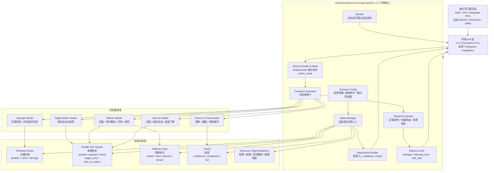
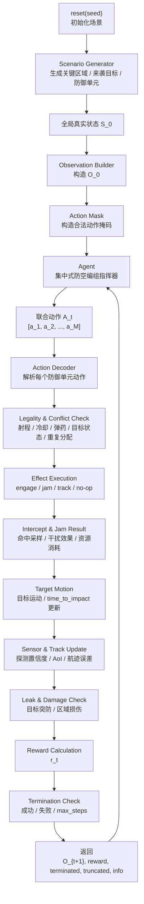
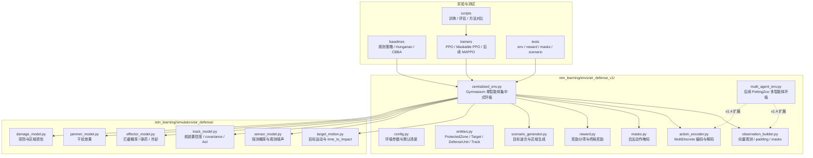
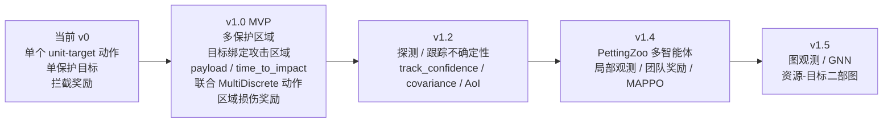

# AirDefenseResourceAssignmentEnv v1.0 架构图

更新时间：2026-07-10

本文档根据 [air_defense_rl_environment_model_design.md](D:/huang/Programs/防空编组/docs/air_defense_rl_environment_model_design.md) 绘制，用于指导 `AirDefenseResourceAssignmentEnv v1.0` 的环境实现。

## 1. 总体分层架构

## 2. 单步交互流程

## 3. 状态、动作、奖励三大接口

```mermaid
flowchart LR
    subgraph STATE["状态空间 O_t"]
        ZF["zone_features<br/>区域位置 / 价值 / 损伤"]
        TF["target_features<br/>位置 / 速度 / 威胁 / 载荷<br/>目标区域 / 到达时间 / 航迹置信度"]
        UF["unit_features<br/>类型 / 弹药 / 能量 / 冷却<br/>射程 / 成本 / 可用性"]
        EF["edge_features<br/>距离 / in_range / 命中概率<br/>time_to_intercept / expected_benefit"]
        GF["global_features<br/>时间进度 / 存活比例 / 弹药比例 / 总损伤"]
    end

    subgraph ACTION["动作空间 A_t"]
        MD["MultiDiscrete 联合动作<br/>每个防御单元选择一个动作"]
        MODE["mode_i<br/>noop / track / engage / jam / hold"]
        TARGET["target_i<br/>目标编号或 null"]
        MASK["action_mask<br/>物理约束和资源约束"]
    end

    subgraph REWARD["奖励函数 r_t"]
        RI["R_intercept<br/>拦截高威胁目标"]
        RJ["R_jam / R_track<br/>压制和航迹维护"]
        RP["R_protect<br/>保护关键区域"]
        CD["C_resource / C_time<br/>资源和时间成本"]
        PD["P_damage / P_leak<br/>区域损伤和突防惩罚"]
        PC["P_invalid / P_conflict / P_overkill<br/>非法动作 / 冲突 / 过度分配"]
    end

    STATE --> ACTION
    ACTION --> REWARD
```

## 4. 建议代码模块映射

## 5. v1.0 最小实现边界

## 6. 一句话架构理解

`AirDefenseResourceAssignmentEnv v1.0` 的核心不是“模拟一枚导弹打一个目标”，而是把防空编组抽象为一个动态资源分配系统：环境维护目标、区域、资源和航迹状态；agent 输出多防御单元联合动作；仿真器执行运动、拦截、干扰和损伤转移；奖励函数以关键区域损伤最小化和资源效率为核心。
