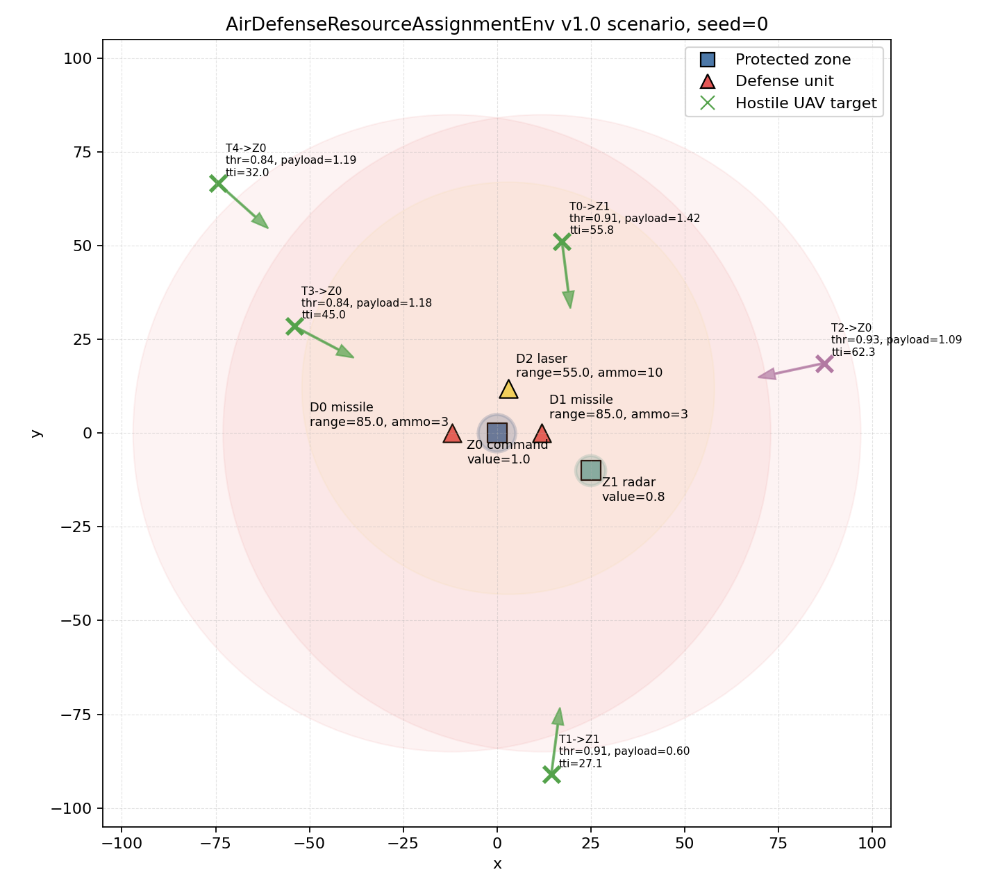
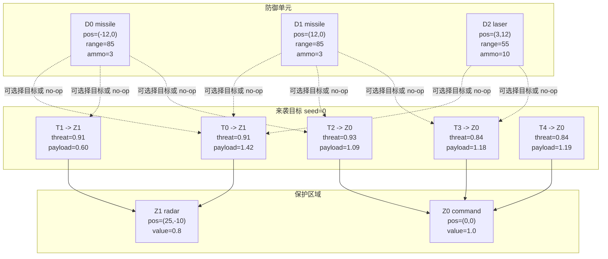

# AirDefenseResourceAssignmentEnv v1.0 场景图

更新时间：2026-07-10

本文档根据当前 `AirDefenseResourceAssignmentEnvV1` 默认配置绘制。目标随机生成使用：

```text
seed = 0
```

## 1. 俯视场景图



图中元素含义：

- 蓝色方块：保护区域 `ProtectedZone`
- 红色/黄色三角：防御单元 `DefenseUnit`
- 绿色/紫色叉号：来袭无人机目标 `Target`
- 绿色/紫色箭头：目标朝对应保护区域运动方向
- 淡红色圆：missile 防御单元射程
- 淡黄色圆：laser 防御单元射程

## 2. 当前默认场景要素

### 保护区域

| 编号   | 类型        | 位置          | 半径  | 价值    |
| ---- | --------- | -----------:| ---:| -----:|
| `Z0` | `command` | `(0, 0)`    | `5` | `1.0` |
| `Z1` | `radar`   | `(25, -10)` | `4` | `0.8` |

### 防御单元

| 编号   | 类型        | 位置         | 射程   | 弹药   | 基础命中率  | 成本    |
| ---- | --------- | ----------:| ----:| ----:| ------:| -----:|
| `D0` | `missile` | `(-12, 0)` | `85` | `3`  | `0.88` | `2.0` |
| `D1` | `missile` | `(12, 0)`  | `85` | `3`  | `0.88` | `2.0` |
| `D2` | `laser`   | `(3, 12)`  | `55` | `10` | `0.68` | `0.5` |

### 来袭目标

默认场景每个 episode 随机生成 `5` 个目标。每个目标包含：

```text
position
velocity
threat
payload
target_zone
time_to_impact
target_class
```

图中目标标签格式：

```text
T目标编号 -> Z攻击区域编号
thr = threat
payload = payload
tti = time_to_impact
```

## 3. 场景关系图



## 4. 当前 v1 场景的核心含义

当前 v1 场景不是单点防御，而是一个动态资源-目标分配问题：

```text
多个防御单元
  -> 同时面对多个来袭目标
  -> 每个目标攻击不同保护区域
  -> agent 每一步输出联合动作
  -> 环境根据命中、突防、资源消耗和区域损伤计算奖励
```

因此，后续算法要学习的不只是“哪个目标最近”，而是：

```text
在有限弹药、不同射程、不同区域价值和目标载荷下，
如何分配防御资源以最小化总区域损伤。
```
