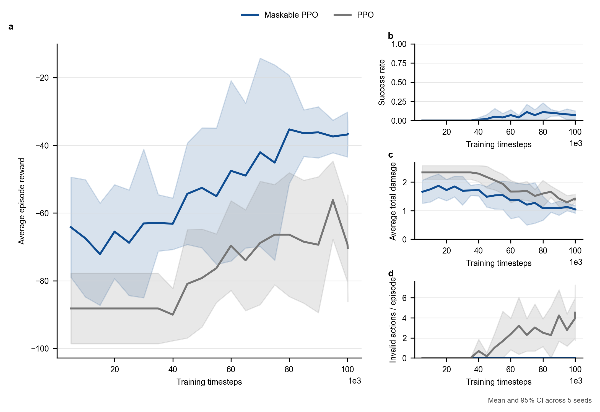

# AirDefenseResourceAssignmentEnv v1.0 正式基准实验（100k × 5 seeds）

更新时间：2026-07-14

## 1. 实验目的

本实验用于检验以下问题：

1. 普通 PPO 能否在 v1.0 联合动作环境中学会有效资源分配；
2. 动作掩码能否稳定改善 PPO 的合法性和任务性能；
3. Maskable PPO 能否达到或超过当前最强规则基线 `greedy_damage`；
4. 当前环境和算法链路是否足以作为后续学术创新的基准平台。

本实验是项目第一组正式多种子学习型基准，不再是 smoke run。

## 2. 实验协议

环境使用 `AirDefenseResourceAssignmentEnvV1` 默认配置：2 个保护区域、3 个异构防御单元和每回合 5 个随机来袭目标。

对比方法：

- `random_joint`
- `nearest_joint`
- `highest_threat`
- `time_to_impact`
- `greedy_damage`
- `ppo`
- `maskable_ppo`

训练与评估设置：

| 项目 | 设置 |
| --- | --- |
| 训练种子 | `0, 1, 2, 3, 4` |
| 请求训练步数 | 每个学习算法、每个种子 `100,000` |
| 实际训练步数 | `100,096`（完成完整 PPO rollout） |
| 最终评估 | 每个场景块 `100` 回合，共 `500` 回合/方法 |
| 最终评估种子块 | `200, 300, 400, 500, 600` |
| 曲线评估频率 | 每 `5,000` 步 |
| 曲线评估回合 | 每个检查点 `20` 回合 |
| 统计方法 | 5 个实验运行上的双侧 Student-t 95% 置信区间 |
| 设备 | CPU |

运行命令：

```powershell
conda run -n rein-learning python scripts\compare_air_defense_v1_methods.py --timesteps 100000 --eval-episodes 100 --seeds 0 1 2 3 4 --curve-eval-freq 5000 --curve-eval-episodes 20 --experiment-name formal_benchmark_100k_5seeds_20260714
```

## 3. 最终结果

下表按平均回合奖励排序。奖励给出均值和跨 5 个运行的 95% CI，其余指标为均值。

| 方法 | 平均奖励 [95% CI] | 成功率 | 拦截率 | 突防率 | 平均损伤 | 弹药消耗 | 单发命中率 | 非法动作 |
| --- | ---: | ---: | ---: | ---: | ---: | ---: | ---: | ---: |
| `maskable_ppo` | -35.93 [-45.75, -26.10] | 0.082 | 0.561 | 0.296 | 1.052 | 14.10 | 0.210 | 0.00 |
| `greedy_damage` | -38.75 [-44.23, -33.28] | 0.074 | 0.517 | 0.304 | 1.052 | 15.80 | 0.164 | 0.00 |
| `nearest_joint` | -47.28 [-53.24, -41.32] | 0.034 | 0.463 | 0.352 | 1.235 | 15.93 | 0.145 | 0.00 |
| `random_joint` | -48.53 [-52.81, -44.24] | 0.038 | 0.461 | 0.357 | 1.241 | 15.80 | 0.164 | 0.00 |
| `time_to_impact` | -57.78 [-62.12, -53.44] | 0.014 | 0.369 | 0.417 | 1.441 | 15.97 | 0.116 | 0.00 |
| `highest_threat` | -59.33 [-63.83, -54.83] | 0.014 | 0.360 | 0.439 | 1.487 | 15.97 | 0.113 | 0.00 |
| `ppo` | -86.52 [-126.34, -46.70] | 0.000 | 0.398 | 0.438 | 1.534 | 7.47 | 0.289 | 6.84 |

原始数据与完整置信区间：

- [逐运行结果](../../results/air_defense_v1/formal_benchmark_100k_5seeds_20260714/runs.csv)
- [跨种子汇总](../../results/air_defense_v1/formal_benchmark_100k_5seeds_20260714/summary.csv)
- [实验配置](../../results/air_defense_v1/formal_benchmark_100k_5seeds_20260714/experiment_config.json)

## 4. 配对差异分析

所有差异均按相同 `run_index` 的评估场景块配对计算。

### 4.1 Maskable PPO 相对普通 PPO

| 指标 | 平均差异 | 95% CI | 方向 |
| --- | ---: | ---: | --- |
| 平均奖励 | +50.596 | [+8.242, +92.950] | Maskable PPO 更高 |
| 成功率 | +0.082 | [+0.036, +0.128] | Maskable PPO 更高 |
| 拦截率 | +0.163 | [+0.112, +0.214] | Maskable PPO 更高 |
| 突防率 | -0.142 | [-0.186, -0.097] | Maskable PPO 更低 |
| 平均损伤 | -0.482 | [-0.615, -0.349] | Maskable PPO 更低 |

这些区间均不跨 0，说明动作掩码带来的提升在本次 5 个运行中具有一致方向。Maskable PPO 在所有最终评估中非法动作均为 0；普通 PPO 平均为 6.84，并且种子 4 达到 17.63。

普通 PPO 的单发命中率较高，但平均只发射 7.47 次，且所有运行的任务成功率均为 0。这说明它主要表现为少量选择性射击、无动作和非法动作的混合策略，高单发命中率不能代表整体防御有效。

### 4.2 Maskable PPO 相对 greedy_damage

| 指标 | 平均差异 | 95% CI | 判断 |
| --- | ---: | ---: | --- |
| 平均奖励 | +2.830 | [-6.628, +12.287] | 未形成稳定优势 |
| 成功率 | +0.008 | [-0.062, +0.078] | 未形成稳定优势 |
| 拦截率 | +0.044 | [-0.013, +0.102] | 有改善趋势，但区间跨 0 |
| 突防率 | -0.008 | [-0.052, +0.036] | 基本相当 |
| 平均损伤 | -0.000 | [-0.188, +0.187] | 基本相当 |
| 弹药消耗 | -1.702 | [-3.630, +0.226] | 有节省趋势，但区间跨 0 |
| 单发命中率 | +0.047 | [-0.003, +0.096] | 有改善趋势，但区间跨 0 |

因此，当前证据支持：

```text
Maskable PPO 已达到强规则基线水平，并表现出更好的资源使用趋势；
但 5 个种子的配对区间仍跨 0，尚不能声称稳定超过 greedy_damage。
```

## 5. 学习曲线

完整审计曲线包含 0 步随机策略点：

- [完整学习曲线 PNG](../../results/air_defense_v1/formal_benchmark_100k_5seeds_20260714/learning_curves.png)
- [完整学习曲线 SVG](../../results/air_defense_v1/formal_benchmark_100k_5seeds_20260714/learning_curves.svg)

为避免普通 PPO 的极低随机初值压缩有效学习阶段，另生成了 5k 步之后的分析曲线：



关键检查点均值：

| 方法 | 步数 | 奖励 | 成功率 | 拦截率 | 平均损伤 | 非法动作 |
| --- | ---: | ---: | ---: | ---: | ---: | ---: |
| PPO | 20k | -88.19 | 0.00 | 0.000 | 2.339 | 0.00 |
| PPO | 60k | -69.64 | 0.00 | 0.286 | 1.668 | 2.39 |
| PPO | 100k | -69.21 | 0.00 | 0.390 | 1.426 | 3.95 |
| Maskable PPO | 20k | -65.49 | 0.00 | 0.258 | 1.721 | 0.00 |
| Maskable PPO | 60k | -47.55 | 0.07 | 0.422 | 1.360 | 0.00 |
| Maskable PPO | 80k | -35.31 | 0.11 | 0.554 | 1.084 | 0.00 |
| Maskable PPO | 100k | -36.81 | 0.07 | 0.542 | 1.050 | 0.00 |

Maskable PPO 的主要改善发生在约 40k–80k 步，80k 后基本进入平台。普通 PPO 在早期先收敛到近似不行动策略，之后才恢复部分拦截能力，但始终没有成功回合，且非法动作在训练后期重新增加。

## 6. 稳定性与计算成本

- `maskable_ppo` 最终奖励标准差：7.91；
- `greedy_damage` 最终奖励标准差：4.41；
- `ppo` 最终奖励标准差：32.07；
- Maskable PPO 各种子最终奖励范围：-47.25 至 -28.42；
- 普通 PPO 各种子最终奖励范围：-143.12 至 -66.87。

Maskable PPO 比规则策略更受训练随机性影响，但明显比普通 PPO 稳定。

计算成本：

- 实验墙钟时间约 2,068 秒，即 34.5 分钟；
- 普通 PPO 平均训练时间约 175.0 秒/模型；
- Maskable PPO 平均训练时间约 228.4 秒/模型；
- 当前实现中 Maskable PPO 训练耗时约高 30.5%。

## 7. 研究结论

1. 动作掩码不是可有可无的工程选项，而是当前联合资源分配问题的必要约束接口。
2. Maskable PPO 已成为可信的学习型 baseline：它显著优于普通 PPO，并达到 `greedy_damage` 水平。
3. 仅使用 MLP + Maskable PPO 尚未形成对强规则策略的稳定优势，因此不能把本次结果本身作为算法创新结论。
4. 所有方法的绝对成功率仍低于 10%，说明默认 v1.0 场景属于偏难场景，也说明单一成功率不足以描述防御质量。
5. 后续创新应重点解释和改进资源—目标结构关系、分配冲突和跨场景泛化，而不应只增加训练步数。

## 8. 局限与下一步

当前实验只覆盖默认场景，没有验证目标数量、速度、弹药和命中概率变化下的泛化。5 个训练种子适合建立第一组置信区间，但仍不足以证明 Maskable PPO 相对强规则策略的小幅差异。

建议下一阶段按以下顺序开展：

1. 建立简单、中等、困难三档固定场景配置；
2. 在三档场景上复用相同多种子协议，检验性能和样本效率；
3. 增加 Hungarian/优化分配基线，避免只与贪心规则比较；
4. 将 `greedy_damage` 和 Maskable PPO 的差异分解为威胁选择、资源保留、冲突和过度分配；
5. 在证据明确后实现资源—目标图编码或结构化联合动作策略；
6. 最后再进入局部观测和 MAPPO 多智能体环境。
