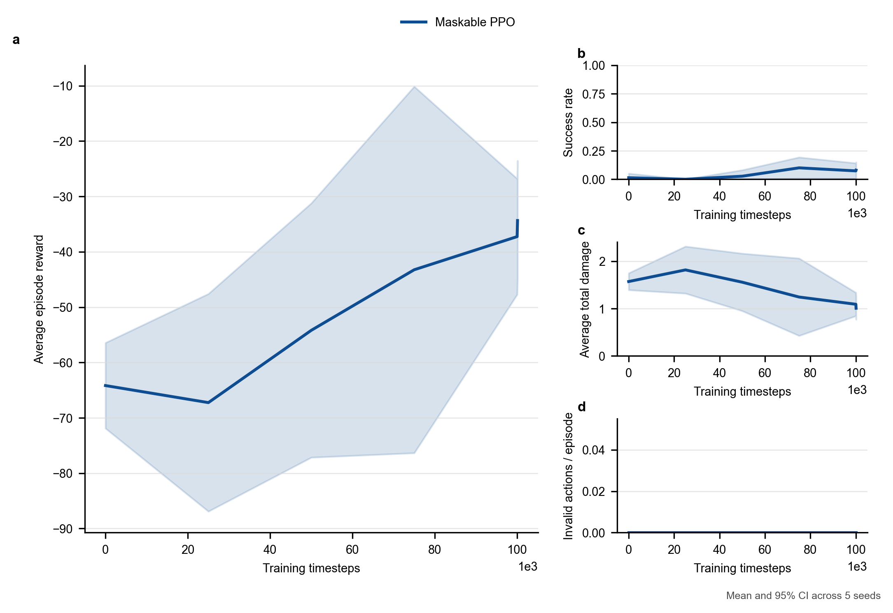
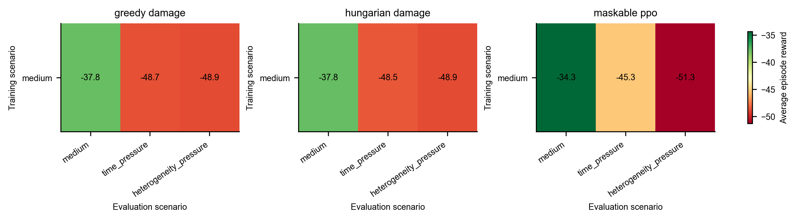

# AirDefense v1.0 任务七：核心场景正式实验报告

更新时间：2026-07-17  
实验性质：100k × 5 种子正式对比  
结果目录：`results/air_defense_v1/task7_formal_medium_100k_5seeds/`

## 1. 研究问题

任务七在任务六筛选结果的基础上，检验以下问题：

1. 增加到 100k 训练步后，Maskable PPO 能否摆脱早期低交战策略；
2. Maskable PPO 在默认、时间压力和异质性压力下能否达到强规则基线水平；
3. 学习策略相对 Greedy 和 Hungarian 的稳定优势、残留不足和结构性失效是什么；
4. 在不引入 GNN 的前提下，下一轮算法研究应优先解决什么问题。

## 2. 正式协议

| 项目 | 配置 |
| --- | --- |
| 训练场景 | `medium` |
| 测试场景 | `medium`、`time_pressure`、`heterogeneity_pressure` |
| 对比方法 | `greedy_damage`、`hungarian_damage`、`maskable_ppo` |
| 训练种子 | `0, 1, 2, 3, 4` |
| 请求训练步数 | 100,000 |
| SB3 实际训练步数 | 100,096 |
| 曲线评估 | 每 25,000 步，30 回合/检查点 |
| 最终评估 | 100 个配对回合/场景/种子 |
| 统计单位 | 5 个独立训练运行 |
| 置信区间 | 配对 Student-t 95% CI |
| 设备 | CPU |

执行命令：

```powershell
conda run -n rein-learning python scripts\compare_air_defense_v1_methods.py `
  --train-scenario medium `
  --eval-scenarios medium time_pressure heterogeneity_pressure `
  --methods greedy_damage hungarian_damage maskable_ppo `
  --seeds 0 1 2 3 4 `
  --timesteps 100000 `
  --eval-episodes 100 `
  --eval-seed 200 `
  --curve-eval-freq 25000 `
  --curve-eval-episodes 30 `
  --curve-eval-seed 10000 `
  --device cpu `
  --experiment-name task7_formal_medium_100k_5seeds
```

普通 PPO 已在任务六中完成动作掩码消融并确定发生全 no-op 塌缩，本轮不再将其作为主方法。GNN 未进入本轮实验。

## 3. 完整性审计

| 产物 | 数量 | 期望 | 状态 |
| --- | ---: | ---: | --- |
| `runs.csv` | 45 | 45 | 完整 |
| `episodes.csv` | 4,500 | 4,500 | 完整 |
| `summary.csv` | 153 | 153 | 完整 |
| `paired_differences.csv` | 153 | 153 | 完整 |
| `generalization_matrix.csv` | 153 | 153 | 完整 |
| `learning_curves.csv` | 30 | 30 | 完整 |
| Maskable PPO 模型 | 5 | 5 | 完整 |
| TensorBoard 运行 | 5 | 5 | 完整 |

全部模型实际训练步数均为 100,096，没有缺失、重试或提前终止的种子。45 个运行块来自 `3 个场景 × 3 种方法 × 5 个运行`，每个方法比较使用相同的评估种子块。

## 4. 总体结果

### 4.1 主要任务指标

| 测试场景 | 方法 | 平均奖励及 95% CI | 平均损伤 | 拦截率 | 高威胁突防率 | 成功率 |
| --- | --- | --- | ---: | ---: | ---: | ---: |
| `medium` | Greedy | -37.82 [-41.39, -34.25] | 1.029 | 0.522 | 0.292 | 0.078 |
| `medium` | Hungarian | -37.80 [-41.64, -33.95] | 1.028 | 0.524 | 0.296 | 0.076 |
| `medium` | Maskable PPO | -34.35 [-41.40, -27.30] | 1.020 | 0.576 | 0.302 | 0.078 |
| `time_pressure` | Greedy | -48.71 [-54.85, -42.56] | 1.444 | 0.573 | 0.409 | 0.090 |
| `time_pressure` | Hungarian | -48.51 [-53.59, -43.44] | 1.436 | 0.574 | 0.413 | 0.090 |
| `time_pressure` | Maskable PPO | -45.30 [-53.33, -37.27] | 1.393 | 0.602 | 0.402 | 0.112 |
| `heterogeneity_pressure` | Greedy | -48.85 [-52.87, -44.84] | 1.290 | 0.441 | 0.367 | 0.010 |
| `heterogeneity_pressure` | Hungarian | -48.87 [-53.42, -44.31] | 1.291 | 0.442 | 0.364 | 0.010 |
| `heterogeneity_pressure` | Maskable PPO | -51.33 [-57.57, -45.08] | 1.389 | 0.440 | 0.408 | 0.034 |

从均值看，Maskable PPO 在 `medium` 和 `time_pressure` 的奖励略高，在异质性压力下略低。是否构成稳定差异必须以配对置信区间判断，不能只比较表中均值。

### 4.2 资源与决策开销

| 测试场景 | 方法 | 平均弹药 | 资源成本 | 单位弹药损伤降低 | 决策时间/ms |
| --- | --- | ---: | ---: | ---: | ---: |
| `medium` | Hungarian | 15.74 | 16.87 | 0.120 | 0.035 |
| `medium` | Maskable PPO | 14.02 | 15.78 | 0.147 | 0.901 |
| `time_pressure` | Hungarian | 15.78 | 16.89 | 0.134 | 0.038 |
| `time_pressure` | Maskable PPO | 13.24 | 15.39 | 0.164 | 1.005 |
| `heterogeneity_pressure` | Hungarian | 15.75 | 15.34 | 0.103 | 0.037 |
| `heterogeneity_pressure` | Maskable PPO | 13.89 | 14.67 | 0.116 | 0.924 |

学习策略的决策耗时显著高于规则方法，但绝对值仍约为 1 ms；在当前仿真步长下不构成实时性瓶颈。

## 5. 配对统计结论

以下差异统一定义为 `Maskable PPO - Hungarian`。奖励、拦截率越大越好；损伤、弹药、成本和突防率越小越好。

### 5.1 `medium`

| 指标 | 配对差异 | 95% CI | 结论 |
| --- | ---: | --- | --- |
| 平均奖励 | +3.45 | [-2.51, 9.40] | 未检测到稳定差异 |
| 平均损伤 | -0.009 | [-0.177, 0.160] | 未检测到稳定差异 |
| 拦截率 | +0.052 | [0.010, 0.094] | Maskable PPO 稳定更高 |
| 高威胁突防率 | +0.006 | [-0.058, 0.070] | 未检测到稳定差异 |
| 资源成本 | -1.085 | [-2.577, 0.407] | 节省趋势尚不稳定 |

Maskable PPO 在默认场景中提高了总体拦截率，但奖励、损伤和高威胁突防率没有形成显著差异。更高拦截数量没有自动转化为更低高价值损伤。

### 5.2 `time_pressure`

| 指标 | 配对差异 | 95% CI | 结论 |
| --- | ---: | --- | --- |
| 平均奖励 | +3.21 | [-5.47, 11.89] | 未检测到稳定差异 |
| 平均损伤 | -0.043 | [-0.226, 0.140] | 未检测到稳定差异 |
| 拦截率 | +0.028 | [-0.024, 0.080] | 未检测到稳定差异 |
| 平均弹药 | -2.544 | [-4.481, -0.607] | Maskable PPO 稳定更少 |
| 资源成本 | -1.506 | [-2.819, -0.193] | Maskable PPO 稳定更低 |
| 高威胁突防率 | -0.011 | [-0.093, 0.071] | 未检测到稳定差异 |

任务六中观察到的时间压力失效在 100k 后消失。Maskable PPO 在没有检测到奖励、损伤和拦截率下降的同时，平均少使用约 2.54 发弹药并降低资源成本。这是当前最清晰的学习策略优势信号。

严格来说，本实验尚未预先设定非劣效界值，因此“任务性能不显著不同”不能直接写成“已经证明非劣效”。后续论文如要形成正式资源效率主张，应补充预注册界值的非劣效分析。

### 5.3 `heterogeneity_pressure`

| 指标 | 配对差异 | 95% CI | 结论 |
| --- | ---: | --- | --- |
| 平均奖励 | -2.46 | [-10.48, 5.56] | 未检测到稳定差异 |
| 平均损伤 | +0.098 | [-0.052, 0.248] | 未检测到稳定差异 |
| 拦截率 | -0.002 | [-0.071, 0.066] | 未检测到稳定差异 |
| 高威胁突防率 | +0.044 | [0.001, 0.087] | Maskable PPO 稳定更高 |
| 资源成本 | -0.670 | [-1.641, 0.302] | 节省趋势尚不稳定 |

Maskable PPO 的总体拦截率与规则方法接近，但高威胁目标突防率高约 4.4 个百分点。这说明残留问题不是“不会拦截”，而是异质资源与高价值目标之间的优先级匹配仍不稳定。

## 6. 联合动作冲突

规则方法强制执行一对一匹配，因此冲突率和过度分配率均为 0。Maskable PPO 的动作掩码只保证单个资源动作合法，没有保证多个资源不会同时选择同一目标。

| 场景 | 冲突率 | 95% CI | 过度分配率 | 95% CI |
| --- | ---: | --- | ---: | --- |
| `medium` | 0.0168 | [0.0016, 0.0320] | 0.0164 | [0.0017, 0.0311] |
| `time_pressure` | 0.0254 | [0.0073, 0.0435] | 0.0246 | [0.0074, 0.0419] |
| `heterogeneity_pressure` | 0.0188 | [0.0033, 0.0343] | 0.0183 | [0.0034, 0.0333] |

三个场景中的 95% CI 均不包含 0。联合冲突是跨场景、跨种子存在的结构性问题，比继续单纯增加训练步数更值得优先研究。

## 7. 学习过程

Maskable PPO 在 `medium` 曲线评估块上的跨种子均值为：

| 实际检查点 | 平均奖励及 95% CI | 平均损伤 | 拦截率 |
| ---: | --- | ---: | ---: |
| 0 | -64.16 [-71.89, -56.44] | 1.571 | 0.337 |
| 25,000 | -67.24 [-86.90, -47.59] | 1.817 | 0.259 |
| 50,000 | -54.18 [-77.15, -31.22] | 1.557 | 0.429 |
| 75,000 | -43.24 [-76.35, -10.14] | 1.244 | 0.499 |
| 100,000 | -37.26 [-47.72, -26.79] | 1.091 | 0.561 |
| 100,096 | -34.35 [-45.16, -23.54] | 1.007 | 0.571 |

25k 前后仍存在明显的早期策略退化，75k 时跨种子方差最大，但 100k 后五个种子都恢复为主动交战策略。任务六的 20k 结果准确暴露了早期训练风险，却不代表最终策略能力。





## 8. 典型配对回合

### 8.1 时间压力下的资源效率成功案例

`time_pressure`，train seed 3，episode seed 1264：

| 方法 | 奖励 | 损伤 | 弹药 | 拦截数 | 高威胁突防数 |
| --- | ---: | ---: | ---: | ---: | ---: |
| Hungarian | -83.16 | 2.429 | 16 | 2 | 2 |
| Maskable PPO | 39.81 | 0.000 | 7 | 5 | 0 |

该回合说明学习策略可以在时间受限条件下形成比即时规则更有效的交战时机与资源保留行为。它是机制案例，不代替跨种子统计结论。

### 8.2 异质性场景中的冲突失效案例

`heterogeneity_pressure`，train seed 2，episode seed 1076：

| 方法 | 奖励 | 损伤 | 弹药 | 拦截数 | 高威胁突防数 | 冲突率 |
| --- | ---: | ---: | ---: | ---: | ---: | ---: |
| Hungarian | -84.65 | 2.371 | 16 | 1 | 1 | 0.000 |
| Maskable PPO | -150.64 | 3.433 | 16 | 0 | 2 | 0.143 |

Maskable PPO 在该回合同时出现 12.5% 的过度分配率。动作均为单资源合法动作，但联合组合不满足一对一协调，造成资源浪费和高威胁目标漏防。

## 9. 可以与不能形成的结论

### 当前证据支持

- 100k 训练预算能够消除 20k 筛选阶段的持续低交战陷阱；
- Maskable PPO 在三个核心场景的奖励和损伤上均未与强规则基线形成显著差异；
- Maskable PPO 在 `medium` 具有更高总体拦截率；
- Maskable PPO 在 `time_pressure` 稳定减少弹药和资源成本；
- Maskable PPO 在 `heterogeneity_pressure` 具有更高的高威胁突防率；
- 学习策略存在跨场景稳定的联合分配冲突与过度分配；
- Greedy 与 Hungarian 在三个场景的奖励差异均不显著。

### 当前证据不支持

- 不能宣称 Maskable PPO 在总体奖励上稳定优于规则方法；
- 不能把“差异不显著”写成三种方法已经统计等价；
- 不能宣称 Hungarian 的长时域性能优于 Greedy；
- 不能仅凭异质性压力结果认定 GNN 必然有效；
- 不能直接把单个成功案例作为资源效率的总体因果证明。

## 10. 下一研究入口

本轮暂不进入 GNN。优先研究的问题应从“状态编码结构”转为“联合动作协调约束”：

```text
现有 MLP Maskable PPO
vs.
保持同一 MLP 编码器的冲突自由 Maskable PPO
```

候选实现包括顺序资源决策加动态目标掩码、自回归联合动作，或策略输出后的可微/不可微匹配层。第一轮只改变联合动作生成机制，保持环境、奖励、训练预算和状态编码不变，以隔离冲突约束的效果。

建议下一任务先运行 30k × 3 种子机制筛选，验收指标为：

- 非法动作率保持 0；
- 冲突率和过度分配率降为 0；
- `time_pressure` 的资源效率优势不退化；
- `heterogeneity_pressure` 的高威胁突防率下降；
- 决策耗时仍满足仿真实时要求。

只有在消除联合动作冲突后，异质性场景仍表现出稳定的高威胁匹配瓶颈，才有充分理由进入 GNN 表示研究。

## 11. 总结

任务七完成了从筛选趋势到正式证据的转变。Maskable PPO 在 100k 后达到强规则基线的奖励与损伤区间，并在时间压力下显示资源节省信号；与此同时，异质性高威胁匹配和联合动作冲突成为新的、可测量的研究问题。下一阶段应先改进联合动作协调机制，不直接加入 GNN。

