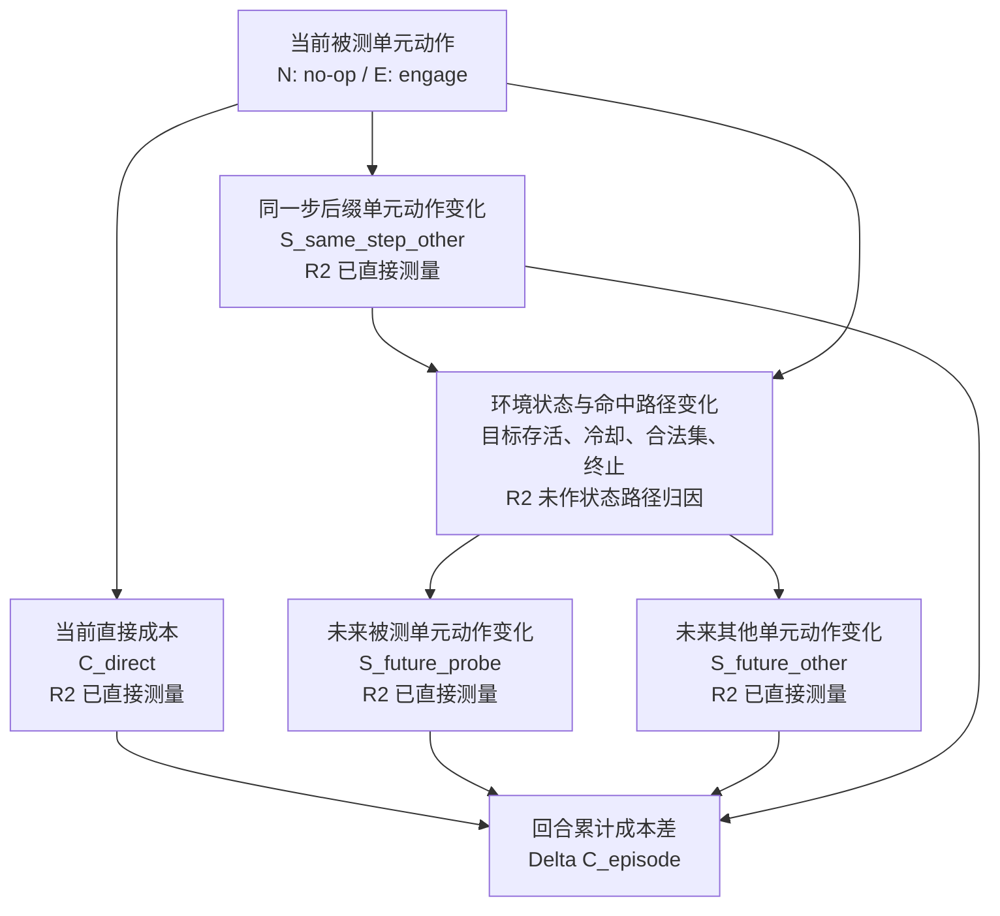

# LR-01 阅读报告：反事实效应分解与 AirDefense 动作替代边界

任务状态：`PASSED`  
完成时间：2026-07-29  
实验授权：否  
总体判决：`BASELINE + ADAPT`；优化接入为 `AVOID`；规范性接口为 `OPEN`

## 1. 论文身份

| 项目 | 内容 |
| --- | --- |
| 标题 | *Counterfactual Effect Decomposition in Multi-Agent Sequential Decision Making* |
| 作者 | Stelios Triantafyllou、Aleksa Sukovic、Yasaman Zolfimoselo、Goran Radanovic |
| 会议 | ICML 2025，PMLR 267，60072–60098 |
| 论文类型 | 多智能体序贯决策中的结构因果解释方法 |
| 官方页面 | <https://proceedings.mlr.press/v267/triantafyllou25a.html> |
| 本地原文 | [PDF](../../../research_papers/02_innovation_references/2025_ICML_Counterfactual_Effect_Decomposition.pdf) |
| 代码 | <https://github.com/stelios30/cf-effect-decomposition> |

官方页面与本地 27 页 PMLR 版本的标题、作者、卷号和页码一致。正文公式页、
附录证明页与图示页均已核对。

## 2. 一句话结论

这篇论文已经覆盖“一个动作的总反事实效应可经后续智能体行为和环境状态路径
传播”的一般因果解释问题；AirDefense R2 的可辩护贡献只能收窄为动态合法集
下的资源成本测量失真及其同一步自回归后缀账本，不能再声称首次提出动作替代
或一般多智能体效应分解。

## 3. Problem–Method–Insight

| 层 | 论文内容 |
| --- | --- |
| Problem | 总反事实效应只说明替代动作会改变多少结果，却不说明变化经哪些后续智能体行为和环境状态传播 |
| Method | 用 MMDP-SCM 定义 TCFE、tot-ASE 与 r-SSE，以恒等式分解总效应；再用 Shapley 分配行为效应、用 ICC 分配状态效应 |
| Insight | 在多智能体序贯系统中，“谁随后改变了行为”和“哪些状态转移承载了效应”是不同解释对象；解释性分配不等于规范性优化目标 |

论文面向对已实现轨迹的回顾性解释与问责，不提出新的 PPO advantage、策略
梯度目标或受约束在线学习算法。

## 4. 一页公式卡

### 4.1 MMDP-SCM

论文把状态和各智能体动作写成确定性结构方程与外生噪声的组合（PDF p.3，
Eq. 1）：

\[
S_0=f^{S_0}(U^{S_0}),\qquad
S_t=f^S(S_{t-1},A_{t-1},U^{S_t}),
\]

\[
A_{i,t}=f^{A_i}(S_t,U^{A_{i,t}}).
\]

其中 \(U\) 彼此独立；给定一个外生上下文 \(u\)，全部状态和动作组成唯一轨迹
\(\tau\)。

### 4.2 总反事实效应

对事实动作 \(\tau(A_{i,t})\) 和替代动作 \(a_{i,t}\)，结果变量为 \(Y\)
（PDF p.3，Definition 2.1）：

\[
\operatorname{TCFE}_{a_{i,t},\tau(A_{i,t})}(Y\mid\tau)
=
\mathbb E[Y_{a_{i,t}}\mid\tau]-\tau(Y).
\]

它回答“替代当前动作后结果总体改变多少”，但不回答变化由何种中介路径造成。

### 4.3 后续智能体行为效应

令所有晚于 \(t\) 的动作采用它们在当前替代动作下的自然反事实值：

\[
\mathcal I_{\mathrm{cf}}
=
\{A_{i',t'}:=A_{i',t'}[a_{i,t}]\}_{i',t'>t}.
\]

总 agent-specific effect（PDF p.4，Definition 3.1）为：

\[
\operatorname{totASE}
=
\mathbb E[Y\mid\tau;M]_{M^{do(\mathcal I_{\mathrm{cf}})}}-\tau(Y).
\]

它保留后续智能体对干预的自然行为响应，但阻断当前动作经状态转移直接传播
到这些行为之外的路径。

### 4.4 状态路径效应与正确加和关系

论文先定义普通 SSE：后续智能体动作固定为事实值，只让当前替代动作经状态
传播。但作者给出反例说明，一般并不存在
\(\operatorname{TCFE}=\operatorname{totASE}+\operatorname{SSE}\)。

真正进入恒等式的是 reverse state-specific effect（PDF p.4，Eq. 2）：

\[
\operatorname{rSSE}
=
\mathbb E[Y\mid\tau;M]_{M^{do(\mathcal I_{\mathrm{cf}})}}
-
\mathbb E[Y_{a_{i,t}}\mid\tau].
\]

因此（PDF p.4，Theorem 3.3；p.15 给出证明）：

\[
\boxed{
\operatorname{TCFE}
=
\operatorname{totASE}
-
\operatorname{rSSE}
}.
\]

若把状态路径贡献记为
\(E_{\mathrm{state}}=-\operatorname{rSSE}\)，则可写成：

\[
\operatorname{TCFE}
=
\operatorname{totASE}+E_{\mathrm{state}}.
\]

这一区分非常重要：论文分解中的“状态贡献”是负的 r-SSE，不是普通 SSE。

### 4.5 子集智能体效应

对智能体子集 \(N\)，只允许 \(N\) 中智能体的后续动作采用替代动作下的自然
响应；其余智能体固定为事实动作（PDF p.6，Definition 5.1）：

\[
\operatorname{ASE}^{N}
=
\mathbb E[Y\mid\tau;M]_{M^{do(\mathcal I_N)}}-\tau(Y),
\]

\[
\mathcal I_N
=
\{A_{j,t'}:=A_{j,t'}[a_{i,t}]\}_{j\in N,t'>t}
\cup
\{A_{j,t'}:=\tau(A_{j,t'})\}_{j\notin N,t'>t}.
\]

它表示总效应中只经指定智能体行为传播的部分，而不是该智能体“应承担”的
规范责任。

### 4.6 Shapley 如何分配行为效应

把合作博弈的价值函数定义为 \(v(S)=\operatorname{ASE}^{S}\)，则智能体
\(j\) 的贡献（PDF p.6，Definition 5.2）为：

\[
\phi_j
=
\sum_{S\subseteq \mathcal N\setminus\{j\}}
\frac{|S|!(n-|S|-1)!}{n!}
\left[
\operatorname{ASE}^{S\cup\{j\}}-\operatorname{ASE}^{S}
\right].
\]

它满足 efficiency、invariance、symmetry 和 contribution monotonicity，
并保证：

\[
\sum_j\phi_j=\operatorname{totASE}.
\]

Shapley 只分配行为中介的 tot-ASE；它不分配完整 TCFE，也不自动生成策略
优化权重。

### 4.7 状态变量归因

论文用 intrinsic causal contribution 衡量知道状态块 \(S_k\) 对应外生噪声后，
反事实差值不确定性降低多少（PDF p.5，Eq. 4）：

\[
\operatorname{ICC}(S_k\rightarrow\Delta Y\mid\tau)
=
\operatorname{Unc}_{<S_k}-\operatorname{Unc}_{\le S_k}.
\]

再按 ICC 占总方差的比例分配 r-SSE：

\[
\psi_{S_k}
=
\frac{\operatorname{ICC}(S_k\rightarrow\Delta Y\mid\tau)}
{\operatorname{Var}(\Delta Y\mid\tau)}
\operatorname{rSSE}.
\]

这里的 structure-preserving intervention 不是把状态任意钉死，而是条件化于
状态结构方程的外生噪声，同时保留环境的父节点关系和结构机制。

## 5. 为什么普通结果差不是动作责任

普通 N/E 结果差混合至少四类内容：

1. 当前动作自身的直接结果；
2. 后续智能体因该动作而改变的行为；
3. 环境状态、命中和目标存活改变后的传播；
4. 行为与状态路径之间的交互。

因此总结果差可以忠实表示替代动作的总体政策后果，却不能唯一归属于当前
动作。论文的 Sepsis 例子中，同一 TCFE 同时包含医生/AI 后续行为和患者状态
变化；其 Gridworld 实验还直接表明普通
\(\operatorname{totASE}+\operatorname{SSE}\) 不能重建 TCFE。

这与 AirDefense N1 的结论一致：

\[
\text{全局结果有效}\;\not\Rightarrow\;\text{局部责任可辨识}.
\]

## 6. 识别假设及 AirDefense v1 审计

| 假设 | 论文要求 | AirDefense v1 判定 |
| --- | --- | --- |
| 有限时域、Markov 状态 | MMDP 状态包含转移所需信息 | 基本满足；完整模拟器状态、冷却、弹药、目标和随机状态可快照 |
| 已知或可表示的结构方程 | 状态、动作由父节点和外生噪声生成 | 模拟器与冻结策略可执行，优于纯观察数据；但尚未显式登记为统一 SCM |
| 外生噪声相互独立 | \(P(u)=\prod P(u_i)\) | 命中随机带和策略均匀随机带按步/目标/单元生成，工程上可满足；需审计环境是否还有共享随机源 |
| 轨迹后验 | 需从 \(P(u\mid\tau)\) 做 abduction | R2 使用预生成共同随机带，不是论文的轨迹后验推断 |
| weak noise monotonicity | 用指定类别全序识别反事实分布 | 已知模拟器可直接执行反事实，未必需要从观察分布识别；若套用论文估计器，动作类别全序和动态 mask 下的结构耦合仍须冻结 |
| 同时动作条件独立 | 正文写作 \(\pi(a_t\mid s_t)=\prod_i\pi_i(a_{i,t}\mid s_t)\) | 不满足现有 factorized AR 策略；后缀动作依赖前缀和动态合法集 |
| 晚于干预的行为中介 | ASE 只干预 \(t'>t\) 的动作 | 不显式覆盖 AirDefense 同一步后缀替代；需把每个单元决策展开为 micro-time MDP 才能表示 |
| 结果变量可纳入状态 | reward 可作为状态的一部分 | 回合成本、损伤和终局指标可构造为累计状态 |

结论：AirDefense 的完全状态模拟器足以执行结构反事实，但当前 R2 协议不是
论文识别算法的直接实现。特别是“同一步自回归后缀”必须通过微时间展开后才
属于论文的后续动作路径。

## 7. 论文证据与证据边界

### 7.1 Gridworld

- 干预 A2 的拾取动作，比较事实和反事实轨迹；
- 实证显示 TCFE 不能由 tot-ASE 与普通 SSE 相加得到，但 Theorem 3.3 的
  `tot-ASE - r-SSE` 可以重建；
- ASE-SV 给不响应干预的 A1 和不能直接影响状态的 Planner 零贡献；
- r-SSE-ICC 定位到产生随机惩罚的四个状态；
- Appendix L 中可直接计算的 ground truth 落在估计标准误范围内。

### 7.2 Sepsis

- 从 600 条失败轨迹中筛选 `TCFE≥0.8` 的 8,728 个替代动作；
- 单独 clinician-specific 和 AI-specific effects 的和可与 tot-ASE 相差
  最高 95%，而 ASE-SV 按定义始终有效分配 tot-ASE；
- 随信任参数增大，贡献从 clinician 转向 AI，符合行为结构预期；
- r-SSE-ICC 在 437 个满足效应和方差门槛的动作上产生稀疏状态贡献；
- 使用 100 个后验样本估计效应、20 个附加样本估计条件方差；
- Appendix L 用 10 个种子检查估计误差，Appendix M 用 5 个额外类别全序
  检查 noise-monotonicity 选择鲁棒性。

### 7.3 不能过度解读

这些实验支持公式恒等式、分配效率和结构可解释性，但不证明：

- 分配分数是道德或规范责任；
- 解释分数能提高策略学习；
- noise monotonicity 在真实系统中成立；
- 方法能扩展到大量智能体或很长时域；
- 对大效应样本的筛选结论可无条件外推到所有动作。

精确 ASE-SV 随智能体数指数增长；r-SSE-ICC 对时域为 \(O(h)\)，论文仅讨论
Shapley 近似、时间分组和稀疏时二分搜索等缓解方法（PDF pp.16–17）。

## 8. AirDefense 路径效应图



R2 的四项均按资源事件身份和时间位置记账；命中、目标存活、状态转移和
动态 mask 如何分别导致这些动作变化，仍被吸收到分支轨迹中，没有按 r-SSE
或 ICC 分解。

## 9. R2/N1 对照矩阵

| 维度 | ICML 2025 效应分解 | AirDefense R2/N1 | 判定 |
| --- | --- | --- | --- |
| 原问题 | 解释已实现轨迹中动作总效应经谁/何状态传播 | 判断回合累计成本差为何不能读成当前动作局部资源成本 | 问题相邻但不相同 |
| 总量 | 轨迹条件 TCFE | \(C(E)-C(N)\) | R2 总成本差可视为特定结果上的局部反事实总差 |
| 一级分解 | `TCFE = tot-ASE - r-SSE` | `ΔC = C_direct - S_same - S_future_probe - S_future_other` | 不同恒等式 |
| 分解基准 | 因果中介：后续智能体行为与状态路径 | 事件账本：谁在何时少消耗了多少资源 | R2 不是论文公式实例的完整实现 |
| 同一步后缀 | 正文 ASE 只含 \(t'>t\)，同时动作为同层节点 | 明确记录 AR 前缀改变同一步后缀 | 论文未显式覆盖；微时间建模后可纳入 |
| 状态路径 | r-SSE 后再用 ICC 分配状态 | 目标状态与命中路径不单独归因 | R2 尚未识别 |
| 智能体分配 | ASE-SV 对子集自然干预做 Shapley | probe/other 成本按动作身份直接求和 | 不是 Shapley |
| 随机性 | 轨迹后验 + noise monotonicity | 显式共同随机带 + 目标精确边缘化 | 估计协议不同 |
| 主要用途 | 回顾性解释、问责工具 | 测量失真确认、标签语义诊断 | 均非在线优化算法 |
| 证据 | 两个模拟环境的解释忠实性 | 新策略/新状态三场景独立确认 | R2 的领域证据独立，但一般原理已相邻覆盖 |

### 9.1 R2 是否重复论文的总效应分解

**判定：部分。**

R2 的 N/E 总成本差属于动作反事实总差，且其替代通道与论文“后续行为会传递
当前动作效应”的洞见重合。但 R2 没有构造 tot-ASE/r-SSE 的交叉世界自然
干预，也没有把状态路径从行为路径分离；四通道恒等式依赖可加资源事件账本，
不是 Theorem 3.3 的领域改名。

### 9.2 同一步后缀替代是否被显式覆盖

**判定：依赖建模；在论文原始模型中没有显式覆盖。**

论文把同一步动作写为仅依赖 \(S_t\) 的乘积联合策略，ASE 只改变 \(t'>t\)
的动作。AirDefense 的单元 \(i+1\) 动作依赖单元 \(i\) 的前缀占用和动态
合法集。若把一个环境步展开为多个单元 micro-step，论文框架可覆盖；否则
R2 的 `S_same_step_other` 位于原图没有表示的因果边上。

### 9.3 论文效应能否直接作为 PPO advantage

**判定：不能。**

TCFE/ASE/ICC 是给定事实轨迹的回顾性解释量。它们不是已证明无偏的
\(A^\pi(s,a)\)，不带 on-policy occupancy、Bellman 一致性或 PPO clipping
兼容性保证。若要用于训练，至少还需：

1. 冻结规范目标，说明优化 TCFE、tot-ASE 或某一 Shapley 分量的决策含义；
2. 证明或界定估计量相对 \(A^\pi\) 的偏差；
3. 处理自然干预和实际策略分布的支持域错配；
4. 建立零系数完整更新等价和全局 CMDP 强基线；
5. 以独立在线实验证明安全与成本没有被解释性分数扭曲。

### 9.4 测量解释与规范性优化是否被区分

论文只解决“总效应如何解释”，其 Shapley efficiency 表示分数加总恢复
tot-ASE，不表示应该最大化、最小化或惩罚这些分数。Discussion 将用途定位
为 accountability 和 retrospective failure analysis。

N1 的未解问题正是：即使局部账本可计算，也没有决定应该保持全局预算、
单独惩罚直接成本，还是构造双层约束。论文加强了这一 no-go，而没有替项目
作出规范选择。

## 10. 已覆盖的项目主张

以下主张必须删除或收窄：

1. **删除**“首次发现当前动作效应会经后续智能体动作和环境状态传播”；
2. **删除**“首次把多智能体序贯总效应分成智能体路径和状态路径”；
3. **删除**“分解后的局部分量天然适合作为 PPO 信用或责任”；
4. **收窄**“动作替代测量贡献”为 AirDefense 动态合法集、共同随机数协议和
   可加资源账本下的独立实证，而不是一般因果分解原理；
5. **保留**“回合累计成本差不能直接解释为当前动作局部资源成本”的领域证据，
   但相关工作必须引用该论文并说明它提供更一般的因果解释框架。

## 11. 不可直接迁移点

- 论文的同时动作乘积策略不能直接表示当前 AR 前缀依赖；
- 轨迹后验、noise monotonicity 和自然干预不等于 R2 的共同随机数耦合；
- Shapley 分配满足解释公理，不提供安全约束资格或策略改进保证；
- r-SSE-ICC 需要大量后验嵌套采样，不能直接成为在线 PPO 信号；
- 论文面向已实现轨迹；AirDefense 在线 actor 分布持续变化，存在已观察到的
  离线支持域错配。

## 12. 项目剩余差异：最多三条

| 剩余差异 | 当前身份 | 可验证方式 |
| --- | --- | --- |
| 动态合法集中的同一步 AR 后缀替代 | 已有 R2 测量证据，但一般理论未建立 | 把环境步展开为 micro-time SCM，证明或反证原账本与 ASE 路径的一一映射 |
| 可加资源事件账本与一般因果中介的边界 | 已冻结领域测量贡献 | 在同一快照同时计算四通道账本和 tot-ASE/r-SSE，检验哪些状态效应无法由成本账本表达 |
| 全局资源约束与局部解释量的规范接口 | `OPEN`，不是当前贡献 | 先形式化双层目标，再与全局 CMDP、等容量非分解对照做预注册证伪 |

三条中只有第一项已有直接实验基础；第二项是可选方法学审计，第三项仍需
人工决定规范目标。它们都不自动授权新算法。

## 13. 创新压力测试

| 层 | 相对论文的差异强度 | 结论 |
| --- | --- | --- |
| Problem | 中 | R2 聚焦资源成本读出，而论文处理一般反事实解释 |
| Method | 弱到中 | 四通道事件账本不同于 ASE/r-SSE，但属于相邻分解思想 |
| 技术细节 | 中 | 同一步 AR 前缀、动态 mask、目标边缘化和显式 CRN 是真实差异 |
| Evidence | 中 | R2 有独立策略/状态确认；论文有更一般的双环境解释证据 |
| Insight | 弱 | “后续行为造成总效应混叠”已被论文一般性覆盖 |

最危险的伪创新是把“分量数不同”或“应用到防空”当作方法差异。可辩护表述
应把贡献放在冻结协议下的领域测量事实，而不是因果分解优先权。

## 14. `BASELINE / ADAPT / AVOID / OPEN` 判决

| 标签 | 判决 |
| --- | --- |
| `BASELINE` | 任何声称局部动作责任或后续行为分解的项目方法，都必须把本文作为最近解释基线 |
| `ADAPT` | 可用 micro-time SCM 把同一步 AR 后缀纳入路径图，并用论文术语重新审计 R2；只作解释性适配 |
| `AVOID` | 不把 TCFE、ASE、Shapley 或 ICC 直接接入 PPO advantage、reward、loss 或 action mask |
| `OPEN` | 是否存在目标一致、支持域可控的“全局资源约束—局部解释”接口仍开放，须与 CPO/安全 MARL 联合定义 |

总体判决不是“复现该论文并训练”，而是：

```text
把 ICML 2025 作为解释与因果路径强基线
                    ↓
收窄 R2 的优先权和论文主张
                    ↓
只适配同一步 AR micro-time 表示
                    ↓
规范目标未冻结前，不进入在线算法
```

## 15. 移交 LR-05

LR-05 阅读 CAPO/COSAC 时必须携带以下边界：

1. CED 的 ASE 是轨迹条件、自然干预下的解释量；
2. CAPO/COSAC 若构造可优化 advantage，必须明确其 estimand、偏差和策略
   分布，而不能只因也使用 counterfactual 就与 ASE 等同；
3. 同一步 AR 后缀需按 micro-time 顺序建模；
4. 对照重点应是“解释性效率”与“策略梯度有效性”的差异；
5. 任何顺序信用候选都必须保留 joint PPO fallback，并接受 AirDefense
   已观察到的支持域错配压力测试。

## 16. 术语表与来源锚点

| 英文 | 本报告译法 | 原文锚点 |
| --- | --- | --- |
| total counterfactual effect, TCFE | 总反事实效应 | PDF p.3, Def. 2.1 |
| total agent-specific effect, tot-ASE | 总智能体特定效应 | PDF p.4, Def. 3.1 |
| state-specific effect, SSE | 状态特定效应 | PDF p.4, Def. 3.2 |
| reverse state-specific effect, r-SSE | 反向状态特定效应 | PDF p.4, Eq. 2 |
| agent-specific effect, ASE | 智能体子集特定效应 | PDF p.6, Def. 5.1 |
| natural intervention | 自然干预 | PDF p.3 |
| structure-preserving intervention | 保结构干预 | PDF p.5 |
| intrinsic causal contribution, ICC | 内在因果贡献 | PDF p.5, Eq. 4 |
| noise monotonicity | 噪声单调性 | PDF pp.3–4, 14 |
| counterfactual identifiability | 反事实可识别性 | PDF pp.3–4 |

### 关键来源索引

- Abstract、问题与贡献：PDF pp.1–2；
- MMDP-SCM、干预、TCFE：PDF p.3；
- tot-ASE、SSE、r-SSE、Theorem 3.3：PDF p.4；
- ICC 与保结构干预：PDF p.5；
- ASE-SV 与 Shapley 公理：PDF p.6、p.14；
- Gridworld 与 Sepsis 证据：PDF pp.6–9；
- 识别限制：PDF p.9、p.14；
- 条件方差算法与证明：PDF pp.15–16；
- 复杂度：PDF pp.16–17；
- 估计误差和全序鲁棒性：PDF pp.24–27；
- 三类反事实图：PDF p.27。

