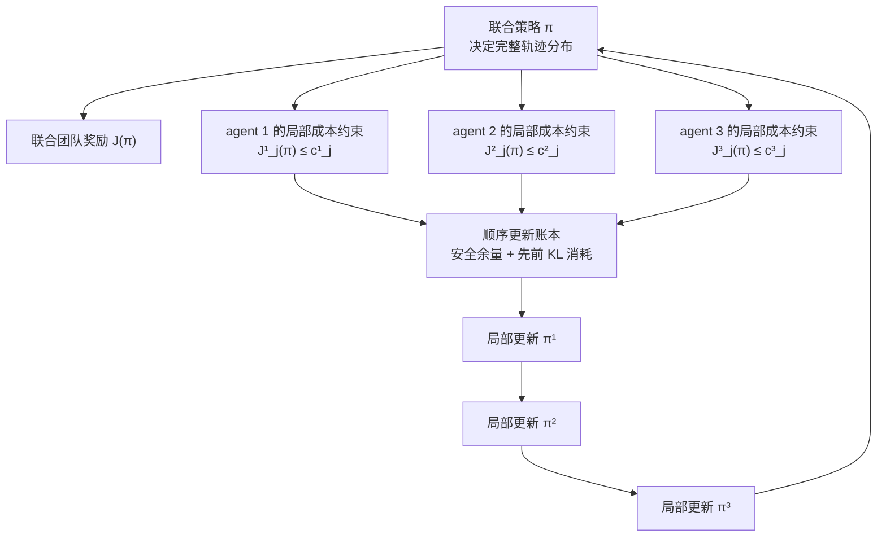

# LR-02 阅读报告：Scal-MAPPO-L 与 AirDefense 全局—局部约束边界

任务状态：`PASSED`  
完成时间：2026-07-29  
实验授权：否  
总体判决：方法家族为 `BASELINE`；约束接口可 `ADAPT`；局部性保证不可直接迁移，记为 `AVOID`；高威胁风险语义仍为 `OPEN`

## 1. 论文身份

| 项目 | 内容 |
| --- | --- |
| 标题 | *Scalable Constrained Policy Optimization for Safe Multi-agent Reinforcement Learning* |
| 作者 | Lijun Zhang、Lin Li、Wei Wei、Huizhong Song、Yaodong Yang、Jiye Liang |
| 会议 | NeurIPS 2024，第 38 届 Neural Information Processing Systems |
| 算法 | Scalable MAPPO-Lagrangian（Scal-MAPPO-L） |
| 官方页面 | <https://proceedings.neurips.cc/paper_files/paper/2024/hash/fa76985f05e0a25c66528308dda33de0-Abstract-Conference.html> |
| 官方 PDF | <https://proceedings.neurips.cc/paper_files/paper/2024/file/fa76985f05e0a25c66528308dda33de0-Paper-Conference.pdf> |
| 核验版本 | NeurIPS 2024 官方 33 页版本 |

公式、图 1–4、Algorithm 1、复杂度和局限性均按官方 PDF 原页码核验。

## 2. 一句话结论

Scal-MAPPO-L 是 AirDefense 必须了解的受约束 MARL 强基线家族，但不是当前
集中式自回归策略的即插即用算法：论文的理论依赖乘积局部策略、空间相关性衰减、
可行初始策略和精确顺序 trust-region 更新，而 AirDefense 三个单元通过共享目标、
动态合法集和自回归前缀发生即时全局耦合。项目可适配其“奖励 critic + 成本 critic
+ 乘子”的 CMDP 接口，却不能继承其可扩展性或安全定理。

## 3. 首要概念纠偏

任务指导中把论文概括为“全局约束分解”。精读后应修正为：

```text
论文：联合团队奖励
      + 每个 agent 的多个局部期望累计成本约束
      + 这些约束通过环境与联合策略发生全局耦合

不是：一个全局共享安全成本
      → 自动分摊成每个 agent 的局部责任
```

论文在 PDF p.3, Eq. 3 定义的是每个智能体的局部成本函数
\(C_j^i(s^i,a^i)\) 及其阈值 \(c_j^i\)。改变任一局部策略会改变联合轨迹分布，
进而可能改变其他智能体的累计成本。这属于“约束满足的联合耦合”，不等于
“当前动作的因果责任已被识别”。

## 4. Problem–Method–Insight

| 层 | 论文内容 |
| --- | --- |
| Problem | 集中式安全 MARL 依赖全局状态和联合信息，随智能体数增长产生通信、计算和非平稳性瓶颈 |
| Method | 在图结构上假设动力学与策略相关性随距离指数衰减；以 \(\kappa\)-hop 状态构造截断 advantage；结合顺序 advantage 分解、TRPO 上下界和局部成本约束 |
| Practical algorithm | 每个智能体配置 actor、奖励价值网络、多个成本价值网络和约束乘子；用 PPO clip 近似理论 trust-region 问题 |
| Insight | 若远端影响足够弱，局部观测造成的 surrogate 误差可随 \(\kappa\) 指数衰减；顺序限制每个局部更新的 KL 半径，可控制联合策略的奖励下降和成本上升 |
| 关键边界 | 理论安全保证属于精确的 Eq. 16；实际 Scal-MAPPO-L 使用 PPO/期望 KL 等近似，作者明确承认可能无法严格维持 Theorem 3.7 |

## 5. 一页公式卡

### 5.1 受约束 Markov 博弈

论文令智能体图为 \(G=(\mathcal N,\mathcal E)\)，全局状态和联合动作分别为
\(\mathcal S=\prod_i\mathcal S_i\) 与
\(\mathcal A=\prod_i\mathcal A_i\)，联合策略是局部策略的乘积：

\[
\pi(a\mid s)=\prod_{i=1}^{n}\pi^i(a^i\mid s^i).
\]

联合奖励目标（PDF p.3, Eq. 2）为：

\[
\max_\pi J(\pi)
=
\mathbb E_{\rho_0,\pi}
\left[
\sum_{t=0}^{\infty}\gamma^t R(s_t,a_t)
\right].
\]

智能体 \(i\) 的第 \(j\) 个成本约束（PDF p.3, Eq. 3）为：

\[
J_j^i(\pi)
=
\mathbb E_{\rho_0,\pi}
\left[
\sum_{t=0}^{\infty}\gamma^t C_j^i(s_t^i,a_t^i)
\right]
\le c_j^i,
\qquad j=1,\ldots,m_i.
\]

这里的 \(J_j^i\) 是联合策略诱导轨迹下的**期望折扣累计成本**。满足该式
不表示每个状态、每条轨迹或每次决策都安全；\(C_j^i\) 也是预先定义的局部
成本，不是论文从全局结果中推断出的责任。

### 5.2 顺序 advantage 与局部 surrogate

论文沿 HAPPO/HATRPO 的顺序更新思想，将联合 advantage 写成逐个智能体的
顺序增量之和（PDF p.4, Lemma 3.1, Eq. 8）：

\[
A_\pi(s,a)
=
\sum_{i=1}^{n}
A_\pi^i(s,a^{-i},a^i).
\]

对前 \(i-1\) 个已更新策略 \(\bar\pi^{1:i-1}\) 和待更新策略
\(\hat\pi^i\)，定义（PDF p.4, Definition 3.2, Eq. 9）：

\[
L_\pi^{1:i}
\left(\bar\pi^{1:i-1},\hat\pi^i\right)
=
\mathbb E
\left[
A_\pi^i(s,a^{1:i-1},a^i)
\right].
\]

期望中的状态来自旧策略占用分布，前缀动作来自已更新策略，当前动作来自
\(\hat\pi^i\)。该量依赖顺序前缀，并不是每个智能体互不相关地最大化自己的
reward。

### 5.3 空间衰减假设

论文用 Dobrushin 影响系数 \(W_{ij}\) 表示智能体 \(j\) 的状态—动作变化对
智能体 \(i\) 局部转移的最大影响。Assumption 2.1（PDF p.3, Eq. 4）要求：

\[
\max_i\sum_j e^{\beta d(i,j)}W_{ij}\le\zeta,
\qquad
\zeta\in[0,2/\gamma).
\]

Assumption 2.2（PDF p.3, Eq. 5）进一步要求远端状态变化对局部策略的影响满足：

\[
\sup
\left|
\pi^i(\cdot\mid s_{\mathcal N_i^\kappa},s_{\mathcal N_{-i}^\kappa})
-
\pi^i(\cdot\mid s_{\mathcal N_i^\kappa},s'_{\mathcal N_{-i}^\kappa})
\right|
\le \xi e^{-\beta\kappa}.
\]

附录 B.2 明确把第二条称为策略类的设计约束；作者也承认准确确定动力学衰减
参数是困难的工程问题，实验中采用保守值。

### 5.4 截断 advantage 上界

令 \(\phi=e^{-\beta}\)。在两条空间衰减假设成立时，
远于 \(\kappa\) 跳的信息变化造成的局部 advantage 差满足（PDF p.4,
Proposition 3.3, Eq. 11；证明见 p.20）：

\[
\sup
\left|
A_\pi^i(z_{\mathcal N_i^\kappa},z_{\mathcal N_{-i}^\kappa})
-
A_\pi^i(z_{\mathcal N_i^\kappa},z'_{\mathcal N_{-i}^\kappa})
\right|
\le \eta\phi^\kappa.
\]

这里存在必须保留的原文公式不一致：

- PDF p.4 的 Proposition 3.3 定义
  \(\eta_{\mathrm{main}}=\xi\gamma\zeta/(1-\gamma\zeta)\)；
- PDF p.20 的证明最后得到
  \(\eta_{\mathrm{app}}=(2+\xi)\gamma\zeta/(1-\gamma\zeta)\)；
- Corollary 3.4 的 \(\eta'\) 也使用 \((2+\xi)\gamma\zeta\) 项。

本报告不替作者静默判定哪一个是排版错误。若需要复现理论界，应先向原文/代码
核对；在保守审计中只能采用较大的附录常数。

进一步，完整顺序 surrogate 与 \(\kappa\)-hop 局部 surrogate 的误差为
（PDF pp.4–5, Corollary 3.4, Eq. 12）：

\[
\left|
L_\pi^{1:i}(\bar\pi^{1:i-1},\bar\pi^i)
-
L_{\pi_\kappa^i}^{i}(\bar\pi_\kappa^i)
\right|
\le \eta'\phi^\kappa,
\]

\[
\eta'
=
\frac{M_i\xi}{1-\gamma}
+
\frac{(2+\xi)\gamma\zeta}{1-\gamma\zeta}.
\]

误差指数衰减不是无条件结论，而是由
“图距离有意义 + 远端影响确实衰减 + 策略类也服从该衰减”共同换取。

### 5.5 奖励改进下界与成本上界

每个智能体按顺序最大化（PDF p.5, Proposition 3.5, Eq. 13）：

\[
\bar\pi_\kappa^i
=
\arg\max_{\hat\pi_\kappa^i}
\left[
L_{\pi_\kappa^i}^{i}(\hat\pi_\kappa^i)
-
\eta'\phi^\kappa
-
\nu_\kappa^i
D_{\mathrm{KL}}^{\max}
(\pi_\kappa^i\Vert\hat\pi_\kappa^i)
\right],
\]

并得到联合回报下界（Eq. 14）：

\[
J(\bar\pi)-J(\pi)
\ge
\sum_i
\left[
L_{\pi_\kappa^i}^{i}(\hat\pi_\kappa^i)
-
\eta'\phi^\kappa
-
\nu_\kappa^iD_{\mathrm{KL}}^{\max}
(\pi_\kappa^i\Vert\hat\pi_\kappa^i)
\right].
\]

对应的成本上界（PDF p.5, Corollary 3.6, Eq. 15）可概括为：

\[
J_j^i(\bar\pi)
\le
J_j^i(\pi)
+
L_{j,\pi_\kappa^i}^{i}(\bar\pi_\kappa^i)
+
\eta''\phi^\kappa
+
\nu_{j,\kappa}^i
\sum_{h<i}
D_{\mathrm{KL}}^{\max}
(\pi_\kappa^h,\bar\pi_\kappa^h).
\]

最后一项说明：第 \(i\) 个局部更新可用的安全余量会被此前智能体的策略变化
消耗。所谓“局部更新”仍携带全局顺序账本。

### 5.6 Theorem 3.7 真正保证了什么

Theorem 3.7（PDF pp.5–6, Eq. 16；证明见 pp.23–24）要求每个智能体：

1. 按固定顺序更新；
2. 在由所有相关约束剩余余量决定的
   \(D_{\mathrm{KL}}^{\max}\le\delta_\kappa^i\) 内搜索；
3. 同时满足自己的成本 surrogate 上界；
4. 把之前智能体已经消耗的 KL/成本余量计入右端；
5. 从已经满足所有成本约束的基策略开始。

在这些条件和前述衰减假设同时成立时，才有：

\[
J(\bar\pi)\ge J(\pi),
\qquad
J_j^i(\bar\pi)\le c_j^i,\quad\forall i,j.
\]

\(\delta_\kappa^i\) 取所有相关智能体、所有成本约束允许更新半径的最小值。
因此它是由联合安全余量产生的保守局部更新预算，不是局部责任分数。附录 C.7
还明确指出，首个半径非负依赖旧策略已经可行；论文没有给出从不可行初始化安全
学习到可行域的同等保证。

### 5.7 实际 Scal-MAPPO-L

每个智能体维护 actor、奖励价值网络和每个成本的价值网络，并引入
\(\lambda_{1:m_i}^i\ge0\)。虽然正文一句称其为 scalar，公式实际上是每个局部
约束一个乘子。Lagrangian advantage（PDF p.6, Eqs. 17–18）为：

\[
A_{\pi_{\theta_\kappa^i}}^{i,(\lambda)}
=
A_{\pi_{\theta_\kappa^i}}^i
-
\sum_{u=1}^{m_i}
\lambda_u^i
\left(
A_{u,\pi_{\theta_\kappa^i}}^i+d_u^i
\right).
\]

实际目标再用 PPO ratio clipping 替换最大 KL 约束（Eq. 20）。这一步提高了
可实现性，却切断了“实际代码必然继承 Theorem 3.7”的逻辑。作者在 PDF p.7
和 p.24 两次明确承认，实践近似可能使严格理论保证无法维持。

## 6. 理论假设清单与 AirDefense 审计

| 条件 | 论文要求 | AirDefense v1 判定 |
| --- | --- | --- |
| 图结构局部性 | 智能体间有稳定图距离，远端影响随距离衰减 | **高度可疑**；3 个单元共享 5 个目标，图直径很小 |
| 动力学衰减 | \(W_{ij}\) 满足 Dobrushin 加权界 | **未验证**；目标存活、资源占用和终止会立即改变全局后续 |
| 策略衰减 | 远端状态对局部策略影响至多 \(\xi e^{-\beta\kappa}\) | **不满足现接口**；策略读取集中状态，前缀动作改变后缀合法集 |
| 乘积局部策略 | \(\pi(a\mid s)=\prod_i\pi^i(a^i\mid s^i)\) | **不满足**；当前是集中式自回归/因子化策略 |
| 局部成本已定义 | \(C_j^i(s^i,a^i)\) 具有明确规范语义 | 直接发射成本可定义；“动作局部责任”被 N1 判为含混 |
| 有界 advantage | 奖励/成本 advantage 及常数界可用 | 有限时域、有限奖励下可界，但项目尚未计算论文所需常数 |
| 可行初始策略 | 更新前联合策略已满足全部约束 | 未冻结预算前无法判定；all-noop 可低成本但不安全 |
| 精确顺序更新 | 每个局部子问题按序求解并记录已消耗余量 | 当前 PPO minibatch 更新不等价 |
| 最大 KL trust region | 使用逐状态最大 KL，而非仅平均 KL/PPO clip | 当前实现不具备；项目还观察到小平均 KL 可跨越 argmax 交战边界 |
| 理论—实现一致 | 实际算法严格执行 Eq. 16 | 论文自身明确否定这一点；Scal-MAPPO-L 是近似算法 |

最关键的不适配不是“领域不同”，而是数学对象不同。AirDefense 中第一个单元
选中某目标后，该目标会立即从后续单元动态合法集中消失；这是一条强的同一步
条件依赖。若把三个防御单元改写为独立 agent，问题的观察结构、策略类和优化
协议都会改变，不能把它当作无成本的符号替换。

另有一个需要作者澄清的理论条件：Assumption 2.1 写
\(\zeta\in[0,2/\gamma)\)，但正文常数含 \(1-\gamma\zeta\)，附录证明还使用
\(\sum_t(\gamma\zeta)^t=1/(1-\gamma\zeta)\)。按通常几何级数收敛和正界解释，
表面上需要更强的 \(\gamma\zeta<1\)。在澄清前，不能仅凭正文给出的
\(\zeta<2/\gamma\) 宣称界有效。

## 7. 论文证据与证据边界

### 7.1 实验设计

- 环境：Safe MAMuJoCo；
- 主比较：IPPO、HAPPO、MAPPO-L、Scal-MAPPO-L；
- 主任务：Safe ManyAgent Ant `2×3 / 3×2 / 6×1`；
- \(\kappa\) 敏感性：6、8、12 智能体任务；
- Scal-MAPPO-L 与 MAPPO-L 使用相同网络结构和公共超参数；
- 所有曲线取至少 3 个随机种子平均并经过时间平滑；
- 最大 \(\kappa\)、\(10^7\) 步墙钟时间分别为 8.43、9.28、11.65 小时；
- 复杂度写为 \(O(TNMHP)\)，其中 \(M\) 是约束数。

### 7.2 实验实际支持

图 1 支持：MAPPO-L 和 Scal-MAPPO-L 在三个 ManyAgent Ant 任务上的成本明显
低于非安全 IPPO/HAPPO，奖励总体保持良好；使用约半数智能体状态的
Scal-MAPPO-L 曲线与 MAPPO-L 接近。

图 2 支持：\(\kappa=1\) 通常奖励最低、成本接近最高；当
\(\kappa\ge3\) 后，性能明显改善，并在个别环境接近或超过 MAPPO-L。

附录 D 支持：更多 Ant 与 Coupled HalfCheetah 曲线呈现类似趋势；作者声明
Scal-MAPPO-L 不做参数共享，公共网络结构和超参数与 MAPPO-L 对齐。

### 7.3 不能过度解读

论文实验不能证明：

- 实际 Scal-MAPPO-L 严格满足 Theorem 3.7；
- 约束在每条轨迹、每个状态或每次动作上都不违反；
- 局部成本等于动作责任；
- 小 \(\kappa\) 已在真实通信系统中降低墙钟时间；
- 曲线接近已经通过统计等价或非劣效检验；
- 方法适用于所有智能体彼此强耦合的任务。

正文只报告“至少 3 个种子”的平滑曲线，没有主表数值、置信区间或预注册
非劣效检验。附录 D.2 反而报告 \(\kappa\) 下降时墙钟时间没有显著下降，因为
实现没有真实模拟信息收发。附录 E.1 说明，如果每个智能体的决策都与所有其他
智能体显著相关，理论结论可能无用；通信量与性能的均衡关系也尚未建立。论文
还没有用实验逐项验证可行初始化、空间衰减常数、最大 KL 半径及精确 Eq. 16，
因此曲线中的低成本不能反向证明定理假设已经满足。

## 8. 全局—局部约束映射图



AirDefense 若把资源成本写为一个团队总预算 \(J_C(\pi)\le c_C\)，它是全局
CMDP 约束；若把每个单元直接发射成本写为 \(J_C^i(\pi)\le c_i\)，才接近本文
的局部约束。无论哪一种，都没有自动回答“某次动作导致的后续替代成本应由谁
承担”。

## 9. 与项目正式证据逐项对照

### 9.1 Task 7：为什么需要显式约束基线

[Task 7](../../experiments/air_defense_v1_task7_formal_100k.md) 的正式 100k ×
5 种子结果表明：

- `time_pressure` 中 Maskable PPO 相对 Hungarian 平均少用 2.544 发弹药，
  资源成本低 1.506，95% CI 均支持稳定下降；
- `heterogeneity_pressure` 中高威胁突防率高 0.044，
  95% CI `[0.001, 0.087]`，安全分配稳定变差；
- 三场景联合分配冲突率为
  `0.0168 / 0.0254 / 0.0188`，均非零。

这说明资源成本与高威胁安全不是一个标量 reward 能稳定代表的同一维度。
Scal-MAPPO-L 的最大项目价值，是把“显式成本 critic 和预算约束”提升为必须
对照的强基线；它不能解决当前自回归动作的唯一分配、顺序偏置或交战校准。

### 9.2 N1：候选 B 的重合判定

[N1 离线语义审计](../../experiments/air_defense_v1_n1_offline_semantic_audit.md)
发现 60.84% 的账本行中，当前动作直接成本为正，而回合成本差非正；N1-P2
因此失败，出口为 N1-E4。

候选 B 若定义为“直接对团队期望累计资源成本施加 CMDP/Lagrangian 约束”，
则其 Problem 和 Method 主干已被 CPO、MAPPO-L 及本文覆盖，不能作为项目核心
算法创新。本文虽采用每 agent 局部成本而非单一团队成本，但二者都属于已知
CMDP 约束范式。

N1 仍有一个与本文不同的问题：本文**假定** \(C_j^i\) 已具有正确局部语义，
没有从回合总成本识别局部动作责任。N1 的测量审计因此不是被本文完全替代，
但它也不能凭语义诊断直接成为在线算法。

### 9.3 RG-MCH：约束优化与信用残差不是同一层

[RG-MCH 压力测试](../../experiments/air_defense_v1_rg_mch_ppo_stress_test.md)
显示：

- 相对 MCH v0，GAE 锚定残差方向在两个场景均改善；
- 仍有 2/6 个运行塌缩；
- 异质场景资源成本达到 factorized PPO 的 125.9%；
- engagement gate 激活率 0.8876，无法识别 Critic 集成共同错误。

RG-MCH 修改“actor 用什么信用更新”；Scal-MAPPO-L 修改“奖励最大化时如何
显式满足成本约束”。两者不互相替代。该论文对 RG-MCH 的直接压力是：若未来
算法同时声称安全和资源可控，就必须与显式 CMDP/Lagrangian 基线比较，不能只
用反事实残差和 reward 改善证明约束成立。

## 10. 五个强制问题的结论

### 10.1 Scal-MAPPO-L 能否作为项目强基线

**条件性可以，但分两层。**

1. 必须基线：保持当前集中式 factorized/autoregressive PPO，增加成本 critic、
   乘子和显式预算的 `centralized constrained factorized PPO` 或
   MAPPO-L 风格基线。它与当前问题结构最公平。
2. 结构性基线：只有在把三个单元正式重构为独立 agent、冻结局部观察和通信图
   后，才可加入 Scal-MAPPO-L；此时必须同时保留全局状态 MAPPO-L 以分离
   “受约束优化”与“局部化”的效果。

因此，Scal-MAPPO-L 是必须进入相关工作和基线设计的算法家族，但当前不能直接
替换主干并宣称公平对照。

### 10.2 资源成本适合做期望累计约束吗

**适合，但只在以下规范目标下：**

- 研究目标确实是限制策略的期望折扣回合资源消耗；
- 成本是非负、逐步可加且训练/评估折扣和回合定义一致；
- 预算在看结果前冻结，并存在可行策略；
- 接受动作替代引起的后续成本变化是联合策略真实后果；
- 不把约束乘子或 cost advantage 解释成局部因果责任。

**反例：**

- 若要求“某一动作应承担多少成本”，期望总成本不够，N1 已证明符号会被替代
  效应掩盖；
- 若要求每个回合都不得超预算，期望约束允许跨回合补偿；
- 若 all-noop 以极低资源成本满足预算却导致高威胁漏防，单独资源约束会奖励
  错误安全行为；
- 若训练用折扣成本、论文报告用未折扣成本，两者不是同一约束。

### 10.3 高威胁突防应是目标还是约束

| 建模方式 | 后果 |
| --- | --- |
| reward 惩罚项 | 可与资源、普通目标和其他收益交易；权重变化会改变安全语义 |
| 期望累计约束 | 可限制平均漏防次数/损伤，但仍允许关键回合或状态中的严重违反 |
| chance/CVaR/轨迹约束 | 更接近“低概率灾难也不可接受”，但超出本文的方法和保证 |
| shield/硬规则 | 可保证指定局部动作不可执行，但需要明确模型或安全规则 |

Task 7 已显示异质场景存在稳定高威胁退化，因此下一次算法比较至少要把
高威胁漏防作为独立安全指标；究竟冻结为期望约束、尾部风险约束还是硬规则，
仍属于人工规范选择，不能由本文自动决定。

### 10.4 局部责任是安全保证所必需吗

**不是全局期望安全保证的必要条件。** 若团队资源成本或高威胁成本的定义和预算
已经明确，直接对其施加 CMDP 约束即可，不必先回答每个动作“应负多少责任”。

**但它是以下主张的必要前置：**

- 给每个单元分配可解释的独立预算；
- 用局部成本标签训练单元级 credit；
- 声称某一当前动作造成了多少后续资源浪费；
- 把局部乘子解释为责任而不仅是优化变量。

本文解决的是局部策略更新如何不破坏联合约束，不是局部责任如何从全局结果
识别。

### 10.5 集中式 factorized PPO 如何公平对照

必须先建立同结构的受约束版本，再讨论多 agent 局部化；否则同时改变策略结构、
观察范围和优化目标，无法归因。

## 11. 强基线最小接口

本节只定义接口，不授权实现或训练。

| 接口项 | 最低要求 |
| --- | --- |
| 环境 | 同一 AirDefense 环境、状态、转移、reward、episode horizon |
| 主策略 | 保持当前 factorized/autoregressive actor、单元顺序和动态 mask |
| reward critic | 与 factorized PPO 完全一致 |
| cost signal | 至少单列逐步资源成本；高威胁漏防若入约束必须单列，不与资源合并 |
| cost critic | 每个冻结约束一个价值头和 advantage；不得用 N1 含混账本冒充局部成本 |
| 乘子 | 每个约束一个非负乘子，更新规则、初值、上限和预算预先冻结 |
| PPO 语义 | 使用完整联合动作 ratio/clipping；不能在“关闭约束”时残留独立层级 clip |
| 严格 fallback | 所有乘子/约束系数为零时，参数、loss、ratio、mask 和梯度应退化为原 factorized PPO |
| 公平控制 | 相同网络容量、优化器、训练步数、PPO epoch、场景、种子和评估回合 |
| 评价 | reward、损伤、截获、高威胁漏防、资源成本、all-noop、浪费交战、冲突、非法动作、时间 |
| 统计 | 至少延续 5 个独立训练种子、配对评估和 95% CI；若声称非劣，预注册非劣界值 |
| 可行性 | 单独报告每个约束的可行率、平均超限量和最坏/尾部超限，不只报告乘子值 |

若以后增加单位级 Scal-MAPPO-L，另需固定每个单元的局部观察、单元图与
\(\kappa\)、目标唯一分配机制、参数共享设置、同容量全局 MAPPO-L、
\(\kappa\) 消融和真实通信成本。

## 12. 创新压力测试

| 候选主张 | 相对本文的创新距离 | 判定 |
| --- | --- | --- |
| 用 Lagrangian 限制期望累计资源成本 | 极低 | 已是标准安全 RL/MAPPO-L 范式，删除创新主张 |
| 多个单元各自配置成本 critic/乘子 | 极低 | 本文明确覆盖每 agent 多约束 |
| 顺序更新实现联合安全与改进 | 极低 | Theorem 3.7 与 HAPPO/HATRPO 路线已覆盖 |
| 用 \(\kappa\)-hop 局部信息减少通信 | 低，且项目规模不匹配 | 三单元强耦合下不应作为主线 |
| 动态 AR 合法集下的全局约束—局部责任接口 | 中，但尚未定义 | 本文不解决责任识别；仍需 Problem–Method–Insight 闭环 |
| 小平均 KL 下交战 argmax 边界仍发生离散塌缩 | 中，已有项目证据 | 可形成新的约束优化压力问题，但尚非算法 |
| 期望资源约束与高威胁尾部风险同时满足 | 中 | 本文只处理期望成本；需 LR-03 继续审计多约束冲突 |

不能把“应用于防空”“把 agent 改名为防御单元”或“使用自己的 cost 指标”
写成算法创新。

## 13. `BASELINE / ADAPT / AVOID / OPEN` 判决

| 标签 | 判决 |
| --- | --- |
| `BASELINE` | 显式 CMDP/Lagrangian 成本约束是后续安全—资源算法的必备强基线；Scal-MAPPO-L 是局部化受约束 MARL 的相关工作基线 |
| `ADAPT` | 先在当前集中式 factorized PPO 上适配独立成本 critic、约束乘子、预算和严格 joint-PPO fallback |
| `AVOID` | 不直接把三个策略因子称为独立 agent；不继承空间衰减、可扩展性或 Theorem 3.7 安全保证；不把期望约束称为逐状态安全 |
| `OPEN` | 高威胁漏防应采用期望、chance、CVaR 还是硬约束；全局约束与局部责任是否需要双层接口；小 KL 如何约束离散交战边界 |

总体路线是：

```text
先把“显式约束优化”固定为强基线
                ↓
保持当前联合动作语义做同结构公平对照
                ↓
将局部责任、尾部风险和离散边界视为未解问题
                ↓
不因采用 Lagrangian 或多 cost critic 声称算法创新
```

## 14. 验收自审

| LR-02 通过条件 | 结果 |
| --- | :---: |
| 区分全局约束与局部责任 | 通过；见第 3、8、10.4 节 |
| 重建核心公式 | 通过；见第 5 节 |
| 列出顺序保证的关键条件 | 通过；见第 5.6、6 节 |
| 区分理论算法与实践近似 | 通过；见第 5.7、7.3 节 |
| 审计原文公式一致性 | 通过；见第 5.4、6 节 |
| 对照 Task 7、N1、RG-MCH | 通过；见第 9 节 |
| 定义公平强基线接口 | 通过；见第 11 节 |
| 给出不可直接迁移点 | 通过；见第 6、13 节 |
| 不以领域应用充当创新 | 通过；见第 12 节 |
| 不提出实现或训练预算 | 通过 |

## 15. 移交 LR-03

LR-03 应携带以下已冻结问题：

1. 资源成本与高威胁漏防必须作为不同约束/风险量审计；
2. Scal-MAPPO-L 的多个成本乘子已覆盖“多约束存在”，创新不能只来自多加一个
   cost critic；
3. 需要重点考察多个约束梯度冲突、预算不可同时满足和乘子振荡；
4. 期望累计约束不能代表尾部或逐轨迹安全；
5. 任何候选必须保持关闭约束时的严格 joint factorized PPO fallback；
6. 项目的离散交战边界可能使小平均 KL 不等于行为稳定，应检查现有方法是否覆盖。

LR-02 不授权 LR-03 之外的算法实现、在线训练或预算扩展。

## 16. 术语表与来源锚点

| 英文 | 本报告译法 | 原文锚点 |
| --- | --- | --- |
| constrained Markov game | 受约束 Markov 博弈 | PDF pp.2–3 |
| spatial correlation decay | 空间相关性衰减 | PDF p.3；Appendix B, pp.17–18 |
| Dobrushin condition | Dobrushin 条件 | PDF p.3, Eq. 1 |
| \(\kappa\)-hop policy | \(\kappa\)-跳局部策略 | PDF p.3 |
| multi-agent advantage decomposition | 多智能体顺序 advantage 分解 | PDF p.4, Lemma 3.1 |
| surrogate return | surrogate 回报 | PDF p.4, Definition 3.2 |
| truncated advantage | 截断 advantage | PDF pp.4–5 |
| max-KL trust region | 最大 KL trust region | PDF pp.5–6 |
| safety slack | 安全余量 | PDF pp.6, 23–24 |
| Lagrangian multiplier | Lagrangian 乘子 | PDF p.6 |
| Scal-MAPPO-L | 可扩展 MAPPO-Lagrangian | PDF pp.6–7, p.24 |

### 关键来源索引

- 摘要、问题和贡献：PDF pp.1–2；
- 受约束 Markov 博弈：PDF pp.2–3，Eqs. 1–3；
- 空间衰减假设：PDF p.3，Eqs. 4–5；Appendix B, pp.17–18；
- 顺序 advantage 与截断误差：PDF pp.4–5，Eqs. 8–12；
- 奖励下界、成本上界与联合保证：PDF pp.5–6，Eqs. 13–16；
- Lagrangian 与 PPO 实现：PDF pp.6–7，Eqs. 17–20；
- Algorithm 1 和实践保证边界：PDF p.24；
- 主实验图：PDF pp.7–8，Figures 1–2；
- 额外实验和公平设置：PDF pp.25–26，Figures 3–4；
- 复杂度和墙钟时间：PDF p.26；
- 局限性：PDF pp.26–27。
