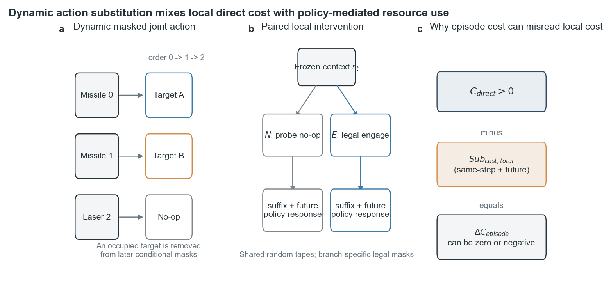
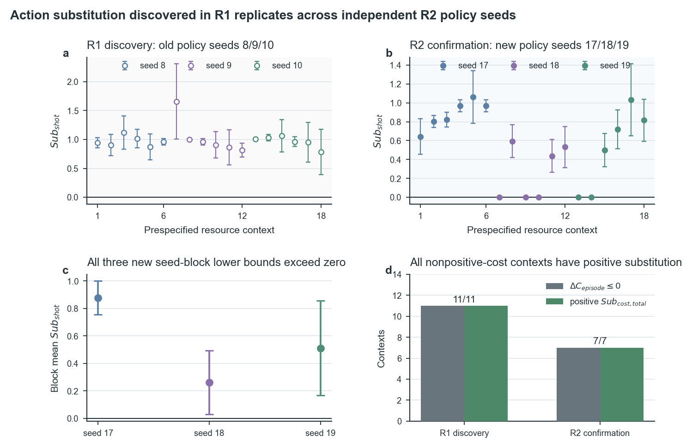
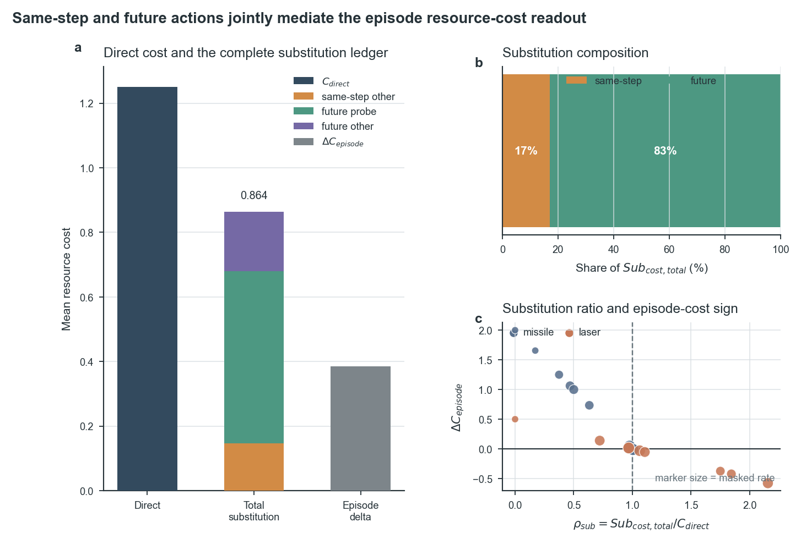
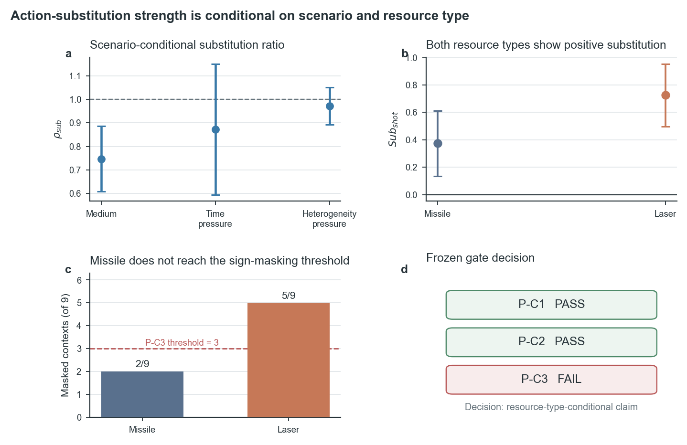

# 防空资源编组项目工作进展总结报告

汇报日期：2026-07-31  
汇报主题：反事实资源成本测量、联合策略优化与动态支持域创新路线

## 一、阶段工作概览

当前研究围绕 AirDefense v1 动态防空资源编组环境展开。每个决策步需要为 3 个
异质防御单元分配至多 5 个动态目标，联合动作受到弹药、射程、冷却、目标存活和
同一步目标占用的共同约束。项目已经形成两条相互衔接的成果线：

1. **测量与诊断线**：研究当前交战动作的直接资源消耗为何会与同一步后缀动作和
   未来策略响应混合，建立可复核的成对反事实成本账本；
2. **算法创新主线**：从联合动作合法性、no-op 塌缩和反事实信用不稳定出发，
   依次检验 Q-Critic、MCH/RG-MCH、BPCE、FCRC 等候选，最终将当前主候选
   收敛为动态支持敏感信赖域 DS-TR。

阶段工作的核心变化不是继续增加算法模块，而是把“现象—测量—机制—干预”
分开验证。未通过门控的候选被明确停止，只有能够通过预注册机制门的路线才进入
下一阶段训练。

---

## 二、专题论文：动态掩码序列分配中的资源成本成对反事实审计

### 2.1 研究问题

在自回归联合动作中，动作按单元顺序 \(0\rightarrow1\rightarrow2\) 生成。
前序单元选择目标后，该目标会从后续单元的合法集合中移除。因此，当前单元的
engage/no-op 决策不仅产生直接资源成本，还可能改变：

- 同一步中其他单元的后缀动作；
- 被测单元未来是否再次交战；
- 其他单元未来是否接替射击；
- 回合累计资源成本和最终安全结果。

所以，简单使用

\[
\Delta C_{\mathrm{episode}}
=C_{\mathrm{episode}}(E)-C_{\mathrm{episode}}(N)
\]

作为当前动作的局部成本标签，会把直接消耗和后续动作替代混在一起。论文研究的
不是重新提出一般反事实信用，而是回答一个更具体的测量问题：

> 在动态掩码、自回归联合动作和冻结策略延续下，回合累计成本差究竟包含哪些
> 动作路径，能否被逐项重构？



图 1 说明当前 engage 动作会改变同一步后缀合法集和未来策略响应。即使当前
直接成本 \(C_{\mathrm{direct}}>0\)，总替代成本也可能抵消这部分消耗，使
\(\Delta C_{\mathrm{episode}}\) 接近零或变为负值。

### 2.2 方法框架

研究固定 AirDefense v1 的 factorized joint PPO，不在确认阶段更新 Actor。
对每个冻结状态和被测单元构造两个局部分支：

- \(N\)：当前被测单元强制 no-op；
- \(E\)：当前被测单元强制对合法目标 engage。

两个分支从同一环境快照出发，使用共同随机数（CRN）对齐环境和策略随机性。
当前合法目标不随机抽取，而是按照条件于 engage 的目标概率进行精确边缘化。
分支内后续单元始终重新计算合法动作掩码，避免强行固定已经变为非法的动作。

完整替代成本被拆为三项：

\[
Sub_{\mathrm{cost,total}}
=Sub_{\mathrm{cost,same}}
+Sub_{\mathrm{cost,future,probe}}
+Sub_{\mathrm{cost,future,other}},
\]

并满足逐账本恒等式：

\[
\boxed{
\Delta C_{\mathrm{episode}}
=C_{\mathrm{direct}}-Sub_{\mathrm{cost,total}}
}.
\]

其中：

- \(Sub_{\mathrm{cost,same}}\)：同一步其他单元的动作替代；
- \(Sub_{\mathrm{cost,future,probe}}\)：未来被测单元的动作替代；
- \(Sub_{\mathrm{cost,future,other}}\)：未来其他单元的动作替代。

该框架将“共同随机数降低方差”和“账本结构是否完整”明确分开：CRN 提高成对
估计精度，但只有完整动作路径记账才能解决测量混合。

### 2.3 实验设计

实验分为机制发现 R1 与独立确认 R2。

| 项目 | R1 机制发现 | R2 独立确认 |
|---|---:|---:|
| 策略种子 | 8/9/10 | 17/18/19 |
| 场景 | 压力场景 | medium/time/heterogeneity |
| 来源模型 | 旧冻结模型 | 9 个无行为筛选新模型 |
| 确认上下文 | 18 个资源上下文 | 108 个新上下文 |
| 每上下文配对重复 | 32 | 32 |
| R2 总配对重复 | — | 3,456 |
| R2 目标条件账本 | — | 7,776 行 |
| 与旧正式观测 hash 重叠 | — | 0 |

统计单位严格区分 ledger row、repeat、context 和场景—策略种子 block，不把
目标条件账本行错误当作独立上下文。

### 2.4 主要实验结果

#### 结果一：正动作替代在新策略种子上复现



R1 中 18/18 个资源上下文出现正的未来替代射击；R2 独立确认中：

- 13/18 个上下文的平均 \(Sub_{\mathrm{shot}}>0\)；
- 13/18 个上下文的 95% 下界大于 0；
- seeds 17/18/19 的三个 block 下界全部大于 0；
- 7/7 个非正累计成本上下文均具有正总替代。

这表明“当前交战会替代同一步或未来其他射击”不是旧种子上的偶发现象。

#### 结果二：同一步项不可省略，未来项占主导

首轮 future-only 公式漏掉了同一步其他单元的后缀动作变化，导致 7,776 条目标
账本中 287 条出现非零残差，最大残差为 2.0。加入
\(Sub_{\mathrm{cost,same}}\) 后，完整恒等式最大误差降至
\(8.88\times10^{-16}\)，Actor 参数差为 0。



在 `time_pressure/resource` 上下文中：

- 平均总替代成本为 0.864；
- 同一步替代为 0.147，约占 17%；
- 未来替代为 0.718，约占 83%；
- 平均回合成本差仅为 0.384。

因此，增加 rollout 可以降低随机误差，却不能把包含后续策略响应的回合成本自动
变成当前动作的纯局部成本。

#### 结果三：机制存在，但不跨资源类型普遍成立



| 分层 | Context 数 | 平均替代射击 | 平均替代比率 \(\rho_{\mathrm{sub}}\) | 成本符号掩盖率 |
|---|---:|---:|---:|---:|
| medium | 18 | 0.544 | 0.747 | 0.620 |
| time pressure | 18 | 0.550 | 0.873 | 0.589 |
| heterogeneity pressure | 18 | 0.876 | 0.972 | 0.865 |
| missile（time/resource） | 9 | 0.373 | 0.571 | 0.517 |
| laser（time/resource） | 9 | 0.726 | 1.175 | 0.660 |

P-C1 完整账本门与 P-C2 独立确认门通过，但 P-C3 跨资源类型普遍性门失败：
missile 只有 2/9 个上下文发生平均成本符号掩盖，低于至少 3 个的冻结门槛；
laser 为 5/9。由此保留“资源类型条件性”结论，不把结果外推为任意资源的普遍
规律。

### 2.5 论文内容框架

论文按“测量问题—审计协议—独立确认—失败边界”组织：

1. Introduction：提出动态掩码序列分配中的局部成本测量问题；
2. Related Work：区分反事实信用、时序信用、顺序 MARL 和资源约束；
3. Problem Formulation：定义 AirDefense v1、factorized joint PPO 和估计对象；
4. Method：N/E 配对、CRN、目标边缘化和三分量成本账本；
5. Experimental Protocol：R1/R2 独立性、统计单位与冻结门控；
6. Results：公式修正、机制复现、成本组成和资源类型边界；
7. Discussion：解释测量有效性及其对在线信用算法的要求；
8. Limitations：限定环境、策略、顺序、资源类型和统计范围；
9. Conclusion：定位为可复核的测量与诊断模块，而非已验证的在线 PPO 改进。

论文保留三项有限贡献：明确测量问题、建立三分量成对反事实账本、在新种子和新
上下文上确认机制并保留失败边界。

---

## 三、主线算法与实验推进

### 3.1 基础策略：从结构合法到 factorized joint PPO

主线首先解决联合动作结构问题：

1. **Maskable PPO**：使用环境合法动作掩码，但不能处理多个单元对同一目标的
   同步冲突；
2. **Conflict-free joint action**：在联合动作级避免目标冲突；
3. **Autoregressive policy**：按固定单元顺序生成条件动作；
4. **Factorized engagement-target joint PPO**：把每个单元动作拆为
   engage/no-op 和条件 target，同时保留 joint log-prob、joint PPO ratio 与
   单一 joint clipping。

factorized joint PPO 成为后续所有创新实验的安全主干。它改善了动作语义和部分
高威胁未分配问题，但 30k 正式筛选仍有明显种子分叉：最坏场景平均 all-noop
达到 0.533，冻结门要求不超过 0.02，19 项门槛只通过 6 项。因此，结构合法和
动作因子化不能单独解决 deterministic no-op 塌缩。

固定探针进一步表明：失败策略的交战概率并未完全归零。例如 seed 1 的平均总
交战概率为 0.4726，no-op 概率为 0.5274，但 deterministic argmax 在三个场景
均表现为 100% no-op。这说明问题同时包含概率碎片化、0.5 决策边界跨越和 PPO
随机种子分叉。

### 3.2 动作条件 Q-Critic：数值拟合不等于动作排序

非图 Q-Critic 在 338/117/116 的分组数据划分上训练。三个种子的动作回报 MAE
相对 \(V(s)\) 均改善 36.4%—40.1%，但：

- 总体动作排序只有 0.25—0.375；
- engage/no-op 符号和 target 排序均未达到门槛；
- 整体通过种子为 0/3。

分层 Q-Critic 后，target 排序提高到 0.83—0.87，说明“给定 engage 后选哪个
目标”相对可学；但 engage/no-op 判别只有 0.588—0.706，相对基线平均下降
0.255。这个结果把瓶颈定位到规范性的交战决策，而不是目标关系建模能力。

### 3.3 MCH-PPO 系列：离线反事实信用无法稳定替代在线 joint GAE

| 方法 | 核心机制 | 10k 同场景塌缩 | 主要阳性 | 主要失败 |
|---|---|---:|---|---|
| MCH-PPO v0 | 冻结层级 Q-Critic，反事实 advantage 替代 joint GAE | 3/6 | 结构合法 | 突防和损伤恶化 |
| RG-MCH-PPO | joint GAE 锚定 + reliability-gated residual | 2/6 | 异质场景奖励与安全改善 | 成本比 1.259，可靠度无法识别共同错误 |
| SA-RG-MCH-PPO | 数据支持度 × ensemble agreement + 初始 KL 锚定 | 5/6 | 诊断出训练支持严重不足 | 没有严格回退到 factorized joint PPO |

MCH v0 证明直接用冻结 Critic 信用替代 GAE 会沿新访问分布产生严重漂移。
RG-MCH 的异质场景平均奖励提高 14.49、损伤降低 0.320，说明 GAE 锚定方向有效；
但仍有 2/6 塌缩，且异质场景成本为基线的 125.9%。

SA-RG 的 engagement/target context support 只有 0.1244/0.0218，反事实残差
几乎被完全关闭；然而算法仍有 5/6 塌缩。原因是它关闭辅助残差后仍采用两层独立
ratio 和 clipping，没有恢复 factorized PPO 的 joint ratio 与 joint clipping。
由此冻结了一条重要算法契约：

> 任何后续创新关闭时，必须严格恢复原 factorized joint PPO，而不是只做到
> “辅助项接近零”。

### 3.4 BPCE-PPO：在线边界标签可运行，但覆盖、方向和资源成本不稳定

BPCE 在当前 rollout 的 engagement 边界附近运行成对反事实探测，并以辅助系数
0.05 加入 joint PPO。软件验收通过，但正式 10k 结果为：

| 场景 | 奖励差 | 损伤差 | 高威胁突防差 | 成本比 | all-noop 不劣种子 |
|---|---:|---:|---:|---:|---:|
| time pressure | -24.953 | +0.587 | +0.153 | 0.597 | 1/3 |
| heterogeneity pressure | +21.686 | -0.509 | -0.129 | 1.928 | 2/3 |

异质场景存在安全阳性，但资源成本达到基线的 1.928 倍；6 个同场景运行仍有
2 个塌缩。边界探测只在一个场景优于等预算随机探测，训练时间为 1.940 倍。
后续标签审计还发现双向 ENGAGE/STOP 覆盖不足，因而 BPCE 被停止，不再通过
扩大样本、改辅助系数或追加 target 辅助挽救。

### 3.5 FCRC：静态指标可定义，但没有独立增量预测价值

FCRC（Future Coverability Responsibility Contrast）衡量当前动作消耗某资源
后，对其他带 TTI 威胁的未来最大可覆盖能力造成的变化。

静态审计阶段结果积极：

- 34 个上下文出现责任跨度，35.39% 动作为正；
- 与单元成本、目标权重的相关均远低于 0.90；
- 平均计算 1.02 ms；
- 形式、非退化、非换名和计算门全部通过。

但冻结的独立成对预测验证未通过：

- high-low 截获损害差均值为 0.0184，但单侧符号翻转 \(p=0.351\)；
- FCRC 与候选截获损害 Spearman 为 0.415；
- 加入 FCRC 后留一区组 CV MAE 改善约为 0%；
- high-low 泄漏损伤差为 -0.050。

因此 FCRC 停止算法化。该结果说明“可计算、非退化、具有相关性”仍不足以成为
在线优化信号，必须证明独立增量价值和安全方向一致。

### 3.6 文献基线如何收窄创新空间

| 文献算法 | 可吸收内容 | 不能直接作为当前创新 |
|---|---|---|
| 反事实效应分解 | 区分行为路径、状态路径和事实解释 | 解释量不能直接当 PPO advantage |
| GradS | 记录多成本梯度夹角、范数和冲突 | 当前缺少可靠成本 Critic，不宜先优化错误目标 |
| PASPO | 可行支持上的自回归采样、顺序初始化控制 | 自回归可行采样和联合 log-prob 已有覆盖 |
| COSAC/SeqAU | 前缀条件顺序信用、直接/间接影响 | contextual bandit 不覆盖完整 MDP 动态支持 |
| OCR-CFT | 评价重构、改进方向对齐、在线回退 | 当前离线 Actor/Critic 覆盖不足，乐观重构不构成证书 |

定向阅读排除了“再做一种顺序信用分解”“增加一个 Critic”“增加梯度塑形”这类
伪创新，把真正未解决的问题收窄到动态支持域下的优化几何。

### 3.7 当前主候选：动态支持敏感信赖域 DS-TR

DS-TR 关注自回归前缀动作改变后，后续仍可达的合法联合动作集合如何变化。普通
KL 只度量概率分布的平滑变化，却可能忽略一个很小的 engagement 概率变化跨过
deterministic argmax 边界后，引发后续合法支持域的大幅跳变。

当前 v0 主度量以可行后缀集合的 Jaccard 距离定义结构风险，并以旧策略概率对
新旧动作变化加权。与 FCRC、BPCE 和 MCH 不同，它：

- 不依赖反事实环境 rollout；
- 不依赖冻结 Q-Critic；
- 不使用资源责任标签；
- 直接读取环境合法掩码和自回归前缀结构；
- 关闭时可以严格回退到原 joint PPO。

已完成的 DS-0 冻结重放审计表明，DS 在基础变量之外具有增量解释力：

| 结构结果 | AUROC 增量 | BA 增量 | 场景方向 | seed-block 方向 |
|---|---:|---:|---:|---:|
| 高威胁合法但未分配变化 | 0.0665 | 0.0551 | 2/2 非负 | 6/6 非负 |
| 前缀阻断变化 | 0.0879 | 0.1008 | 2/2 非负 | 6/6 非负 |
| engagement 极端方向 | 0.0028 | 0.0000 | 2/2 非负 | 2/6 非负 |

前两个结果的 bootstrap 下界均大于 0，max-T FWER \(p=0.000999\)。普通
downstream argmax flip 的最大增量只有 0.0120，不能解释 DS 的主要增量。
第三个结果未通过，所以当前只支持两类结构失败，不外推为所有退化模式。

DST-05.5 已冻结唯一时间轴 `rollout_update_index`，并完成两路各 512-step 的
真实 Callback 预检。两轮 actions、rewards、dones、advantages、returns、
PPO 指标、最终参数、优化器状态和 RNG 全部等价；三次独立事件评估没有污染训练
状态。该结果只证明 DS-1 数据接口有效，不构成时序先行性或算法收益证据。

---

## 四、算法路线对比与阶段判断

| 路线 | 主要解决对象 | 项目内最强证据 | 当前状态 |
|---|---|---|---|
| Factorized joint PPO | 联合动作结构与 engage/target 语义 | 严格 joint PPO 主干 | 保留为 baseline |
| Q-Critic / hierarchical Q | 动作价值与目标排序 | target 排序 0.83—0.87 | 仅保留诊断 |
| MCH / RG-MCH / SA-RG | 反事实信用接入在线 PPO | GAE 锚定有局部阳性 | 停止主创新 |
| BPCE-PPO | 在线边界反事实标签 | 异质场景安全改善 | 因覆盖和成本失败停止 |
| FCRC | 未来可覆盖责任 | 静态非退化、计算快速 | 独立预测门失败，停止 |
| DS-TR | 动态支持域扰动与策略更新稳定性 | DS-0 增量机制门通过 | 当前主候选，等待 DS-1 |

主线演化呈现出一致规律：

1. **低误差不等于正确排序**；
2. **解释相关性不等于规范优化信号**；
3. **小 KL 不等于 deterministic 行为稳定**；
4. **关闭辅助项不等于严格恢复 baseline**；
5. **静态机制阳性不等于更新级先行，更不等于算法收益**。

---

## 五、下一阶段发展方向与创新思路

### 5.1 最近一步：完成 DS-1 更新级先行性验证

下一阶段只运行冻结的：

```text
scenario: heterogeneity_pressure
requested budget: 10k（实际 10,240 steps）
policy seeds: 8/9/10
algorithm: factorized engagement-target joint PPO
```

比较三组预测器：

- K0：KL + clip fraction + entropy；
- K1：K0 + 普通前缀动作翻转；
- K2：K1 + DS 加权翻转。

只有 K2 在未来 1—3 个 rollout 更新的塌缩预测上提供稳定增量，DS-TR 才进入
算法实现。

### 5.2 条件通过后：实现最小 DS-TR v0

DS-TR v0 应坚持最小干预：

- 保留标准 joint PPO surrogate；
- 只增加单一动态支持扰动约束；
- 辅助系数为零时逐位恢复 factorized joint PPO；
- 与普通 KL、普通 churn 和 PASPO 启发的可行后缀均匀初始化做增量对照；
- 不同时加入 Critic、BPCE、GradS、reward shaping 或 GNN。

### 5.3 可进一步形成的创新方向

1. **位置与状态条件的 DS 预算**  
   若固定 DS-TR v0 有效，可研究早期自回归位置和高威胁状态是否需要更严格的
   支持域预算，避免统一阈值过度冻结后期动作。

2. **从集合 Jaccard 到概率质量运输**  
   在 v0 通过后，可把离散支持变化扩展为带结构代价的最优传输距离，同时保持
   精确 fallback；该方向需要专项查新和独立消融。

3. **测量诊断与优化几何的正交结合**  
   成对成本账本可用于解释资源信用混合，DS 用于约束策略更新的结构级联。两者
   可以在分析层共同解释失败，但在机制未通过前不应合并成复合训练目标。

4. **跨场景、跨顺序与跨资源确认**  
   最终算法需要验证不同单元顺序、更多异质资源和新环境机制，特别要确认收益
   不是来自冻结坏策略、降低交战率或偶然修复初始化偏置。

### 5.4 阶段目标

近期目标是回答一个可证伪问题：

> 动态支持域扰动是否比普通 KL 和普通动作翻转更早地预测联合行为塌缩？

若答案为否，DS-TR 路线将停止，并保留“动态支持具有静态解释力但没有更新级
先行性”的阴性结论；若答案为是，才进入最小算法干预与跨场景筛选。这样的门控
设计保证后续创新建立在已验证机制上，而不是建立在模块叠加或个别种子结果上。

---

## 六、汇报结论

1. 专题论文围绕动态掩码序列分配中的资源成本测量问题，建立了 N/E 配对、
   CRN、目标精确边缘化和三分量逐时刻成本账本；
2. 新策略种子和新上下文确认了动作替代机制，同时明确了 missile/laser 的
   资源类型边界；
3. 主线已经系统检验 Q-Critic、MCH/RG-MCH、BPCE 和 FCRC，阴性结果共同排除
   了冻结 Critic、单边标签、简单 KL 锚定和静态责任指标的直接算法化；
4. 当前创新主候选收敛为 DS-TR，DS-0 增量机制门和真实 Callback 预检已经通过；
5. 下一阶段仍是诊断先行：先验证 DS 的更新级先行性，再决定是否实现 DS-TR。

## 主要项目内证据来源

- `docs/manuscript/action_substitution_cost_identifiability/final_manuscript_zh.md`
- `docs/manuscript/action_substitution_cost_identifiability/figure_table_plan.md`
- `docs/experiments/air_defense_v1_task12_noop_stability.md`
- `docs/experiments/air_defense_v1_task14_q_critic.md`
- `docs/experiments/air_defense_v1_task14_hierarchical_q.md`
- `docs/experiments/air_defense_v1_mch_ppo_mechanism_stress_test.md`
- `docs/experiments/air_defense_v1_rg_mch_ppo_stress_test.md`
- `docs/experiments/air_defense_v1_sa_rg_mch_ppo_stress_test.md`
- `docs/experiments/air_defense_v1_bpce_ppo_stress_test.md`
- `docs/experiments/air_defense_v1_n3_fcrc_paired_predictive_validation.md`
- `docs/experiments/air_defense_v1_ds0_dynamic_support_audit.md`
- `docs/experiments/air_defense_v1_dst05_5_event_timeline_preflight.md`

