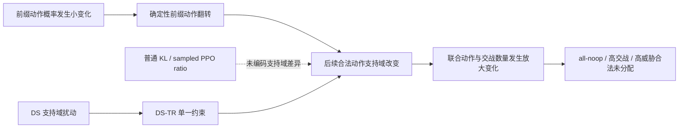

# AirDefense-v1 六篇定向阅读综合与算法创新决策

日期：2026-07-29  
文档性质：研究决策与最小验证设计，不授权修改算法、启动训练或改变已冻结结论  
输入范围：LR-01—LR-06 阅读报告、现有算法实验总复盘、已冻结正式实验报告  
决策状态：**推荐进入“动态支持域扰动”零训练诊断；算法实现须等待诊断门通过**

---

## 0. 执行结论

六篇论文没有提供一个可以直接移植并合理宣称为本项目创新的现成模块。它们真正带来的价值，是共同排除了几条看似自然、实际已经被文献覆盖或被本项目数据否决的路线：

- 不能把反事实解释量直接当成 PPO advantage；
- 不能把 Lagrangian、多成本 Critic 或梯度筛选本身当作算法创新；
- 不能把“自回归 + 动态掩码”当作创新；
- 不能把局部顺序反事实信用当作尚未解决的新问题；
- 不能用小 KL、历史最优教师或离线 Critic 乐观重构替代在线改进方向的可靠性证明；
- 不能重新开启已被双向标签覆盖失败否决的 BPCE 标签路线。

当前最值得验证的创新假设是：

> **动态支持敏感信赖域（Dynamic-Support-Sensitive Trust Region，DS-TR）**：在集中式自回归策略中，不只限制动作概率或联合 log-prob 的变化，还限制前缀策略更新对后续合法联合动作支持域的扰动，从而抑制“小 KL、大全局行为跳变”的离散策略崩塌。

这不是把六篇论文拼接起来。它只针对一个项目中已反复出现、且六篇论文均未直接处理的机制：**前缀动作跨过离散边界后，会改变后续单元的合法动作集合；普通 PPO 的概率信赖域没有表示这种组合结构的变化代价。**

但当前证据还不足以直接实现 DS-TR。最合理的下一步是先做一个不训练模型的 **DS-0 动态支持域扰动审计**：

1. 利用现有精确动作掩码和仅 3 单元、5 目标的可枚举规模；
2. 对冻结状态—前缀中的可替代动作，枚举其后续可行联合动作集合；
3. 测量支持域变化是否独立预测联合 argmax 翻转、高威胁目标合法但未分配、前缀机会被拒绝和 all-noop 方向；
4. 如果该关系不存在、接近常数或完全可由“是否 no-op/单元位置/目标威胁”解释，则立即否决 DS-TR，不进入训练。

这一路线的价值在于：**阴性结果也能快速缩小问题空间；阳性结果才授权一个只增加单一正则项、保留 joint PPO 精确回退的最小算法实验。**

---

## 1. 当前主线问题，不再重新定义

### 1.1 场景

当前主线是一个集中式、动态约束、异质资源条件下的防空武器—目标分配问题：

- 3 个防御单元；
- 5 个来袭目标；
- 弹药、冷却、射程、存活状态和目标唯一分配共同决定合法动作；
- 当前自回归策略依次为单元选择 `no-op` 或合法目标；
- 前面单元的动作会改变后续单元的目标掩码与可行联合动作集合；
- 核心性能不是单一奖励，而是安全、资源消耗、延迟和结构合法性的联合权衡。

因此，本项目不是一般的独立多智能体协作，也不是静态连续资源分配，更不是只需要解释历史轨迹的信用归因问题。

### 1.2 已确认的正面基础

项目已经建立了较强的实验基础设施：

- Plain PPO、Maskable PPO、规则贪心和 Hungarian 等基线；
- 100k、5-seed 正式评估与冻结门槛；
- `Discrete(136)` 精确无冲突联合动作基线；
- 动态掩码自回归联合策略和 joint log-prob / joint PPO ratio；
- 共同随机数回放、动作替代审计、前缀机会诊断；
- 27 个评估块、1,350 回合、169,887 行顺序诊断记录；
- exact fallback、非法动作、冲突、过杀和 all-noop 等结构性测试。

这些基础意味着下一项创新不应再改环境、重做动作表示或发明一套新的标签系统。最优选择应当直接复用精确掩码、现有自回归策略和冻结评估协议。

### 1.3 已确认的主要瓶颈

现有证据一致指向：**“是否交战”比“交战后攻击谁”更困难。**

- Hierarchical Q-Critic 的 target 排序达到 `0.830–0.870`；
- engage 方向明显更弱；
- Factorized engagement-target PPO 在 5 个 10k 运行中有 3 个 all-noop；
- RG-MCH-PPO 有 2/6 塌缩；
- SA-RG-MCH-PPO 有 5/6 塌缩，即使初始锚定 engagement KL 仅 `0.0171`；
- BPCE-PPO 有 2/6 塌缩，异质场景资源成本达到基线的 `192.8%`；
- Role-conditioned 头仍塌缩，`94.8%` 高威胁泄漏是“动作合法但无人分配”，不是掩码错误。

这说明问题不是目标排序器能力不足，也不能简单归因于动作非法或冲突。

### 1.4 已冻结的否定结论

以下结论不应在新创新中被悄悄改写：

1. 完整回合资源成本差不能解释为当前动作的局部资源责任，因为存在同一步和未来动作替代。
2. BPCE 可靠标签只有 `25/72`；短视窗得到 15 ENGAGE、16 STOP、41 AMBIGUOUS，且没有场景×种子块满足预注册双向门槛。
3. FCRC 静态指标虽可定义，但增量预测假设失败。
4. 普通 MCH、独立层级 clipping、支持度锚定和 KL 约束均未稳定阻止塌缩。
5. 一个静态解释指标成立，不等于把它加入优化后能提升策略。

---

## 2. 六篇论文：最有价值的内容与正确使用方式

### 2.1 综合表

| 阅读任务 | 论文最强之处 | 本项目应吸收 | 不应照搬或声称为空白 | 对当前决策的作用 |
|---|---|---|---|---|
| [LR-01 反事实效应分解](../literature/algorithm_innovation_reading/lr_01_counterfactual_effect_decomposition.md) | 把一个动作的总反事实效应拆成后续行为路径与环境状态路径，明确“解释谁造成结果” | 在论文中严格区分事实解释、动作替代效应和规范优化目标 | TCFE、ASE、Shapley、ICC 不能直接充当 PPO advantage；“反事实分解”本身不是本项目新算法 | 否决“再做一种信用分解就能解决优化”的直觉 |
| [LR-02 Scal-MAPPO-L](../literature/algorithm_innovation_reading/lr_02_scalable_constrained_mappo.md) | 奖励 Critic、多个成本 Critic、乘子与局部安全更新形成完整 CMDP 框架 | 如果以后冻结了规范预算，应提供集中式约束 PPO 公平基线 | 论文依赖乘积局部策略和空间影响衰减；本项目是全局耦合的集中式 AR 策略；Lagrangian 不是创新 | 把“约束优化基线”和“项目核心算法创新”分开 |
| [LR-03 GradS](../literature/algorithm_innovation_reading/lr_03_gradient_shaping_multi_constraint_safe_rl.md) | 对多约束梯度关系进行筛选和随机路由，提醒多成本目标可能相互冗余或冲突 | 未来可只读记录奖励/成本梯度夹角、范数和零梯度率 | GradS 比较 cost–cost，不解决 reward–cost；当前也没有可靠的独立在线成本 Critic | 否决现在就增加梯度塑形层；避免在语义不稳时优化“精确的错误目标” |
| [LR-04 PASPO](../literature/algorithm_innovation_reading/lr_04_paspo_constrained_allocation.md) | 直接在可行支持上自回归采样，并系统处理顺序初始化偏置 | 可构造“按可行后缀计数的均匀联合动作初始化”作为廉价控制实验 | 自回归可行采样、动态约束和联合 log-prob 已被覆盖；连续凸多面体方法不能直接移植 | 提供一个高价值基线/诊断，而不是核心创新 |
| [LR-05 COSAC / SeqAU](../literature/algorithm_innovation_reading/lr_05_capo_sequential_counterfactual_credit.md) | 定义前缀条件的顺序反事实 advantage，并区分直接与间接影响 | 可以审计动态支持变化与 SeqAU 近似残差的关系 | 顺序前缀信用、虚拟后缀和直接/间接效应不是空白；论文是 contextual bandit，不含完整 MDP、动态支持和跨时替代 | 把真正缺口缩小到“动态支持下的优化几何”，而不是“有没有顺序信用” |
| [LR-06 OCR-CFT](../literature/algorithm_innovation_reading/lr_06_offline_to_online_critic_reconstruction.md) | 把离线到在线失配拆成评价失配、改进方向失配和在线分布漂移 | 新算法必须保留在线 joint PPO 主目标、明确回退，并分别验证估值和改进方向 | 当前没有可靠离线 actor 和足够覆盖；乐观 Critic、小 KL、历史最优教师都不能构成可靠证书 | 强化“拒绝式门控、在线可回退、先证方向再训练”的实验纪律 |

### 2.2 六篇论文合起来真正留下的缺口

六篇工作已经分别覆盖：

- 反事实解释；
- 约束 MARL；
- 多约束梯度关系；
- 自回归可行支持与初始化；
- 顺序反事实信用；
- 离线到在线 Critic 与策略对齐。

它们共同没有直接回答本项目的一个具体问题：

> 在离散自回归动态掩码策略中，为什么平均 KL 或 sampled joint PPO ratio 很小，部署时的联合 argmax 和交战行为仍可能发生结构性跳变？

本项目的候选解释是：**前缀动作不仅改变即时选择，还改变后续动作支持域。普通 KL 把两个动作视为类别标签，却不知道从动作 \(a\) 切换到 \(b\) 会删除多少后续合法联合动作。**

相关文献已经表明，策略的 greedy action 可能在训练中频繁变化，即“policy churn”；CHAIN 进一步把 churn 与 PPO 的信赖域违背联系起来。因此，“监控 argmax 翻转”本身并不新颖。[Policy Churn](https://arxiv.org/abs/2206.00730)；[CHAIN](https://arxiv.org/abs/2409.04792)

本项目潜在的新意只能是更窄的一层：

> **把动态可行后缀集合的变化显式纳入自回归策略更新距离，并验证它是否解释和抑制 AirDefense 的组合行为跳变。**

截至本轮六篇定向阅读与有限的相邻工作检索，没有发现完全相同的“下游可行后缀支持域信赖距离”。这只构成**值得验证的差异点**，不构成“首次提出”的最终证明；正式写作前仍需围绕 constrained autoregressive policy、state-dependent action set、action masking、policy churn 和 structured trust region 做一次专门查新。

---

## 3. 候选创新筛选：哪些应做，哪些不应做

### 3.1 筛选标准

每个候选都按以下问题审查：

1. 是否直接对应已观察到的失败，而不是想象中的问题？
2. 六篇论文或通用安全 RL 是否已经覆盖其核心机制？
3. 是否依赖已被否决的标签、Critic 或静态指标？
4. 能否复用现有环境、策略和评估协议？
5. 是否能在启动长训练前被低成本否决？
6. 即使结果为阴性，是否能收缩后续搜索空间？

### 3.2 候选排序

| 候选 | 文献差异性 | 项目贴合度 | 实现难度 | 最小判定成本 | 决策 |
|---|---:|---:|---:|---:|---|
| 动态支持域扰动诊断 + DS-TR | 中高，待专项查新 | 很高 | 低—中 | 很低，可先零训练 | **主候选** |
| 可行后缀计数均匀初始化 | 低，PASPO 已给出核心原则 | 高 | 很低 | 很低 | **必要控制项，不作为创新** |
| 动态支持条件的 SeqAU 残差模型 | 中 | 中高 | 中高 | 中 | 暂缓，仅在主诊断阳性后考虑解释 |
| 集中式多成本约束 PPO | 低，是标准基线 | 中 | 中高 | 高 | 预算语义冻结后再补基线 |
| 通用 policy-churn / KL 正则 | 低，邻近工作直接覆盖 | 中 | 低 | 低 | 不作为创新，可作消融 |
| BPCE 证据准入或 margin abstention | 低—中，且依赖失败标签 | 中 | 中 | 中 | 否决，不重启 |
| GradS / GNN / FCRC / OCR 直接移植 | 低或问题错配 | 低 | 中—高 | 高 | 否决 |

---

## 4. 推荐主创新：动态支持敏感信赖域 DS-TR

### 4.1 一句话定义

**DS-TR 在标准 joint PPO 更新之外，限制策略更新对自回归前缀之后“仍然可达的合法联合后缀”的改变，而不是只限制动作概率变化。**

### 4.2 Problem–Method–Insight

| 层 | 内容 |
|---|---|
| Problem | 前缀 engage/no-op 或目标选择发生很小的概率变化时，确定性部署动作可能翻转；该翻转又会改变后续单元的合法目标集合，使局部变化放大为联合行为跳变。平均 KL 和 sampled ratio 没有表示这种支持域级联代价。 |
| Method | 对每个状态—前缀—候选动作精确枚举后续可行联合动作集合，定义动作间的动态支持域扰动；先验证该扰动是否增量预测失败，再将其作为 joint PPO 的单一附加信赖域约束或惩罚。 |
| Insight | 在组合动态约束策略中，两个概率上相邻的动作可能在可达后缀结构上非常遥远；优化几何应感知“动作会保留或删除哪些后续选择”。 |

### 4.3 最小数学对象

令第 \(k\) 个自回归决策的状态—前缀为

\[
x_k=(s,h_k),
\]

其中 \(h_k=(a_1,\ldots,a_{k-1})\)。候选动作 \(a\) 后的合法后缀集合为

\[
\mathcal F_{>k}(x_k,a)
=
\left\{
a_{k+1:n}:
(h_k,a,a_{k+1:n})\in\mathcal F(s)
\right\}.
\]

最小版本采用集合 Jaccard 距离定义两种当前动作的结构差异：

\[
c_{\mathrm{DS}}(x_k;a,b)
=
1-
\frac{
\left|
\mathcal F_{>k}(x_k,a)\cap
\mathcal F_{>k}(x_k,b)
\right|
}{
\left|
\mathcal F_{>k}(x_k,a)\cup
\mathcal F_{>k}(x_k,b)
\right|
}.
\]

解释：

- \(c_{\mathrm{DS}}=0\)：两个动作保留完全相同的后续可行空间；
- \(c_{\mathrm{DS}}\to 1\)：两个动作允许的后续联合选择几乎不重合；
- 该量只依赖精确掩码和前缀，不需要 Critic、资源责任标签或反事实环境 rollout。

对于最后一个自回归位置，后续集合退化，DS 代价没有信息。因此 v0 明确只约束存在下游级联的前缀位置，不声称它单独解决全部 engagement 边界。这个边界必须保留，不能通过临时添加第二种 margin 正则来掩盖。

### 4.4 从诊断到算法的单一机制链

诊断量和优化约束使用同一个数学对象 \(c_{\mathrm{DS}}\)。这不是“指标 + Critic + 标签 + 梯度塑形”的缝合，而是：

1. 先验证一种失败机制；
2. 若机制成立，再把同一个结构距离放进更新规则。

### 4.5 v0 算法形式

保持现有 joint PPO surrogate \(L_{\mathrm{PPO}}\) 不变，增加一个支持域扰动预算：

\[
\max_\theta L_{\mathrm{PPO}}(\theta),
\qquad
\text{s.t.}\quad
D_{\mathrm{DS}}(\pi_\theta,\pi_{\mathrm{old}})\le \delta_{\mathrm{DS}}.
\]

工程 v0 不应直接引入新的可学习乘子、Critic 或复杂最优传输。任务包进一步
把策略级距离冻结为“Jaccard 动作对代价 + 加权总变差”：先用旧策略概率质量
计算各动作相对旧策略的结构风险，再用该风险加权新旧动作概率的总变差。这样
在新旧策略相同时距离严格为 0，也不需要选择一个旧 argmax 或采样动作作为锚点。

- 只对 rollout 中存在下游级联的早期前缀计算；
- 将批均值限制在冻结阈值内，或使用一个固定系数惩罚；
- 系数只允许通过冻结 batch 的量纲匹配确定一次，不做多轮网格搜索；
- 系数为 0 时必须逐项退化为原 joint PPO。

该实现不是最终理论形式，而是最小可证伪原型。若未来需要把 DS-TR 写成理论完整的策略距离，可再考虑带 \(c_{\mathrm{DS}}\) ground cost 的离散最优传输；v0 不应提前承担这项复杂度。

### 4.6 为什么它可能有效

当前 Factorized actor 的部署规则是：

- 先由 Bernoulli engagement 决定 no-op/engage；
- engage 后在合法目标 softmax 中取目标；
- 一个前缀 engage 会占用目标，从后续掩码中删除该目标；
- no-op 则保留该目标给后续单元。

因此，对于早期单元，engage/no-op 翻转不是普通二分类翻转，而是一次“是否保留后续匹配机会”的结构变化。DS-TR 直接约束这一放大通道，同时不干预已经相对可学的 target 排序。

### 4.7 为什么它也可能无效

必须提前承认四种失败方式：

1. **支持域变化可能只是表象。** all-noop 可能主要由 reward scale、value bias 或 entropy 动态造成。
2. **结构距离未必等于任务价值。** 删除很多低价值后缀，不一定比删除一个关键高威胁后缀更危险。
3. **可能冻结坏策略。** 如果旧策略已经偏向 no-op，DS-TR 可能阻止必要探索。
4. **只覆盖早期级联。** 最后位置的 engagement 翻转不会改变下游支持域。

因此，DS-TR 不能凭直觉进入正式训练，必须先通过增量预测与时序先行性检验。

---

## 5. 创新价值与可行性评估

### 5.1 评分

评分范围 1–5；分数表示当前证据下的研究决策，不是最终论文评价。

| 维度 | 评分 | 理由 |
|---|---:|---|
| 问题真实性 | 5.0 | all-noop、合法未分配、小 KL 仍塌缩均有多阶段实证 |
| 项目主线贴合度 | 5.0 | 直接作用于现有集中式 AR 动态掩码策略 |
| 现有基础设施复用 | 5.0 | 精确掩码、前缀日志、联合枚举、joint PPO 和回退测试均已存在 |
| 最小验证速度 | 4.5 | DS-0 可零训练；DS-1 最多需要极少短跑 |
| 实现可行性 | 4.0 | 3 单元、5 目标可精确枚举；只增加一个结构代价 |
| 预期算法收益 | 3.0 | 机制合理，但可能只解释早期级联，不能预先保证性能提升 |
| 文献差异性 | 3.5 | 区别于通用 churn、KL 和 PASPO，但需要专项查新 |
| 论文贡献上限 | 4.0 | 若“机制诊断 + DS-TR 改善 + 跨场景复现”同时成立，可形成清晰算法贡献 |
| 阴性结果价值 | 4.5 | 可快速否决“动态支持几何是主因”，避免新增 Critic/标签和大规模训练 |

### 5.2 与安全策略改进文献的边界

SPIBB 类方法的核心是：低置信状态—动作回退到 baseline；Decision-Point Guided SPI 强调只在覆盖充分的决策点偏离旧策略。这些工作支持“选择性限制更新”的一般思想，但其限制依据是数据覆盖或高置信改进，不是动态 AR 支持域扰动。[SPIBB](https://proceedings.mlr.press/v97/laroche19a.html)；[Decision-Point Guided Safe Policy Improvement](https://proceedings.mlr.press/v258/sharma25a.html)

因此：

- “在风险位置少更新”不是可主张的新意；
- 只有“风险由下游可行后缀结构变化定义，并进入 AR 策略距离”才可能构成差异；
- 如果最终方法退化成按置信度、KL 或 margin 加权，则创新性显著下降。

---

## 6. 可证伪命题

### P1：支持域扰动具有增量解释力

**命题**

在冻结的状态—前缀样本中，\(c_{\mathrm{DS}}\) 较高的替代动作更容易伴随：

- 后续 joint argmax 改变；
- `prefix_denied` 或后续合法机会减少；
- 高威胁目标“合法但未分配”；
- 交战数量向极端方向移动。

并且这种关系在控制以下变量后仍存在：

- 单元位置；
- 当前动作是否 no-op；
- 候选目标威胁等级；
- 当前合法动作数量；
- 场景和种子。

**支持 P1 的最小证据**

- DS 分层后的失败率单调或近似单调；
- 简单分层回归/置换检验中，DS 相对上述控制变量有稳定增量；
- 至少在两个场景方向一致，不由单一种子独占。

**否决条件**

- \(c_{\mathrm{DS}}\) 在数据中近似常数；
- 增量解释力消失；
- 方向在场景或种子间反转；
- 只复述“engage 和 no-op 不同”这一显然事实。

### P2：小 KL 不能排除支持域级联

**命题**

在短训练或现有可恢复 checkpoint 的连续更新中，存在：

\[
\text{small KL}
\quad\land\quad
\text{high DS-weighted flip mass},
\]

且 DS-weighted flip mass 比普通 argmax flip rate 更早指示 all-noop、高交战或高威胁未分配。

**支持 P2 的最小证据**

- 在塌缩前若干更新中，DS-weighted flip mass 先升高；
- 普通 KL 仍处于历史“看似安全”的区间；
- DS 指标相对 KL 和未加权 flip rate 有可重复的提前量或排序优势。

**否决条件**

- KL 已足够解释所有翻转；
- DS 只在塌缩后变化，没有先行性；
- 未加权 flip rate 与 DS 完全等价。

### P3：DS-TR 改善稳定性而非单纯冻结策略

**命题**

在同一 joint PPO 主目标下，DS-TR 减少结构性塌缩，同时不通过长期保持旧动作、降低交战率或牺牲安全来获得表面稳定。

**必须同时观察**

- exact fallback 与结构合法性测试通过；
- all-noop 不增加；
- 高威胁泄漏不劣化，并至少有一个冻结安全指标改善；
- 资源成本满足项目已有非劣门槛；
- target 排序能力不下降；
- 策略仍发生足够的有益动作变化，不是完全冻结。

**否决条件**

- 仅降低 churn，但安全/资源没有改善；
- 通过保持旧策略获得稳定；
- 只在单一种子成立；
- 对惩罚系数高度敏感，需要大规模调参才能展示结果。

---

## 7. 最短实验路径与停止规则

### 7.1 DS-0：零训练动态支持域审计

**目标**

只回答 P1，不实现算法。

**复用内容**

- 现有 169,887 行顺序诊断；
- `prefix_denied`、高威胁未分配、合法动作数量等字段；
- 精确动态掩码；
- `Discrete(136)` 或现有联合动作枚举逻辑；
- 冻结场景和种子分块。

**新增计算**

对每个早期状态—前缀：

1. 枚举当前所有合法候选动作；
2. 对每个候选动作枚举后续合法联合后缀；
3. 计算候选对的 \(c_{\mathrm{DS}}\)；
4. 将实际/部署动作与替代动作的 DS 代价连接到现有失败指标；
5. 完成分场景、分种子和控制变量后的增量检验。

**工作量判断**

- 不新增训练；
- 不新增网络；
- 不需要 BPCE 标签；
- 组合规模很小，计算复杂度不是风险；
- 主要工作是把冻结诊断状态还原为精确前缀掩码并校验集合枚举。

**硬停止**

只要 P1 的任一核心否决条件成立，就停止 DS-TR。此时输出“动态支持域不是主要增量机制”的正式阴性报告，不用训练来挽救假设。

### 7.2 DS-1：更新级 churn 仪表

仅在 DS-0 通过后执行。

**新增日志**

- minibatch 更新前后平均 KL；
- engagement margin 跨零次数；
- engage→no-op 与 no-op→engage 分向翻转；
- joint argmax 翻转；
- DS-weighted flip mass；
- 各位置的后续可行后缀数量变化。

**优先数据来源**

1. 如果现有 checkpoint/训练日志能重放更新，先重放；
2. 否则只做 heterogeneity 场景的 10k、3-seed 短跑；
3. 不同时改算法，不做系数搜索。

**硬停止**

- P2 不成立；
- DS 指标没有先行性；
- 指标与普通 flip rate 等价。

### 7.3 DS-2：最小 DS-TR 原型

仅在 DS-0 和 DS-1 均通过后执行。

**唯一算法改动**

在现有 factorized engagement-target joint PPO 中增加 DS 预算/惩罚。不得同时加入：

- 新 Critic；
- BPCE 标签；
- GradS；
- 新 reward shaping；
- action-order ensemble；
- 历史最优教师；
- 额外 margin 或 entropy 调度。

**参数纪律**

- 只允许 `joint PPO` 与 `joint PPO + DS-TR` 两组；
- DS 系数由冻结 batch 量纲匹配一次后锁定；
- 最多增加一个弱/强消融，用于证明不是任意正则强度；
- 第一轮只在 heterogeneity 做 10k、3-seed；
- 不因为某个种子失败而补种子或改阈值。

**进入扩展实验的条件**

P3 同时成立，且效果不是来自策略冻结。之后才允许：

- time-pressure 10k 筛选；
- 30k 或正式多种子确认；
- 与通用 KL/churn 正则和可行后缀均匀初始化比较。

### 7.4 最坏情况下的投入上限

| 结果 | 新训练量 | 可交付结论 |
|---|---:|---|
| DS-0 否决 | 0 | 动态支持域扰动不是增量主因，停止该路线 |
| DS-0 通过、DS-1 否决 | 0 或最多 3 个 10k | 支持结构与失败相关，但不是更新级先行机制 |
| DS-1 通过、DS-2 否决 | 累计最多 6 个 10k（DS-1 最多 3 个，DS-2 另 3 个） | 诊断成立，但简单信赖域干预不能改善策略 |
| DS-2 通过 | 再授权扩展 | 形成可进入正式验证的算法候选 |

这个分阶段设计把最昂贵的训练放在最后，而不是先实现完整算法再寻找解释。

---

## 8. 必须保留的控制项

### 8.1 可行后缀计数均匀初始化

LR-04 提示了一个适合本项目的低成本控制：

\[
q_i^\sigma(x\mid s,h)
=
\frac{
N_\sigma(s,h\cup\{a_i=x\})
}{
N_\sigma(s,h)
},
\]

其中 \(N_\sigma\) 是给定前缀后仍可完成的合法联合动作数量。按这个条件分布初始化，可使完整合法联合动作在初始时近似均匀，并减少动作顺序造成的初始边际偏置。

用途：

- 判断 DS-TR 的收益是否其实来自修复初始化偏置；
- 检查不同单元顺序在训练前是否已经有系统性 engagement 偏差；
- 提供一个几乎零风险的结构控制。

定位：

- **高价值控制项；**
- **不是主创新；**
- 如果单独解决了大部分塌缩，应优先接受简单解释，而不是强行保留 DS-TR。

### 8.2 通用 churn / KL 控制

至少应比较：

- 原 joint PPO；
- 更严格但普通的 KL 或 churn 正则；
- joint PPO + DS-TR。

若普通 churn 正则达到相同效果，则 DS 结构距离的增量价值不足，论文主张必须降级为工程实现差异。

### 8.3 精确联合动作基线

`Discrete(136)` 仍是重要结构上界/对照：

- 它没有冲突、非法和过杀；
- 但 time 场景资源成本增加 `3.49`；
- 说明“精确合法”不会自动解决安全—资源折中。

DS-TR 不应只证明结构合法，而必须证明优化稳定性或安全—资源折中有增量。

---

## 9. 审稿人压力测试

### 质疑 1：这只是换了一个 KL 权重

**风险成立条件**

DS 代价最终只与是否 no-op 或动作概率差成比例。

**必须提供的反证**

- 匹配相同动作概率差、不同后缀集合差异的动作对；
- 证明 DS 分层在控制 no-op、位置和合法动作数后仍有解释力；
- 与普通 KL/churn 正则做等强度比较。

### 质疑 2：动态掩码本来就是自回归策略的一部分

**回应边界**

动态掩码保证采样合法，但不等于策略更新距离知道不同合法动作会造成多大的后续支持变化。贡献不能写成“首次处理动态约束动作”，只能写成“支持域敏感的更新几何”。

### 质疑 3：结构变化不等于任务价值

**风险**

Jaccard 距离把所有后缀等权，可能过度保护无价值动作。

**当前处理**

v0 先检验未加价值权重的纯结构量是否已经有增量解释力。不能在 v0 中加入 Q 值权重，因为这会重新引入不可靠 Critic 并把单一机制变成缝合算法。

如果纯结构量失败，应否决 v0，而不是用价值权重事后修补。

### 质疑 4：只是冻结旧策略

**必须报告**

- 动作变化率；
- 有益与有害翻转分向统计；
- engagement 数量分布；
- target 排序；
- 与“直接减小 learning rate / KL 阈值”的公平对照。

### 质疑 5：只在一个小型防空场景成立

**当前可接受的主张**

第一阶段只主张该机制在 AirDefense-v1 动态 WTA 场景中成立。只有在 time-pressure 与 heterogeneity 均复现，或者加入不同单元/目标规模后，才能上升为一般自回归受约束 MARL 方法。

### 质疑 6：相邻文献已经做了 policy churn 或安全策略改进

**处理**

- 不主张发现 churn；
- 不主张首次限制策略偏离；
- 专项检索并对比 CHAIN、SPIBB、supported trust region、state-dependent action sets、autoregressive constrained policy；
- 把贡献限定在“下游合法后缀集合定义的结构距离”。

---

## 10. 不应继续投入的路线

### 10.1 不重启 BPCE 标签优化

原因不是参数不好，而是证据接口不满足：

- 可靠标签 `25/72`；
- 短视窗可操作标签 `31/72`；
- 0/6 场景×种子块满足双向门槛；
- time-pressure 资源槽缺乏可识别 STOP。

除非环境或研究问题发生实质变化，否则不应继续改标签阈值。

### 10.2 不用新的 Critic 包装旧问题

当前 target 排序已经较强，engage 方向和跨批/跨场景门控不稳。增加 optimistic critic、ensemble critic 或 OCR-style reconstruction 会扩大实现面，却没有解决训练支持与改进方向错配。

### 10.3 不直接做多约束梯度塑形

在安全、弹药、延迟等规范成本还没有形成稳定在线 Critic 和冻结预算前，GradS 只能精确处理未确认的目标。可以做只读梯度审计，但不进入 actor 更新。

### 10.4 不把顺序反事实信用重新命名

COSAC / SeqAU 已经覆盖前缀条件的顺序反事实信用和直接/间接效应。本项目的差异必须落在动态支持、完整 MDP、跨时替代和非加性约束，而不是重新命名 MCH。

### 10.5 不以均匀初始化冒充算法创新

可行后缀计数初始化非常值得做，但它的核心原则可由 PASPO 直接推导。最好的用途是控制初始化偏置，帮助判断 DS-TR 是否真的在优化阶段起作用。

---

## 11. 条件式论文贡献表述

在 DS-0/1/2 尚未完成前，不应写“提出了有效算法”。当前只能使用假设式表述：

> 我们研究动态约束自回归策略中的一种结构性更新失配：概率上接近的前缀策略可能诱导显著不同的后续可行联合动作集合。我们定义动态支持域扰动，并检验其是否解释普通 KL 未能捕捉的联合行为跳变；在该机制得到验证后，再以支持域敏感信赖域限制 joint PPO 更新。

只有 DS-2 经跨种子和跨场景验证后，才可以升级为：

1. **问题贡献**：识别动态动作支持级联导致的局部概率变化—联合行为跳变失配；
2. **方法贡献**：提出以下游可行后缀结构定义的 DS-TR；
3. **证据贡献**：证明 DS 指标相对 KL/churn 有增量预测力，并改善结构稳定性与安全—资源权衡；
4. **边界贡献**：说明该方法在哪些位置、支持差异和场景中无效。

如果只有 DS-0/1 成立、DS-2 失败，则论文贡献应降级为“机制诊断与负面算法结果”，不应包装成成功优化算法。

---

## 12. 创新演化记录

| 阶段 | 候选 | 证据变化 | 决策 |
|---|---|---|---|
| 早期 | 冲突自由离散/自回归动作 | 解决合法性，但安全—资源折中不足 | 保留为结构基础 |
| 中期 | 顺序/反事实信用 MCH | 多次塌缩，且相邻文献已覆盖顺序反事实核心 | 放弃作为主创新 |
| 中期 | RG-MCH / SA-RG | 可靠度与支持锚定仍不能稳定回退，5/6 等塌缩 | 否决离线支持锚定路线 |
| 后期 | BPCE 在线边界标签 | 工程可行，但标签单边、剂量分叉、成本高 | 正式停止 |
| 定向阅读后 | 多成本、GradS、PASPO、COSAC、OCR 移植 | 要么已有文献覆盖，要么前提不满足 | 不作为核心算法 |
| 当前 | 动态支持域扰动 / DS-TR | 直接对应 AR 动态掩码的结构级联，尚无项目内验证 | 先做 DS-0，条件通过后再实现 |

这条演化记录说明，DS-TR 不是为了“必须找到一个新模块”而临时添加，而是从多次失败后剩余的最小、可检验机制中收敛出来。

---

## 13. 最终决策

### 推荐

下一项研究工作应当是：

> **DS-0：动态支持域扰动的零训练增量审计。**

### 不推荐

- 立即实现完整 DS-TR；
- 再训练 BPCE、MCH 或 SA-RG 变体；
- 新增 Critic、梯度塑形或复杂 safe-RL 框架；
- 先做大规模超参数搜索；
- 在没有专项查新与 DS-0 证据前把 DS-TR 写成既定论文创新。

### 预期节省

该决策把后续投入压缩为一个明确的判断树：

1. **零训练判机制；**
2. **极少短跑判时序；**
3. **单一改动判因果干预；**
4. **只有三门均通过才进入正式算法实验。**

这比继续并行尝试 Critic、标签、梯度、奖励和动作头变体更有可能缩短实验周期，也能保证无论结果正负，下一次决策都建立在一个被明确验证或否决的机制上。

---

## 14. 本文依据

项目内部：

- [算法实验状态总复盘](air_defense_v1_algorithm_experiment_status_review_2026-07-29.md)
- [LR-01：反事实效应分解](../literature/algorithm_innovation_reading/lr_01_counterfactual_effect_decomposition.md)
- [LR-02：Scal-MAPPO-L](../literature/algorithm_innovation_reading/lr_02_scalable_constrained_mappo.md)
- [LR-03：GradS](../literature/algorithm_innovation_reading/lr_03_gradient_shaping_multi_constraint_safe_rl.md)
- [LR-04：PASPO](../literature/algorithm_innovation_reading/lr_04_paspo_constrained_allocation.md)
- [LR-05：COSAC / SeqAU](../literature/algorithm_innovation_reading/lr_05_capo_sequential_counterfactual_credit.md)
- [LR-06：OCR-CFT](../literature/algorithm_innovation_reading/lr_06_offline_to_online_critic_reconstruction.md)

相邻研究边界：

- [Policy Churn](https://arxiv.org/abs/2206.00730)
- [CHAIN: Churn Approximated ReductIoN](https://arxiv.org/abs/2409.04792)
- [SPIBB](https://proceedings.mlr.press/v97/laroche19a.html)
- [Decision-Point Guided Safe Policy Improvement](https://proceedings.mlr.press/v258/sharma25a.html)
- [High Confidence Policy Improvement](https://proceedings.mlr.press/v37/thomas15.html)
- [Supported Trust Region Optimization for Offline Reinforcement Learning](https://proceedings.mlr.press/v202/mao23c.html)
