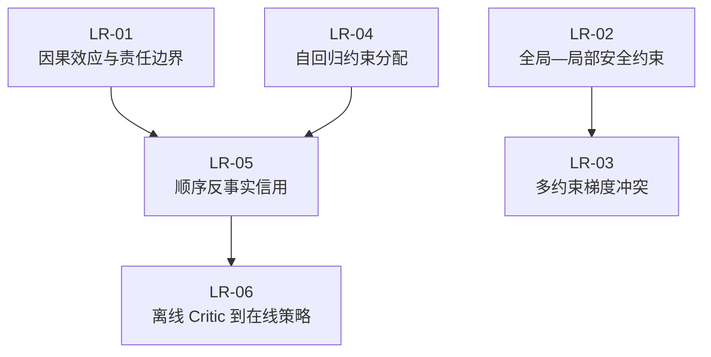

# 算法创新定向论文阅读任务包

任务包编号：LR  
建立时间：2026-07-29  
任务包状态：`COMPLETED`（LR-01 至 LR-06 全部通过）  
任务性质：算法创新前的定向学习与创新边界审计  
实验授权：否  

上位状态依据：

- [AirDefense v1 算法与实验全景状态快照](../../project/air_defense_v1_algorithm_experiment_status_review_2026-07-29.md)
- [项目学术进度总账](../../project/academic_project_progress.md)

## 1. 任务包目的

当前项目缺少的不是更多可直接拼装的网络模块，而是对四类问题的统一理解：

1. 全局安全、累计资源预算和局部动作责任如何区分；
2. 自回归分配的合法性、顺序偏置和信用分配如何处理；
3. 多个安全/资源约束发生冲突时，策略梯度应如何协调；
4. 离线 Critic 或反事实标签如何安全接入在线策略更新。

本任务包选择六篇与这些问题最直接相关的论文。每篇论文构成一个可独立执行、
单独验收的小任务；所有任务使用相同的提取模板，最后形成可横向比较的机制矩阵。

本任务包不要求立即提出新算法，也不授权修改环境、reward、loss、mask、PPO、
FCRC 或 GNN。

## 2. 为什么选择这六篇

| 编号    | 论文                                                                  | 直接回答的问题                         | 优先级 |
| ----- | ------------------------------------------------------------------- | ------------------------------- |:---:|
| LR-01 | Counterfactual Effect Decomposition                                 | 如何区分动作经后续智能体行为和状态路径产生的效应        | P0  |
| LR-02 | Scalable Constrained Policy Optimization for Safe MARL              | 全局约束如何分解为可扩展的局部顺序策略更新           | P0  |
| LR-03 | Gradient Shaping for Multi-Constraint Safe RL                       | 安全与资源梯度冗余或冲突时如何处理               | P0  |
| LR-04 | Autoregressive Policy Optimization for Constrained Allocation Tasks | 自回归分配如何保证硬约束并修正顺序初始偏置           | P0  |
| LR-05 | CAPO / COSAC                                                        | 顺序团队中如何构造低方差反事实信用及分析偏差          | P0  |
| LR-06 | Optimistic Critic Reconstruction and Constrained Fine-Tuning        | 离线 Critic 与在线策略间的估值、改进和分布错配如何处理 | P1  |

六篇论文分别覆盖 Problem、Constraint、Action、Credit 和 Distribution Shift，
不会把同一技术路线重复拆成多个任务。

## 3. 暂不单列的论文

| 论文类别              | 处理方式              | 原因                   |
| ----------------- | ----------------- | -------------------- |
| HATRPO/HAPPO、HARL | 作为公共前置材料引用        | 项目已有 PDF、双语精读稿和汇报材料  |
| CPO、PPO、COMA      | 作为公式背景引用          | 已是必须掌握的基础，不是本轮最新知识缺口 |
| MAPPO             | 作为基线背景            | 项目已有文献和实验认知          |
| 普通 GNN/GAT/WTA    | 暂不安排              | 当前证据不支持关系表示是首要瓶颈     |
| CHPO              | LR-03/LR-04 的邻近补读 | 离散—连续混合动作与本项目不完全同构   |
| HMARL-CBF         | LR-02 的邻近补读       | 更偏连续动力学安全，不直接解决资源责任  |
| 一般反无人机综述          | 不安排精读             | 对算法规范问题的增量较小         |

## 4. 公共前置材料

开始任一任务前，先阅读：

1. [算法实验状态快照](../../project/air_defense_v1_algorithm_experiment_status_review_2026-07-29.md)的第 1、5、8、11 节；
2. [Task 13 反事实信用查新](../../literature/task13_counterfactual_credit_novelty_review.md)；
3. [N1 可辨识资源信用创新审查](../../literature/n1_identifiable_resource_credit_novelty_review.md)；
4. [N2 FCRC 创新审查](../../literature/n2_future_coverability_novelty_review.md)。

已有 HAPPO/HARL 资料：

- [HATRPO/HAPPO PDF](../../../research_papers/04_heterogeneous_resource_coordination/P0_01_2021_HATRPO_HAPPO_Trust_Region_MARL.pdf)
- [HARL PDF](../../../research_papers/04_heterogeneous_resource_coordination/P0_02_2023_HARL_Heterogeneous_Agent_RL.pdf)

## 5. 子任务总表

| 编号    | 独立阅读任务                                                                    | 前置          | 主要交付物                   |
| ----- | ------------------------------------------------------------------------- | ----------- | ----------------------- |
| LR-01 | [反事实效应分解](lr_01_counterfactual_effect_decomposition.md)                   | 公共前置        | 路径效应图、R2/N1 差异表         |
| LR-02 | [可扩展安全多智能体约束优化](lr_02_scalable_constrained_mappo.md)                      | 公共前置        | 全局—局部约束映射、强基线定义         |
| LR-03 | [多约束安全 RL 的梯度塑形](lr_03_gradient_shaping_multi_constraint_safe_rl.md)      | LR-02 建议先完成 | 梯度冲突矩阵、适用性判决            |
| LR-04 | [约束分配的自回归策略优化](lr_04_paspo_constrained_allocation.md)                     | 公共前置        | 顺序去偏机制表、Task 8–12 对照    |
| LR-05 | [顺序团队反事实信用 CAPO/COSAC](lr_05_capo_sequential_counterfactual_credit.md)    | LR-01、LR-04 | SeqAU 公式卡、MCH/BPCE 压力测试 |
| LR-06 | [离线到在线 Critic 重构与受约束微调](lr_06_offline_to_online_critic_reconstruction.md) | LR-05 建议先完成 | 三类错配表、在线接入 no-go 条件     |

## 6. 推荐阅读顺序



推荐批次：

```text
第一批：LR-01、LR-02、LR-04
第二批：LR-03、LR-05
第三批：LR-06
```

每篇预计 3–4 小时，任务包总量约 20 小时。若执行者已经熟悉论文，可缩短背景
章节，但不得跳过公式核对、假设审计和项目映射。

## 7. 统一阅读方法

每篇论文分四遍：

1. **定位阅读**：摘要、引言、问题定义、贡献和结论；
2. **公式阅读**：目标函数、估计量、约束、假设、算法伪代码；
3. **证据阅读**：实验基线、消融、种子、统计方法、失败边界；
4. **项目映射**：与 AirDefense v1 已有证据逐项对照。

禁止只做章节摘要。每篇必须回答：

```text
论文解决的原问题是什么？
关键机制最小公式是什么？
机制成立依赖哪些假设？
论文用什么证据证明，而不是作者声称什么？
它覆盖了本项目哪一项“候选创新”？
哪些部分可以作为强基线？
哪些部分因任务结构不同不能直接迁移？
阅读后应删除、保留或重写哪个项目假设？
```

## 8. 公共输出格式

每个任务最终输出一份阅读报告，统一包含：

| 区块               | 必须内容                              |
| ---------------- | --------------------------------- |
| 论文身份             | 标题、作者、年份、会议/期刊、版本、官方链接            |
| Problem          | 原始问题、状态/动作/奖励/约束定义                |
| Method           | 最小机制、关键公式、伪代码流程                   |
| Assumptions      | 理论和实验成立条件                         |
| Evidence         | 基线、数据、指标、消融、统计结论                  |
| Boundary         | 未解决问题、负结果、外推限制                    |
| Project mapping  | 对应项目任务、相同点、不同点                    |
| Novelty pressure | 已覆盖主张和剩余可能差异                      |
| Decision         | `BASELINE / ADAPT / AVOID / OPEN` |

建议输出目录：

```text
docs/literature/algorithm_innovation_reading/
```

建议文件名与任务编号一致。任务执行前不创建空报告。

## 9. 统一验收门槛

每个子任务只有满足以下条件才可标记 `PASSED`：

1. 论文身份和版本来自官方页面；
2. 至少重写一条核心公式并解释每个变量；
3. 至少列出三项机制成立假设；
4. 实验结论与作者主张分开记录；
5. 至少对照两个本项目正式实验结果；
6. 明确列出一个不可直接迁移点；
7. 给出 `BASELINE / ADAPT / AVOID / OPEN` 判决；
8. 不把相邻思想直接写成项目已成立创新。

## 10. 任务包停止条件

本轮不追求“读得越多越好”。满足以下条件后停止扩展论文集合：

- 六篇全部完成；
- 四个核心问题均至少有两篇论文提供直接方法参照；
- 新论文不再改变机制分类或创新边界；
- 已能列出必须实现的强基线、禁止重复的已有机制和仍开放的算法命题。

只有出现以下情况才补充第七篇：

- 六篇中某个关键公式引用另一篇工作且无法独立理解；
- 发现 2025–2026 年存在与项目候选公式直接等价的同行评审工作；
- 某一强基线缺少足够实现细节。

## 11. 本任务包的最终用途

完成后可以用于共同头脑风暴，但不能自动产生下一算法任务。最终只允许形成：

1. 已有方法覆盖矩阵；
2. 强基线优先级；
3. 可迁移机制与不适用假设；
4. 两到三个待讨论、可证伪的算法命题；
5. 明确的 no-go 清单。

是否进入新算法设计，需要在人工讨论这些产物后另行决定。

## 12. 执行进度

| 任务    | 状态                 | 交付物                                                                                                       |
| ----- | ------------------ | --------------------------------------------------------------------------------------------------------- |
| LR-01 | `PASSED`           | [反事实效应分解阅读报告](../../literature/algorithm_innovation_reading/lr_01_counterfactual_effect_decomposition.md) |
| LR-02 | `PASSED`           | [Scal-MAPPO-L 与全局—局部约束边界](../../literature/algorithm_innovation_reading/lr_02_scalable_constrained_mappo.md) |
| LR-03 | `PASSED`           | [GradS 多约束梯度塑形与规范目标边界](../../literature/algorithm_innovation_reading/lr_03_gradient_shaping_multi_constraint_safe_rl.md) |
| LR-04 | `PASSED`           | [PASPO 约束分配与初始化偏置](../../literature/algorithm_innovation_reading/lr_04_paspo_constrained_allocation.md) |
| LR-05 | `PASSED`           | [COSAC 顺序反事实信用与动态支持边界](../../literature/algorithm_innovation_reading/lr_05_capo_sequential_counterfactual_credit.md) |
| LR-06 | `PASSED`           | [OCR-CFT 离线到在线 Critic 重构与在线接入边界](../../literature/algorithm_innovation_reading/lr_06_offline_to_online_critic_reconstruction.md) |
