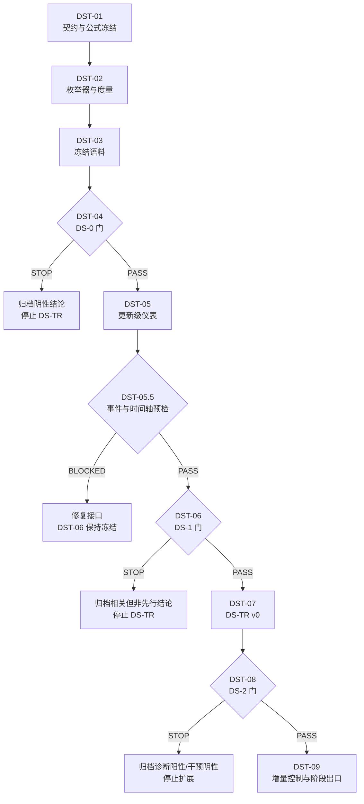

# DS-TR 动态支持敏感信赖域任务包

更新时间：2026-07-30  
任务包状态：`DST-01`—`DST-05.5` 已通过；`DST-06` 已解锁但尚未执行  
上位决策：[六篇定向阅读综合与算法创新决策](../../project/air_defense_v1_literature_synthesis_and_algorithm_innovation_decision_2026-07-29.md)  
任务性质：诊断先行、逐门授权、允许阴性终止

## 1. 任务包目标

本任务包只检验一条算法创新假设：

> 自回归前缀动作的微小策略变化会通过动态掩码改变后续合法联合动作支持域；
> 如果这种支持域扰动能够解释并先行于联合行为崩塌，则用 DS-TR 限制该结构
> 扰动可能比普通 KL 更有效。

任务包不预设 DS-TR 成立。执行顺序必须是：

```text
DS-0 机制存在性 → DS-1 更新级先行性 → DS-2 最小算法干预
```

任何硬门失败，后续任务全部冻结。

## 2. 子任务总表

| 编号 | 工作项 | 前置任务 | 训练授权 | 主要交付物 |
|---|---|---|---:|---|
| DST-01 | [研究契约、公式与证据源冻结](dst_01_research_contract_and_formula_freeze.md) | 无 | 0 | 冻结契约、字段字典、门控表 |
| DST-02 | [精确后缀枚举器与 DS 度量验证](dst_02_suffix_enumerator_and_metric_validation.md) | DST-01 | 0 | 枚举器、度量模块、测试 |
| DST-03 | [冻结语料重建与完整性审计](dst_03_frozen_corpus_reconstruction.md) | DST-02 | 0 | DS-0 分析语料、完整性报告 |
| DST-04 | [DS-0 增量机制审计与硬门](dst_04_ds0_incremental_mechanism_audit.md) | DST-03 | 0 | 正式 DS-0 报告、PASS/STOP |
| DST-05 | [更新级诊断仪表与可重放性](dst_05_update_level_instrumentation.md) | DST-04=`PASS` | 0 | 更新级日志、重放结论 |
| DST-05.5 | [DS-1 事件时间轴冻结与真实 Callback 集成预检](dst_05_5_ds1_event_timeline_preflight.md) | DST-05 | 两路各 512-step smoke | 事件协议、时间轴、集成等价性 |
| DST-06 | [DS-1 短跑与先行性硬门](dst_06_ds1_short_run_precursor_gate.md) | DST-05.5=`PASSED` | 最多 3×10k | 正式 DS-1 报告、PASS/STOP |
| DST-07 | [DS-TR v0 实现与精确回退](dst_07_ds_tr_v0_implementation.md) | DST-06=`PASS` | 仅 smoke | 最小算法、回退测试、实现审计 |
| DST-08 | [DS-2 异质场景最小筛选](dst_08_ds2_heterogeneity_screening.md) | DST-07 | 3×10k | 正式筛选报告、PASS/STOP |
| DST-09 | [增量控制与阶段出口](dst_09_incremental_controls_and_phase_exit.md) | DST-08=`PASS` | 分批授权 | 普通 churn/KL 控制、初始化控制、最终决策 |

## 3. 依赖关系



本任务包没有可并行的主路径。只有文档整理、测试补充等不改变门控判断的辅助工作
可以并行。

## 4. 公共冻结边界

必须保持：

- AirDefense-v1 环境、奖励与核心场景参数；
- 3 单元、5 目标及现有自回归顺序语义；
- factorized engagement-target joint PPO 主目标；
- 动态合法动作掩码、joint log-prob 和 exact fallback；
- 项目现有 all-noop、结构合法性、安全与资源评估口径；
- 已冻结的 BPCE、MCH、FCRC 等否定结论。

禁止：

- 在同一候选中加入新 Critic、BPCE 标签、GradS、reward shaping 或 GNN；
- 为通过门控事后改变 DS 定义、效应阈值、种子或场景；
- 将支持域相关性写成因果优化结论；
- 将普通动态掩码、自回归策略或 policy churn 重新命名为创新；
- DS-0 或 DS-1 未通过时启动 DS-TR 训练；
- 用增加预算挽救失败门控。

## 5. 公共输出位置

建议结果根目录：

```text
results/air_defense_v1/dynamic_support_trust_region/
```

正式报告：

```text
docs/experiments/air_defense_v1_ds0_dynamic_support_audit.md
docs/experiments/air_defense_v1_ds1_support_churn_precursor_audit.md
docs/experiments/air_defense_v1_ds_tr_v0_screening.md
docs/experiments/air_defense_v1_ds_tr_incremental_controls.md
```

建议代码位置：

```text
rein_learning/common/dynamic_support_distance.py
rein_learning/algorithms/policy_gradient/dynamic_support_trust_region_ppo.py
tests/test_dynamic_support_distance.py
tests/test_dynamic_support_trust_region_ppo.py
```

任务指导报告不是科学证据源；正式结果必须进入 `docs/experiments/`。

## 6. 统一状态与移交

```text
NOT_STARTED → IN_PROGRESS → REVIEW → PASSED
                               ↘ STOPPED
                               ↘ BLOCKED
```

- `STOPPED`：假设被数据否决，属于有效研究结果；
- `BLOCKED`：缺少不可恢复输入或发现数据完整性冲突；
- 不得把 `STOPPED` 改写成“待调参”。

移交格式：

```text
任务编号：
状态：
输入快照：
生成文件：
测试与门控：
阴性证据：
禁止下游假设：
下一任务或阶段出口：
```

## 7. 总训练预算

在 DST-08 完成前：

| 阶段 | 最大新增训练 |
|---|---:|
| DST-01—DST-05 | 0 |
| DST-05.5 | 两路各 512-step 集成 smoke，不计入 P2 |
| DST-06 | 3×10k，仅现有日志/检查点不足时 |
| DST-07 | smoke，不得替代正式结果 |
| DST-08 | 3×10k |

因此 DS-TR 被 DST-08 否决时，累计新增正式训练上限为 6×10k。DST-09 的控制
实验必须逐项重新授权，不自动继承预算。

## 8. 任务包完成条件

满足以下任一出口即可关闭本任务包：

1. DST-04=`STOPPED`：机制无增量解释力；
2. DST-06=`STOPPED`：结构相关但没有更新级先行性；
3. DST-08=`STOPPED`：诊断成立但最小干预无效；
4. DST-09 完成：确认或否决 DS-TR 相对普通 churn/KL 与初始化控制的增量价值。

只有第 4 种出口且结论为正，DS-TR 才能进入正式多场景、多种子算法确认阶段。

## 9. 最新移交：DST-04

```text
任务编号：DST-04
状态：PASSED
输入快照：DST-03 冻结语料；12,511 行、1,600 上下文、6 场景—种子组
生成文件：dst_04_ds0_audit/ 下 5 个机器可读产物及 1 份正式实验报告
测试与门控：非退化门通过；2/3 共同主要结果通过完整 P1 硬门
阴性证据：engagement_extreme_direction_nonzero 未通过；前缀阻断增量主要来自 noop-engage
禁止下游假设：P1 不等于时间先行、因果效应或 DS-TR 算法有效
下一任务或阶段出口：DST-05 更新级诊断仪表与可重放性（零训练）
```

## 10. 最新移交：DST-05

```text
任务编号：DST-05
状态：PASSED
输入快照：Task12 冻结 probe；768 状态，核心场景 512 状态
生成文件：dst_05_instrumentation/ 下 4 个机器可读产物及 1 份正式实验报告
测试与门控：5,881 唯一前缀上下文；仪表开关的 RNG/actions/loss/更新参数完全一致
阴性证据：历史每种子仅一个最终权重，replay_insufficient=true
禁止下游假设：DST-05 不构成 P2 证据，不得用聚合曲线代替更新级先行性
下一任务或阶段出口：DST-05.5；先冻结正式事件与 rollout 时间轴并完成两路集成 smoke
```

## 11. 最新移交：DST-05.5

```text
任务编号：DST-05.5
状态：PASSED
输入快照：Task12 冻结 probe；heterogeneity_pressure；seed 8；CRN 73000...73049
生成文件：dst_05_5_event_timeline_preflight/ 下 6 个机器可读产物及 1 份正式报告
测试与门控：11 项事件测试通过；两路各 512-step；两轮训练轨迹、指标、参数与优化器完全等价
阴性证据：smoke 未出现事件，仅验证接口；formal_p2_evidence=false
禁止下游假设：不得把预检解释为 DS 先行性、因果作用或 DS-TR 有效
下一任务或阶段出口：DST-06；执行冻结的 heterogeneity 10k×seeds 8/9/10
```
