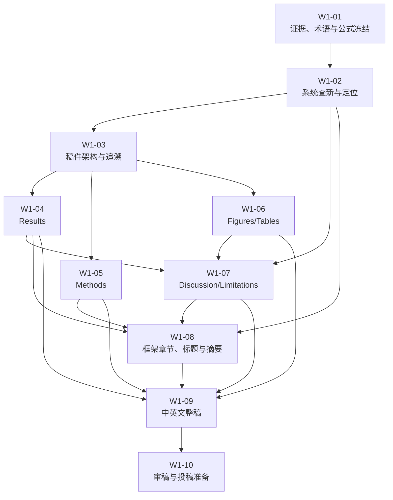

# W1 主张—证据冻结与论文写作任务包

更新时间：2026-07-24  
任务包状态：W1-01 至 W1-10 全部完成；T10 通过，阶段出口为 L2/M2。
上位任务：[W1 主张—证据冻结与论文正文写作](../next_research_phase_claim_evidence_freeze_and_manuscript_drafting.md)  
执行原则：分项验收、证据先行、单一权威源、默认不新增实验

## 1. 任务包用途

本目录将 W1 总纲拆分为 10 个可独立领取、可单独验收、具有明确输入输出的
工作项。上位 W1 报告继续负责解释研究背景、完整边界和最终阶段出口；本目录
负责实际执行。

若子任务报告与正式实验结论发生冲突，优先级为：

1. R2 正式实验报告及冻结结果；
2. 第一创新 Claim–Evidence 矩阵；
3. R1 及前置正式实验报告；
4. W1 总纲；
5. 本目录中的子任务报告；
6. 临时草稿和未归档笔记。

任务指导报告不是科学证据来源。

## 2. 子任务总表

| 编号    | 工作项                                                                   | 前置任务                    | 主要交付物                                              | 本地门控  |
| ----- | --------------------------------------------------------------------- | ----------------------- | -------------------------------------------------- | ----- |
| W1-01 | [证据、术语与公式冻结](w1_01_evidence_terminology_formula_freeze.md)            | 无                       | `terminology_ledger.md`、`evidence_source_index.md` | T01   |
| W1-02 | [系统查新与稿件定位](w1_02_systematic_literature_and_positioning_gate.md)      | W1-01                   | 检索协议、文献矩阵、定位决策                                     | L1–L4 |
| W1-03 | [稿件架构与可追溯设计](w1_03_manuscript_architecture_and_traceability.md)       | W1-01、W1-02             | 论证压缩、章节架构、追溯矩阵                                     | T03   |
| W1-04 | [Results 中文证据稿](w1_04_results_evidence_draft.md)                      | W1-03                   | `results_draft_zh.md`                              | T04   |
| W1-05 | [Methods 与研究完整性稿](w1_05_methods_and_research_integrity_draft.md)      | W1-03                   | `methods_draft_zh.md`、补充方法                         | T05   |
| W1-06 | [Figures、Tables 与数据追溯](w1_06_figures_tables_and_data_traceability.md) | W1-03                   | 图表计划、图表源文件与图注                                      | T06   |
| W1-07 | [Discussion 与 Limitations](w1_07_discussion_and_limitations_draft.md) | W1-02、W1-04、W1-06       | 讨论和局限性中文稿                                          | T07   |
| W1-08 | [框架章节、标题与摘要](w1_08_framing_sections_title_and_abstract.md)            | W1-02、W1-04、W1-05、W1-07 | 引言、相关工作、结论、标题、摘要                                   | T08   |
| W1-09 | [中英文整稿集成](w1_09_bilingual_manuscript_integration.md)                  | W1-04 至 W1-08           | 中文完整稿、英文完整初稿                                       | T09   |
| W1-10 | [审稿压力测试与投稿准备](w1_10_reviewer_audit_and_submission_preparation.md)     | W1-09                   | 审稿审计、期刊适配、投稿清单                                     | T10   |

## 3. 依赖关系



唯一建议并行层为 W1-04、W1-05、W1-06。三个任务共享 W1-03 冻结的章节架构
和追溯矩阵，但不得互相修改对方的主交付文件。

## 4. 公共研究边界

所有子任务必须服从：

> 在 AirDefense v1 冻结 factorized PPO 的动态掩码序列分配中，同一步与
> 未来动作替代会系统性偏置回合累计资源成本对当前动作的局部信用读出；
> 该机制可跨全新策略种子复现，但其是否改变成本标签符号受场景和资源类型
> 约束。

允许定位：

- 测量有效性；
- 反事实信用审计；
- 动作替代机制；
- 完整成本分解；
- 可辨识性和适用边界。

禁止定位：

- 已经优于 PPO 的新算法；
- 已经解决 all-noop；
- 跨环境或跨资源类型通用规律；
- 已验证的机会成本 oracle；
- 已验证的 GNN 修复；
- 未经系统查新支持的“首次”。

## 5. 公共输出目录

```text
docs/manuscript/action_substitution_cost_identifiability/
```

各任务只创建自己声明的交付物。共享文件通过“主负责任务”控制：

| 共享文件                                | 主负责任务 | 其他任务权限              |
| ----------------------------------- | ----- | ------------------- |
| `terminology_ledger.md`             | W1-01 | 只能提出变更请求            |
| `literature_evidence_matrix.md`     | W1-02 | 只能补充已核验文献           |
| `manuscript_traceability_matrix.md` | W1-03 | 各任务填写自己负责的段落/图表位置   |
| `figure_table_plan.md`              | W1-06 | 其他任务引用，不自行另建版本      |
| `manuscript_draft_zh.md`            | W1-09 | 分节任务不直接修改           |
| `manuscript_draft_en.md`            | W1-09 | W1-10 仅提交修订清单或审计后定稿 |

## 6. 统一状态与移交格式

每个子任务只使用以下状态：

```text
NOT_STARTED → IN_PROGRESS → REVIEW → PASSED
                               ↘ BLOCKED
```

`BLOCKED` 仅用于：

- 缺少无法从项目中恢复的权威输入；
- 发现致命数据完整性冲突；
- 文献定位为 L4；
- 上游交付物未通过门控。

每次移交必须包含：

```text
任务编号：
状态：
已生成文件：
已通过门控：
未解决问题：
禁止下游假设：
下一接收任务：
```

## 7. 统一修改规则

- 证据数字冲突时不取平均、不凭印象选择，回到权威结果文件；
- 图表可对冻结数据做确定性重聚合，但必须记录输入和脚本；
- 写作中发现主张证据不足时，先收窄或删除主张；
- 不因写作需要自动增加种子、环境或算法实验；
- 不复制第二份权威 Claim–Evidence 矩阵；
- 术语变更必须在 `terminology_ledger.md` 留下理由和影响范围；
- 文献定位改变贡献时，必须记录创新演化，不得静默改写历史主张；
- 摘要和标题只能由 W1-08 在 Results、Methods 和 Discussion 稳定后完成。

## 8. 推荐执行节奏

第一批：

```text
W1-01 → W1-02 → W1-03
```

第二批：

```text
W1-04 ∥ W1-05 ∥ W1-06
```

第三批：

```text
W1-07 → W1-08 → W1-09 → W1-10
```

文献定位是防止进入写作死路的首要门控。若 W1-02 判定 L3，后续仍可按学位
论文章节执行；若判定 L4，W1-03 至 W1-10 暂停。

## 9. 任务包完成条件

只有以下条件全部满足，拆分后的 W1 才算完成：

1. W1-01 至 W1-10 均为 `PASSED`；
2. 文献定位不是 L4；
3. 所有主张均可追溯到正式证据；
4. 中英文稿使用同一术语、公式和边界；
5. 首轮账本修正得到透明披露；
6. P-C3、机会成本和在线算法负结果未被隐藏；
7. 已完成目标期刊适配或明确采用学位论文章节出口；
8. 没有因为写作压力恢复已停止的实验路线。
