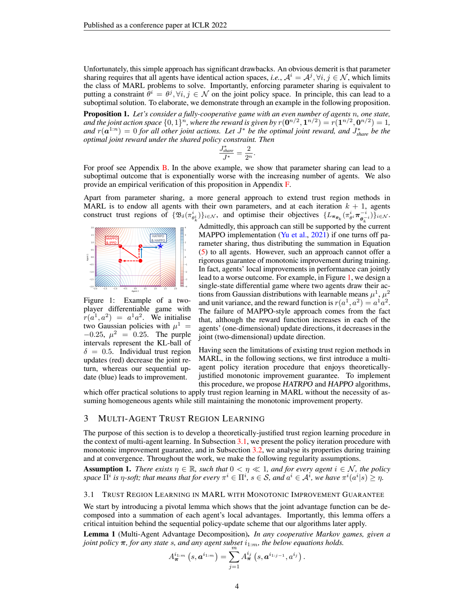
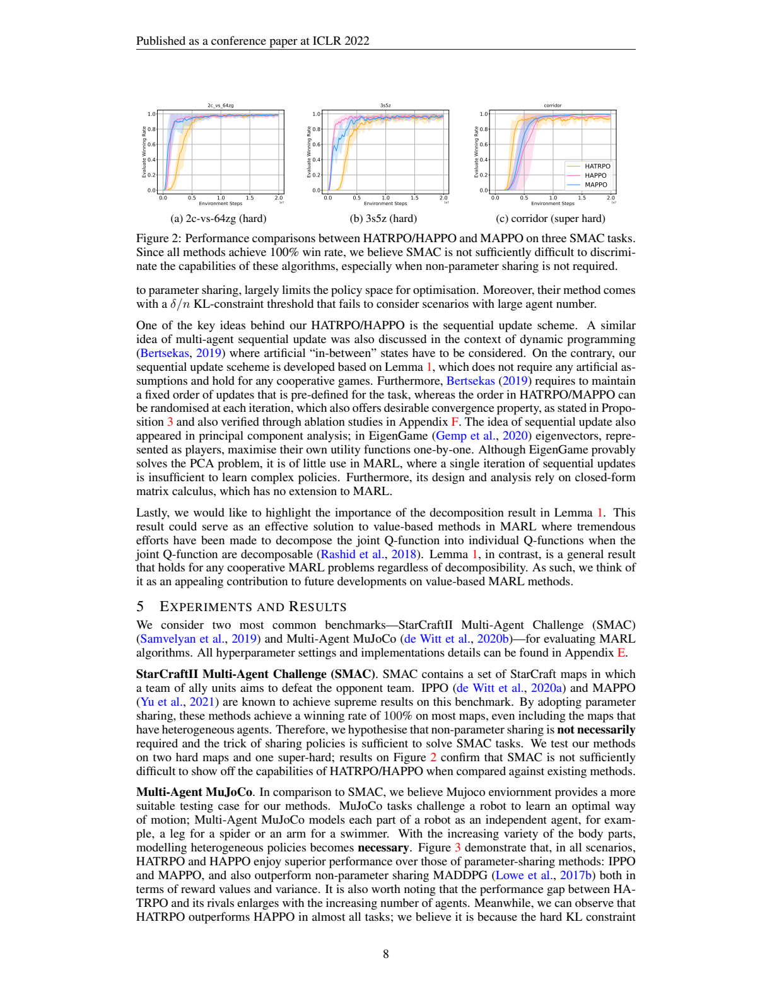
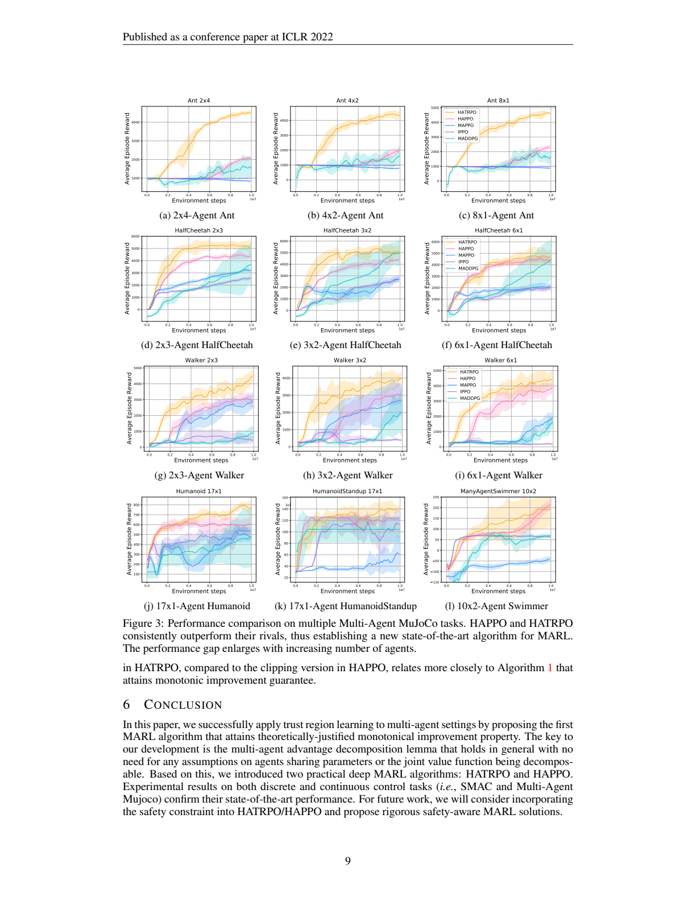

# HATRPO/HAPPO Trust Region MARL 精读读者

Source PDF: `P0_01_2021_HATRPO_HAPPO_Trust_Region_MARL.pdf`  
Paper: Jakub Grudzien Kuba et al., "Trust Region Policy Optimisation in Multi-Agent Reinforcement Learning", ICLR 2022  
Reader status: 精读第一版。已建立 27 页、290 个文本块的 `source_map.json`；本文档优先翻译和解释理论主线、算法主线、实验主线。

## 章节索引

- p.1: 摘要与问题提出
- p.1-p.2: Introduction - 为什么单智能体 trust region 不能直接搬到 MARL
- p.2-p.3: Preliminaries - Markov game、joint policy、advantage、TRPO/PPO 回顾
- p.3-p.4: Existing MARL trust region limitations - 参数共享和同时更新的局限
- p.4-p.6: Multi-agent trust region learning - Lemma 1、Algorithm 1、Theorem 2/3
- p.6-p.7: Practical algorithms - HATRPO 与 HAPPO
- p.7-p.9: Related work 与实验
- p.10-p.27: References 与附录证明、伪代码、超参数、消融

## 术语表

| English term                                            | 中文固定译法     | 精读提示                                          |
| ------------------------------------------------------- | ---------- | --------------------------------------------- |
| trust region                                            | 信任域        | 限制策略更新幅度，使 surrogate objective 的提升能可靠对应真实回报提升 |
| monotonic improvement                                   | 单调改进       | 每次迭代保证 `J(pi_{k+1}) >= J(pi_k)`               |
| joint policy                                            | 联合策略       | 多智能体策略乘积 `pi = prod_i pi_i`                   |
| parameter sharing                                       | 参数共享       | 多个 agent 使用同一套策略参数；省样本但限制策略空间                 |
| centralized training with decentralized execution, CTDE | 集中训练、分散执行  | 训练时用全局信息，执行时每个 agent 独立行动                     |
| advantage decomposition                                 | 优势函数分解     | 将联合/子集 advantage 拆成按 agent 顺序累加的局部 advantage  |
| sequential policy update                                | 顺序策略更新     | 一轮迭代内按随机排列逐个更新 agent，并把前序 agent 的新策略纳入后续目标    |
| HATRPO                                                  | 异质智能体 TRPO | 二阶/信任域版本，更贴近理论单调改进框架                          |
| HAPPO                                                   | 异质智能体 PPO  | 一阶/clipping 版本，更易实现，理论动机来自同一顺序更新结构            |
| non-parameter sharing                                   | 非参数共享      | 每个 agent 有独立策略网络，适合异质动作空间/异质身体部件              |

## 一句话读懂

这篇论文的核心贡献不是“又做了一个 MARL PPO 变体”，而是证明了：在完全合作 Markov game 中，只要用 multi-agent advantage decomposition 把联合优势拆成顺序局部优势，并按 agent 逐个更新策略，就能把 TRPO 的单调改进思想推广到 MARL；HATRPO/HAPPO 是这个理论过程的深度学习近似实现。

## 1. 摘要与问题

**Source:** p.1 S006

**Original:** Trust region methods rigorously enabled reinforcement learning (RL) agents to learn monotonically improving policies, leading to superior performance on a variety of tasks. Unfortunately, when it comes to multi-agent reinforcement learning (MARL), the property of monotonic improvement may not simply apply; this is because agents, even in cooperative games, could have conflicting directions of policy updates. As a result, achieving a guaranteed improvement on the joint policy where each agent acts individually remains an open challenge. In this paper, we extend the theory of trust region learning to cooperative MARL. Central to our findings are the multi-agent advantage decomposition lemma and the sequential policy update scheme. Based on these, we develop Heterogeneous-Agent Trust Region Policy Optimisation (HATRPO) and Heterogeneous-Agent Proximal Policy Optimisation (HAPPO) algorithms.

**中文:** 信任域方法使强化学习 agent 能够在严格理论支持下学习单调改进的策略，并在许多任务上取得优越表现。但在多智能体强化学习中，单调改进并不能直接成立；即便是完全合作博弈，不同 agent 的策略更新方向也可能相互冲突。因此，当每个 agent 独立行动时，如何保证联合策略整体变好，仍然是开放问题。本文把信任域学习理论扩展到合作 MARL。关键发现是 multi-agent advantage decomposition lemma 和 sequential policy update scheme，并基于二者提出 HATRPO 与 HAPPO。

**精读:** 摘要里有三层逻辑：单智能体 TRPO/PPO 的价值在于单调改进；MARL 的难点在于“每个局部方向看似变好，合成的联合方向可能变差”；作者的解决方案不是约束所有 agent 共用参数，而是改变更新顺序和目标定义。

## 2. 引言主线

**Source:** p.1 S008

**Original:** The effectiveness of trust region methods largely stems from their theoretically-justified policy iteration procedure. By optimising the policy within a trustable neighbourhood of the current policy, thus avoiding making aggressive updates towards risky directions, trust region learning enjoys the guarantee of monotonic performance improvement at every iteration.

**中文:** 信任域方法之所以有效，很大程度上来自其有理论支撑的策略迭代过程。它只在当前策略附近可信的邻域内优化策略，从而避免沿风险较大的方向做激进更新，并因此获得每轮迭代性能单调提升的保证。

**Source:** p.2 S009

**Original:** Unfortunately, existing CTDE methods offer no solution of how to perform trust region learning in MARL. Lack of such an extension impedes agents from learning monotonically improving policies in a stable manner. Recent attempts such as IPPO and MAPPO have been proposed to fill such a gap; however, these methods are designed for agents that are homogeneous, which largely limits their applicability and potentially harm the performance.

**中文:** 现有 CTDE 方法并没有解决如何在 MARL 中执行信任域学习的问题。缺少这种扩展，会阻碍 agent 稳定地学习单调改进的策略。IPPO 和 MAPPO 试图填补这一缺口，但它们主要面向同质 agent，这限制了适用范围，也可能损害性能。

**精读:** 这里的批评对象不是 CTDE 本身，而是“有 centralized critic 并不等于有 trust-region monotonic guarantee”。MAPPO 在工程上有效，但论文认为它在理论上没有继承 TRPO 的关键保证，尤其当关闭参数共享时更明显。

## 3. 形式化问题

**Source:** p.2 S013

**Original:** We consider a Markov game, which is defined by a tuple `<N,S,A,P,r,gamma>`. Here, `N={1,...,n}` denotes the set of agents, `S` is the finite state space, `A = prod_i A_i` is the product of finite action spaces of all agents, known as the joint action space, `P` is the transition probability function, `r` is the reward function, and `gamma` is the discount factor. ... In this paper, we consider a fully-cooperative setting where all agents share the same reward function, aiming to maximise the expected total reward `J(pi)`.

**中文:** 本文考虑 Markov game，由 `<N,S,A,P,r,gamma>` 定义。其中 `N={1,...,n}` 是 agent 集合，`S` 是有限状态空间，`A = prod_i A_i` 是所有 agent 动作空间的乘积，也就是联合动作空间，`P` 是转移概率函数，`r` 是奖励函数，`gamma` 是折扣因子。本文关注完全合作设定：所有 agent 共享同一奖励函数，目标是最大化期望总回报 `J(pi)`。

**精读:** 注意本文不是一般和博弈/零和博弈，而是 fully cooperative。所有后续单调改进和 NE 收敛分析都建立在“共同奖励”上；如果你的防空编组任务存在个体局部奖励或资源竞争，需要检查是否能转写成共享团队奖励。

## 4. 为什么 MAPPO/IPPO 不够

**Source:** p.4 S025

**Original:** Parameter sharing requires that all agents have identical action spaces, which limits the class of MARL problems to solve. Importantly, enforcing parameter sharing is equivalent to putting a constraint `theta_i = theta_j` on the joint policy space. In principle, this can lead to a suboptimal solution.

**中文:** 参数共享要求所有 agent 拥有相同动作空间，这限制了 MARL 可处理的问题类别。更重要的是，强制参数共享等价于在联合策略空间上施加 `theta_i = theta_j` 的约束。从原理上说，这可能导致次优解。

**Source:** p.4 S034

**Original:** Individual trust region updates decrease the joint return, whereas our sequential update leads to improvement. ... although the reward function increases in each of the agents' one-dimensional update directions, it decreases in the joint two-dimensional update direction.

**中文:** 单个 agent 的信任域更新会降低联合回报，而本文的顺序更新会带来提升。原因是：虽然奖励函数沿每个 agent 的一维更新方向都增加，但沿联合二维更新方向反而下降。

**精读:** Figure 1 是全文最重要的反例直觉：MARL 里“每个人单独看都改善”不等于“大家同时更新后整体改善”。这也是为什么作者坚持 sequential update，而不是 joint simultaneous update。

## 5. 核心 Lemma: Multi-Agent Advantage Decomposition

**Source:** p.4 S037

**Original:** Lemma 1 (Multi-Agent Advantage Decomposition). In any cooperative Markov games, given a joint policy `pi`, for any state `s`, and any agent subset `i_1:m`, the below equations holds. `A^{i_1:m}_pi(s,a_{i_1:m}) = sum_{j=1}^m A^{i_j}_pi(s,a_{i_1:j-1},a_{i_j})`.

**中文:** Lemma 1（多智能体优势分解）。在任意合作 Markov game 中，给定联合策略 `pi`，对任意状态 `s` 和任意 agent 子集 `i_1:m`，子集联合优势可以分解为按顺序累加的每个 agent 的局部优势：`A^{i_1:m}_pi(s,a_{i_1:m}) = sum_{j=1}^m A^{i_j}_pi(s,a_{i_1:j-1},a_{i_j})`。

**精读:** 这个式子是全文的“铰链”。它不是说 Q 函数可加，也不是 VDN/QMIX 那类 value factorization 假设；它是对 advantage 的望远镜分解。第 `j` 个 agent 的局部 advantage 依赖前面 `i_1:j-1` 的动作，所以顺序是公式内生的。

## 6. Algorithm 1: 理论版顺序策略迭代

**Source:** p.5 S040

**Original:** Draw a permutation `i_1:n` of agents at random. For `m=1:n`, make an update `pi^{i_m}_{k+1} = arg max_{pi^{i_m}} [ L^{i_1:m}_{pi_k}(pi^{i_1:m-1}_{k+1}, pi^{i_m}) - C D^max_KL(pi^{i_m}_k, pi^{i_m}) ]`.

**中文:** 每轮随机抽取一个 agent 排列 `i_1:n`。对 `m=1:n`，依次更新第 `i_m` 个 agent：最大化一个包含“前面 agent 已更新策略”的局部 surrogate objective，同时减去当前 agent 策略变化的最大 KL 惩罚项。

**精读:** 这一步和普通 TRPO 的差别有两个：第一，不一次性更新联合策略，而是逐 agent 更新；第二，第 `m` 个 agent 的目标不是固定旧策略环境，而是显式条件在前 `m-1` 个 agent 的新策略上。正是这个目标让 Lemma 1 的分解项和 TRPO 的 lower bound 能对上。

**Source:** p.6 S043

**Original:** Theorem 2. A sequence `(pi_k)` of joint policies updated by Algorithm 1 has the monotonic improvement property, i.e., `J(pi_{k+1}) >= J(pi_k)` for all `k`. ... Theorem 3. Supposing in Algorithm 1 any permutation of agents has a fixed non-zero probability to begin the update, a sequence `(pi_k)` of joint policies generated by the algorithm ... has a non-empty set of limit points, each of which is a Nash equilibrium.

**中文:** Theorem 2 说明：由 Algorithm 1 更新得到的联合策略序列具有单调改进性质，即对所有 `k` 都有 `J(pi_{k+1}) >= J(pi_k)`。Theorem 3 进一步说明：如果任意 agent 排列都有固定的非零概率被选为更新顺序，则该算法生成的联合策略序列有非空极限点集合，并且每个极限点都是 Nash equilibrium。

**精读:** Theorem 2 是“每步不降”，Theorem 3 是“极限点是均衡”。随机排列不是工程小技巧，而是收敛证明需要的条件：如果顺序长期固定，可能让某些 agent 的改进机会系统性受限。

## 7. 实用算法: HATRPO

**Source:** p.6 S045

**Original:** When implementing Algorithm 1 in practice, large state and action spaces could prevent agents from designating policies for each state separately. To handle this, we parameterise each agent's policy by `theta_i`, which, together with other agents' policies, forms a joint policy `pi_theta` parametrised by `theta=(theta_1,...,theta_n)`.

**中文:** 实现 Algorithm 1 时，大状态/动作空间使得无法为每个状态单独指定策略。因此，作者用 `theta_i` 参数化每个 agent 的策略，所有 agent 策略共同形成由 `theta=(theta_1,...,theta_n)` 参数化的联合策略。

**Source:** p.7 S058

**Original:** Proposition 2 ... One benefit of applying Equation (9) is that agents only need to maintain a joint advantage estimator `A_pi(s,a)` rather than one centralised critic for each individual agent.

**中文:** Proposition 2 的一个好处是：agent 只需要维护一个联合优势估计器 `A_pi(s,a)`，而不需要像某些 CTDE 方法那样为每个 agent 维护一个独立 centralized critic。

**精读:** HATRPO 的工程难点在于如何估计“前序 agent 已更新、当前 agent 候选更新”下的局部 surrogate。Proposition 2 通过 importance ratio 把它改写成旧联合策略采样下的期望，因此可以用一批 on-policy trajectory 和一个 joint advantage estimator 来实现。

## 8. 实用算法: HAPPO

**Source:** p.7 S066

**Original:** To further alleviate the computation burden from `H_k^{i_m}` in HATRPO, one can follow the idea of PPO ... by considering only using first order derivatives. This is achieved by making agent `i_m` choose a policy parameter which maximises the clipping objective ... We refer to the above procedure as HAPPO.

**中文:** 为进一步减轻 HATRPO 中 Hessian/Fisher 相关计算负担，可以借鉴 PPO，只使用一阶导数。具体做法是让 agent `i_m` 最大化 clipping objective。作者将该过程称为 HAPPO。

**精读:** HAPPO 不是普通 PPO 的多 agent 简单相加版。它的 clip objective 里仍然保留 `M_{i_1:m}` 这样的前序 agent 更新权重，所以顺序更新思想仍在。区别是 HATRPO 用 KL 硬/二阶信任域近似，HAPPO 用 PPO clip 降低实现成本。

## 9. 相关工作定位

**Source:** p.7 S068

**Original:** Despite empirical successes, none of them managed to propose a theoretically-justified trust region protocol in multi-agent learning, or maintain the monotonic improvement property. Instead, they tend to impose certain assumptions to enable direct implementations of TRPO/PPO in MARL problems.

**中文:** 尽管已有方法在经验上成功，但它们没有提出理论上有保证的多智能体信任域协议，也没有维持单调改进性质。相反，它们通常施加某些假设，使 TRPO/PPO 能够直接实现到 MARL 问题上。

**精读:** 作者对相关工作的区分标准很明确：不是“能不能跑得好”，而是“是否理论上继承 trust region 的单调改进”。这也解释了为什么实验里 MAPPO 很强但仍被当作 baseline。

## 10. 实验读法

**Source:** p.8 S078

**Original:** Figure 2: Performance comparisons between HATRPO/HAPPO and MAPPO on three SMAC tasks. Since all methods achieve 100% win rate, we believe SMAC is not sufficiently difficult to discriminate the capabilities of these algorithms, especially when non-parameter sharing is not required.

**中文:** Figure 2 比较了 HATRPO/HAPPO 与 MAPPO 在三个 SMAC 任务上的表现。由于所有方法最终都达到 100% 胜率，作者认为 SMAC 不足以区分这些算法能力，尤其是在不需要非参数共享时。

**Source:** p.8 S080

**Original:** In comparison to SMAC, we believe MuJoCo environment provides a more suitable testing case for our methods. ... With the increasing variety of the body parts, modelling heterogeneous policies becomes necessary.

**中文:** 相比 SMAC，作者认为 MuJoCo 更适合测试本文方法。Multi-Agent MuJoCo 把机器人的不同身体部件建模为独立 agent；随着身体部件差异增大，建模异质策略变得必要。

**Source:** p.9 S120

**Original:** Figure 3: Performance comparison on multiple Multi-Agent MuJoCo tasks. HAPPO and HATRPO consistently outperform their rivals, thus establishing a new state-of-the-art algorithm for MARL. The performance gap enlarges with increasing number of agents.

**中文:** Figure 3 展示多个 Multi-Agent MuJoCo 任务上的性能比较。HAPPO 和 HATRPO 持续优于竞争方法，形成新的 MARL state of the art；并且 agent 数量越多，性能差距越大。

**精读:** 实验最值得读的是“为什么 SMAC 不能充分区分，而 MuJoCo 能”。SMAC 中参数共享常常足够强；MuJoCo 的 agent 对应不同身体部件，异质性更自然、更强，因此非参数共享和顺序更新优势更明显。这一点对“异构防空资源协同”很相关：拦截器、雷达、电子干扰、通信节点不像 SMAC 同类单位，反而更接近异构策略需求。

## 11. 结论

**Source:** p.9 S122

**Original:** In this paper, we successfully apply trust region learning to multi-agent settings by proposing the first MARL algorithm that attains theoretically-justified monotonical improvement property. The key to our development is the multi-agent advantage decomposition lemma that holds in general with no need for any assumptions on agents sharing parameters or the joint value function being decomposable. Based on this, we introduced two practical deep MARL algorithms: HATRPO and HAPPO.

**中文:** 本文成功将信任域学习应用到多智能体设定中，提出首个具有理论支撑单调改进性质的 MARL 算法。关键是 multi-agent advantage decomposition lemma；它一般成立，不需要假设 agent 参数共享，也不需要联合价值函数可分解。基于这一点，作者提出两个实用深度 MARL 算法：HATRPO 和 HAPPO。

## 12. 附录证明该怎么读

**Source:** p.17 S188

**Original:** Lemma 1 ... Proof. By the definition of multi-agent advantage function, `A^{i_1:m}_{pi_theta}(s,a_{i_1:m}) = Q^{i_1:m}_{pi_theta}(s,a_{i_1:m}) - V_{pi_theta}(s) = sum_k [Q^{i_1:k}_{pi_theta}(s,a_{i_1:k}) - Q^{i_1:k-1}_{pi_theta}(s,a_{i_1:k-1})]`.

**中文:** Lemma 1 的证明本质是望远镜求和：子集联合 advantage 等于最后一个条件 Q 减去 V；中间插入逐步增加 agent 的 Q 项，首尾相消后，剩下每一步新增 agent 带来的局部 advantage。

**Source:** p.19 S198

**Original:** By Theorem 1, we have `J(pi_{k+1}) >= L_{pi_k}(pi_{k+1}) - C D^max_KL(pi_k,pi_{k+1})`, which by Lemma 8 is lower-bounded by ... as for every `m`, `pi^{i_m}_{k+1}` is the argmax ...

**中文:** Theorem 2 的证明路线是：先套用单智能体 TRPO lower bound；再用 Lemma 8 把联合 KL 上界拆成各 agent KL 之和；随后把联合 surrogate 分解成顺序局部 surrogate；最后因为每个 agent 都选择了使其局部目标最大的策略，所以整轮更新不降低 `J`。

**Source:** p.22 S230

**Original:** Proposition 2 ... The expectation under updated previous agents and candidate current agent can be rewritten as an expectation under the old joint policy with importance ratios and joint advantage.

**中文:** Proposition 2 说明：原本需要在“前序 agent 新策略 + 当前 agent 候选策略”下计算的期望，可以改写成旧联合策略采样下、带 importance ratio 和 joint advantage 的期望。

**精读:** 如果要复现算法，附录 D.1/D.2 比正文更重要。正文告诉你为什么可以，附录告诉你如何从 trajectory batch 算出每个 agent 的梯度目标。

## 13. 对异构资源协同的启发

1. 如果资源类型不同、动作空间不同，参数共享不自然，HAPPO/HATRPO 的“heterogeneous-agent”设定更贴近问题。
2. 如果系统目标是团队收益，例如区域防空成功率、目标威胁降低、资源消耗惩罚的统一 reward，论文的 fully-cooperative 假设可以对齐。
3. 顺序更新可被理解为“资源类型逐类/逐平台协调”：先更新某类资源的策略，再把它作为后续资源的条件，而不是所有资源同时朝各自局部梯度动。
4. 真正落地时，HAPPO 比 HATRPO 更容易先做基线；HATRPO 理论更硬，但二阶近似和 KL 约束实现成本更高。
5. 论文不解决安全约束、硬资源约束、通信延迟、部分可观测下的信息结构等问题；这些需要和后续文献或工程约束结合。

## 14. 精读检查问题

读完这篇后，建议你能回答：

1. 为什么 “每个 agent 的 PPO/TRPO 局部更新都变好” 不保证联合策略变好？
2. Lemma 1 分解的是 advantage，不是 Q 函数。这个区别为什么重要？
3. Algorithm 1 中第 `m` 个 agent 的目标为什么必须依赖前 `m-1` 个 agent 的新策略？
4. Theorem 2 的证明里，单智能体 TRPO bound、KL 可加上界、Lemma 1 分别承担什么角色？
5. HAPPO 相比 MAPPO 的本质差别在哪里？
6. 为什么 MuJoCo 比 SMAC 更能体现异质策略优势？
