# HARL: Heterogeneous-Agent Reinforcement Learning 精读读者

Source PDF: `P0_02_2023_HARL_Heterogeneous_Agent_RL.pdf`  
Paper: Yifan Zhong, Jakub Grudzien Kuba, Xidong Feng, Siyi Hu, Jiaming Ji, Yaodong Yang, "Heterogeneous-Agent Reinforcement Learning", Journal of Machine Learning Research 25, 2024.  
Reader status: 精读第一版。已建立 67 页、597 个文本块的 `source_map.json`；本文档优先覆盖理论主线、算法族、实验结论和防空编组迁移价值。

## 一句话读懂

这篇 JMLR 长文可以看作上一篇 HATRPO/HAPPO 会议论文的扩展版：它把“优势分解 + 顺序更新”从两个算法推进成一个 HARL 算法族，并进一步提出 HAML（Heterogeneous-Agent Mirror Learning）作为统一理论框架，使 HATRPO、HAPPO、HAA2C、HADDPG、HATD3 都能被解释为具有单调改进和 Nash equilibrium 收敛性质的异质智能体算法实例。

## 章节索引

- p.1-p.3: 摘要与 Introduction - 为什么需要 HARL
- p.3-p.8: Preliminaries - cooperative MARL、partial observability、homogeneity vs heterogeneity
- p.9-p.14: HATRL 与 HATRPO/HAPPO
- p.14-p.17: HAML 框架、HAMO、HADF、Theorem 14
- p.17-p.19: HATRPO/HAPPO 作为 HAML 实例，HAA2C/HADDPG/HATD3 扩展
- p.20-p.30: Related work、六类 benchmark 实验和消融
- p.31-p.67: 附录证明、伪代码、HAML 实例、超参数、SMAC/SMACv2 附录曲线

## 术语表

| English term             | 中文固定译法       | 精读提示                                     |
| ------------------------ | ------------ | ---------------------------------------- |
| HARL                     | 异质智能体强化学习算法族 | 本文总称，不是单一算法                              |
| HATRL                    | 异质智能体信任域学习   | 理论策略迭代过程，对应 Algorithm 1                  |
| HAML                     | 异质智能体镜像学习    | 本文最重要新增框架，统一一批 HARL 算法                   |
| HADF                     | 异质智能体漂移泛函    | HAML 中度量策略漂移/约束更新幅度的抽象组件                 |
| HAMO                     | 异质智能体镜像算子    | 将局部 advantage 与 drift functional 结合的优化对象 |
| neighbourhood operator   | 邻域算子         | 表达 hard constraint 或可行更新集合               |
| sampling distribution    | 采样分布         | HAML 中可选择 on-policy 或 off-policy 的状态分布   |
| sequential update scheme | 顺序更新机制       | 随机排列 agent，逐个更新并显式考虑前序更新                 |
| parameter sharing        | 参数共享         | 同质设定常用技巧，但限制异质任务策略空间                     |
| monotonic improvement    | 单调改进         | 联合回报或 value function 不下降                 |
| Nash Equilibrium         | Nash 均衡      | 收敛点上任何单个 agent 都无动力单方面改变                 |

## 与 P0_01 的关系

P0_01 主要证明 HATRPO/HAPPO 能把 trust region learning 推广到 cooperative MARL。P0_02 做了三件更大的事：

1. 把 HATRPO/HAPPO 的理论来源从 HATRL 扩展到更一般的 HAML；
2. 把算法从 on-policy 的 HATRPO/HAPPO 扩展到 HAA2C、HADDPG、HATD3、HAD3QN 等更多实例；
3. 用六类环境验证异质智能体算法族，而不是只在 SMAC/MAMuJoCo 上展示。

## 1. 摘要：从两个算法到一个算法族

**Source:** p.1 S0009

**Original:** The necessity for cooperation among intelligent machines has popularised cooperative multi-agent reinforcement learning (MARL) in AI research. However, many research endeavours heavily rely on parameter sharing among agents, which confines them to only homogeneous-agent setting and leads to training instability and lack of convergence guarantees. To achieve effective cooperation in the general heterogeneous-agent setting, we propose Heterogeneous-Agent Reinforcement Learning (HARL) algorithms that resolve the aforementioned issues.

**中文:** 智能机器之间协作的必要性推动了 cooperative MARL 的发展。然而，许多研究高度依赖 agent 之间的参数共享，这使方法被限制在同质智能体设定中，并导致训练不稳定、缺少收敛保证。为在一般异质智能体设定中实现有效协作，本文提出 HARL 算法族来解决上述问题。

**精读:** 摘要一开头就把问题从“某个算法效果不好”提升到“当前 MARL 研究依赖同质化假设”。对防空编组来说，这个设定非常关键：雷达、火力、干扰、通信节点不应强行共享同一策略参数。

**Source:** p.1 S0009

**Original:** Central to our findings are the multi-agent advantage decomposition lemma and the sequential update scheme. Based on these, we develop the provably correct Heterogeneous-Agent Trust Region Learning (HATRL), and derive HATRPO and HAPPO by tractable approximations. Furthermore, we discover a novel framework named Heterogeneous-Agent Mirror Learning (HAML), which strengthens theoretical guarantees for HATRPO and HAPPO and provides a general template for cooperative MARL algorithmic designs.

**中文:** 本文的关键发现是 multi-agent advantage decomposition lemma 和 sequential update scheme。基于二者，作者发展了可证明正确的 HATRL，并通过可处理的近似推导出 HATRPO 和 HAPPO。进一步，作者提出 HAML 框架，强化 HATRPO/HAPPO 的理论保证，并为 cooperative MARL 算法设计提供通用模板。

**精读:** HATRL 是“信任域路线”，HAML 是“更一般的镜像学习路线”。如果只读 HATRPO/HAPPO，会漏掉这篇长文真正扩展出的理论抽象。

## 2. Introduction：HARL 为什么必要

**Source:** p.3 S0016

**Original:** We prove that all algorithms derived from HAML inherently satisfy the desired property of the monotonic improvement of joint return and the convergence to Nash equilibrium. Thus, HAML dramatically expands the theoretically sound algorithm space and, potentially, provides cooperative MARL solutions to more practical settings. We explore the HAML class and derive more theoretically underpinned and practical heterogeneous-agent algorithms, including HAA2C, HADDPG, and HATD3.

**中文:** 作者证明，从 HAML 派生出的所有算法都天然满足联合回报单调改进和收敛到 Nash equilibrium 的性质。因此，HAML 大幅扩展了理论可靠的算法空间，并可能为更实际的 cooperative MARL 场景提供解法。作者探索 HAML 类并推导出 HAA2C、HADDPG、HATD3 等更有理论支撑且更实用的异质智能体算法。

**精读:** 这段是本文相对上一篇的核心升级：不是“再提出几个算法”，而是给出一种设计合格异质 MARL 算法的生成模板。

## 3. 现有方法的两个根本问题

**Source:** p.7 S0040

**Original:** Figure 1: Example of a two-agent differentiable game with r(a1, a2) = a1a2. We initialise the two policies in the fourth quadrant. Under the straightforward simultaneous update scheme (red), agent 1 takes a positive update to improve the joint reward, meanwhile agent 2 moves towards the negative axis for the same purpose. However, their update directions jointly lead to a lower joint return, while sequential update leads to improvement.

**中文:** Figure 1 展示一个两智能体可微博弈，奖励为 `r(a1,a2)=a1a2`。两个策略初始化在第四象限。在直接同时更新方案中，agent 1 为提升联合奖励沿正方向更新，agent 2 为同样目的沿负方向移动；但二者的联合更新方向反而降低联合回报，而顺序更新能带来改进。

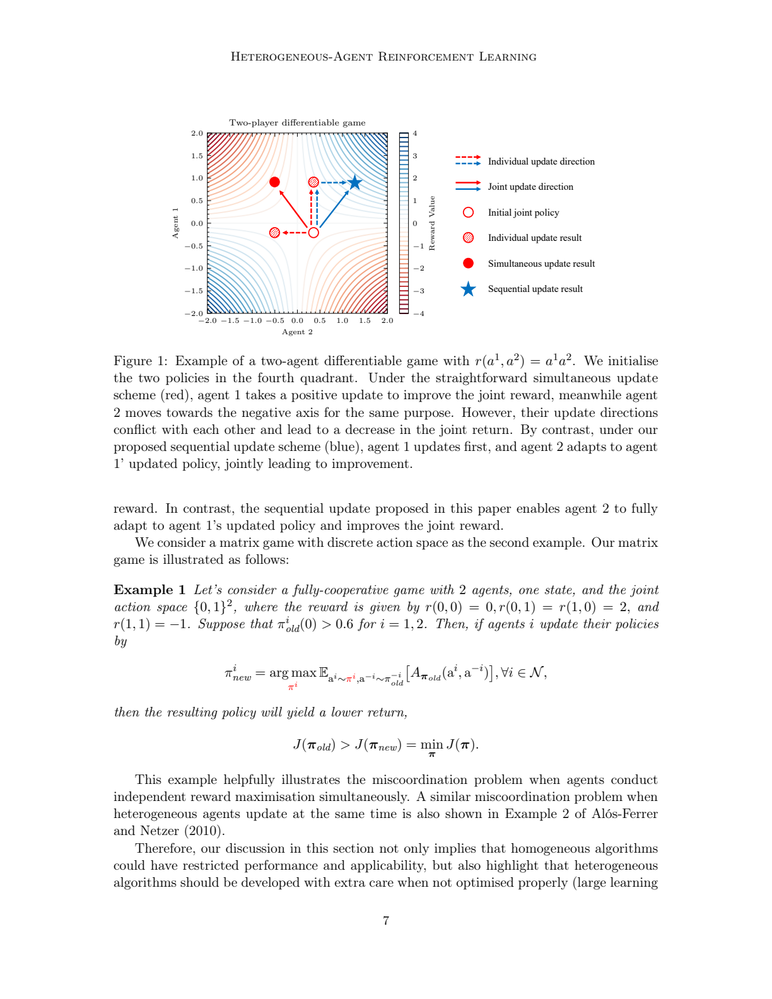

**精读:** 这张图回答“为什么不能把 PPO/TRPO 同时套到每个 agent 上”。在防空编组里，雷达为了提高探测置信度、干扰为了压制目标、火力为了抢占窗口，单看都合理，但同时更新可能破坏全局协同链。

## 4. HATRL：理论策略迭代过程

**Source:** p.9 S0049

**Original:** HARL algorithms are designed for the general and expressive setting of heterogeneous agents, and their essence is to coordinate agents' updates, thus resolving the challenges in Section 2.3.1. We start by developing a theoretically justified Heterogeneous-Agent Trust Region Learning (HATRL) procedure in Section 3.1 and deriving practical algorithms, namely HATRPO and HAPPO, as its tractable approximations in Section 3.2.

**中文:** HARL 算法面向一般且表达力更强的异质智能体设定，其本质是协调 agent 的更新，从而解决前文提出的挑战。作者首先发展理论上有保证的 HATRL 过程，并将 HATRPO 和 HAPPO 作为其可处理近似推导出来。

**精读:** “coordinate agents' updates” 是全篇关键词。HARL 的核心不是让各 agent 更聪明，而是让它们的学习更新不互相打架。

**Source:** p.10 S0052

**Original:** Lemma 4 (Multi-Agent Advantage Decomposition). In any cooperative Markov games, given a joint policy pi, for any state s, and any agent subset i1:m, the below equation holds: `A^{i1:m}_pi(s,a_{i1:m}) = sum_{j=1}^m A^{ij}_pi(s,a_{i1:j-1},a_{ij})`.

**中文:** Lemma 4（多智能体优势分解）。在任意合作 Markov game 中，给定联合策略 `pi`，对任意状态 `s` 和任意 agent 子集 `i1:m`，子集联合优势可分解为按顺序累加的局部优势：`A^{i1:m}_pi(s,a_{i1:m}) = sum_j A^{ij}_pi(s,a_{i1:j-1},a_{ij})`。

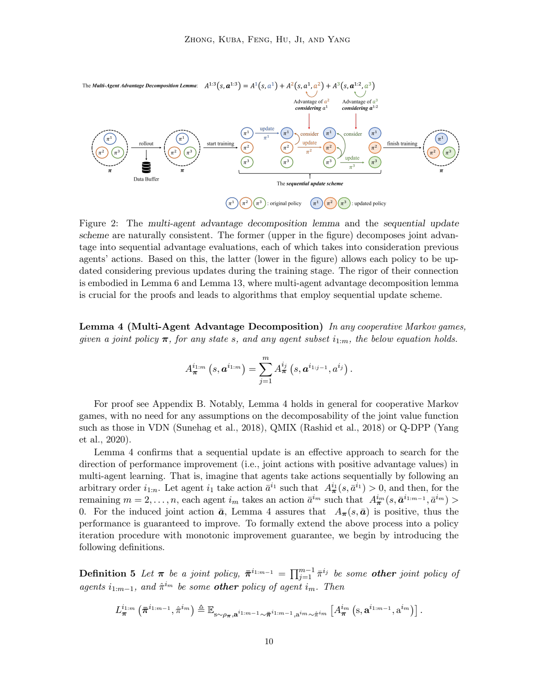

**精读:** 这不是 value decomposition 假设。它不要求联合 Q 函数能拆成个体 Q 函数，而是利用 advantage 的望远镜结构。对异构防空资源来说，这意味着不必强行把团队价值拆成“雷达价值 + 导弹价值 + 干扰价值”，而可以按更新顺序评估各资源的边际贡献。

**Source:** p.11 S0054

**Original:** Lemma 6 Let pi be a joint policy. Then, for any joint policy bar-pi, we have a lower bound of `J(bar-pi)` by summing over sequential local surrogate terms and per-agent KL penalties.

**中文:** Lemma 6 说明：给定当前联合策略 `pi`，任意候选联合策略 `bar-pi` 的回报可由一组顺序局部 surrogate 项和每个 agent 的 KL 惩罚项给出下界。

**精读:** Lemma 6 是把 Lemma 4 接到 trust region lower bound 上的桥。它让“逐个 agent 更新”不只是启发式，而是能形成联合回报下界。

**Source:** p.11 S0059

**Original:** Algorithm 1 does not update the entire joint policy at once, but rather updates each agent's individual policy sequentially. Secondly, during the sequential update, each agent has a unique optimisation objective that takes into account all previous agents' updates, which is also the key for the monotonic improvement property to hold.

**中文:** Algorithm 1 不一次性更新整个联合策略，而是顺序更新每个 agent 的个体策略。并且，在顺序更新中，每个 agent 都有独特的优化目标，该目标显式考虑前序 agent 已完成的更新，这正是单调改进性质成立的关键。

**精读:** 防空类比：不是“雷达策略、火力策略、干扰策略同时各自梯度上升”，而是先更新一个资源类，再把它的新策略作为后续资源类优化的条件。

**Source:** p.11 S0059

**Original:** Theorem 7 A sequence of joint policies updated by Algorithm 1 has the monotonic improvement property, i.e., `J(pi_{k+1}) >= J(pi_k)` for all k.

**中文:** Theorem 7 说明：由 Algorithm 1 更新得到的联合策略序列具有单调改进性质，即对所有 `k`，`J(pi_{k+1}) >= J(pi_k)`。

**Source:** p.12 S0062

**Original:** Theorem 8 Supposing in Algorithm 1 any permutation of agents has a fixed non-zero probability to begin the update, a sequence of joint policies generated by the algorithm, in a cooperative Markov game, has a non-empty set of limit points, each of which is a Nash equilibrium.

**中文:** Theorem 8 说明：如果任意 agent 排列都有固定非零概率被选为更新顺序，那么 Algorithm 1 生成的联合策略序列在 cooperative Markov game 中有非空极限点集合，并且每个极限点都是 Nash equilibrium。

**精读:** 随机更新顺序是理论条件，不是实现细节。它防止固定顺序让某些 agent 长期占优或受限。

## 5. 实用算法：HATRPO 与 HAPPO

**Source:** p.13 S0078

**Original:** Estimating the objective is the last missing piece for HATRPO, which poses new challenges because each agent's objective has to take into account all previous agents' updates. Fortunately, with Proposition 9, we can efficiently estimate this objective by a joint advantage estimator.

**中文:** HATRPO 的最后一个缺口是如何估计目标函数；难点在于每个 agent 的目标必须考虑所有前序 agent 的更新。Proposition 9 说明，可以用联合 advantage estimator 高效估计这个目标。

**精读:** HATRPO/HAPPO 并不需要为每个 agent 各维护一个 centralized critic。它们可依赖 joint advantage estimator，再通过 importance ratio 把顺序目标落到旧策略采样数据上。

**Source:** p.14 S0096

**Original:** To further alleviate the computation burden from HATRPO, one can follow the idea of PPO by considering only using first-order derivatives. This is achieved by making agent im choose a policy parameter which maximises the clipping objective. We refer to the above procedure as HAPPO.

**中文:** 为进一步减轻 HATRPO 的计算负担，可以借鉴 PPO，只使用一阶导数。具体做法是让 agent `im` 选择最大化 clipping objective 的策略参数。作者将这一过程称为 HAPPO。

**精读:** HAPPO 的工程意义仍然很强：它保留顺序更新的异质协同思想，又避免 HATRPO 中二阶近似和共轭梯度的复杂度。

## 6. HAML：这篇长文的最大新增点

**Source:** p.14 S0102

**Original:** Inspired by Mirror Learning that provides a theoretical explanation of the effectiveness of TRPO and PPO in addition to the original trust region interpretation, we further discover a novel theoretical framework for cooperative MARL, named Heterogeneous-Agent Mirror Learning (HAML), which enhances theoretical guarantees of HATRPO and HAPPO.

**中文:** 受 Mirror Learning 启发，作者提出 HAML 这一 cooperative MARL 理论框架。Mirror Learning 为 TRPO/PPO 的有效性提供了除原始 trust region 解释之外的理论解释；HAML 则将这一思想推广到异质智能体，并强化 HATRPO/HAPPO 的理论保证。

**Source:** p.15 S0107

**Original:** The heterogeneous-agent mirror operator (HAMO) integrates the advantage function as an expected local multi-agent advantage minus a drift functional. When the candidate policy equals the old policy, HAMO evaluates to zero; a policy that improves HAMO must make it positive and thus leads to improvement of the multi-agent advantage.

**中文:** HAMO 将 advantage 与 drift functional 结合起来：它等于期望局部多智能体 advantage 减去漂移泛函。当候选策略等于旧策略时，HAMO 为零；若某策略能提高 HAMO，就会使 HAMO 为正，从而带来多智能体 advantage 的提升。

**精读:** HAML 把算法设计拆成三个可替换部件：drift functional、neighbourhood operator、sampling distribution。这一点很适合防空编组，因为不同资源可以有不同的更新距离、硬约束和采样方式。

**Source:** p.16 S0112

**Original:** Algorithm Template 2 draws a random permutation of agents and, for each agent in order, maximises the expected HAMO under a neighbourhood operator. Any HAML algorithm weakly improves the joint return at every iteration.

**中文:** Algorithm Template 2 随机抽取 agent 排列，并按顺序让每个 agent 在邻域算子约束下最大化期望 HAMO。任意 HAML 算法在每轮迭代中都弱改进联合回报。

**Source:** p.16 S0112

**Original:** Theorem 14 (The Fundamental Theorem of Heterogeneous-Agent Mirror Learning) shows that any method derived from Algorithm Template 2 solves the cooperative MARL problem.

**中文:** Theorem 14（HAML 基本定理）表明，从 Algorithm Template 2 派生出的任意方法都能解决 cooperative MARL 问题，并具备一组基础性质，包括单调改进和极限点性质。

**精读:** Theorem 14 是本文理论中心。HATRL 给出了 trust-region 路线，HAML 给出更通用的“算法生成器”。

## 7. HATRPO/HAPPO/HAA2C/HADDPG/HATD3 统一到 HAML

**Source:** p.17 S0123

**Original:** In this section, we show that HATRPO and HAPPO are in fact valid instances of HAML, which provides a more direct theoretical explanation for their excellent empirical performance.

**中文:** 作者在这一节证明 HATRPO 和 HAPPO 实际上是 HAML 的有效实例，这为它们优秀的经验性能提供了更直接的理论解释。

**Source:** p.20 S0142

**Original:** The main additions in our work are: introducing HAML; designing novel algorithm instances of HAML including HAA2C, HADDPG, and HATD3; releasing PyTorch-based implementation; and conducting comprehensive experiments on six challenging benchmarks.

**中文:** 本文的主要新增包括：提出 HAML；设计 HAA2C、HADDPG、HATD3 等 HAML 新算法实例；发布 PyTorch 统一实现；并在六个挑战性 benchmark 上进行综合实验。

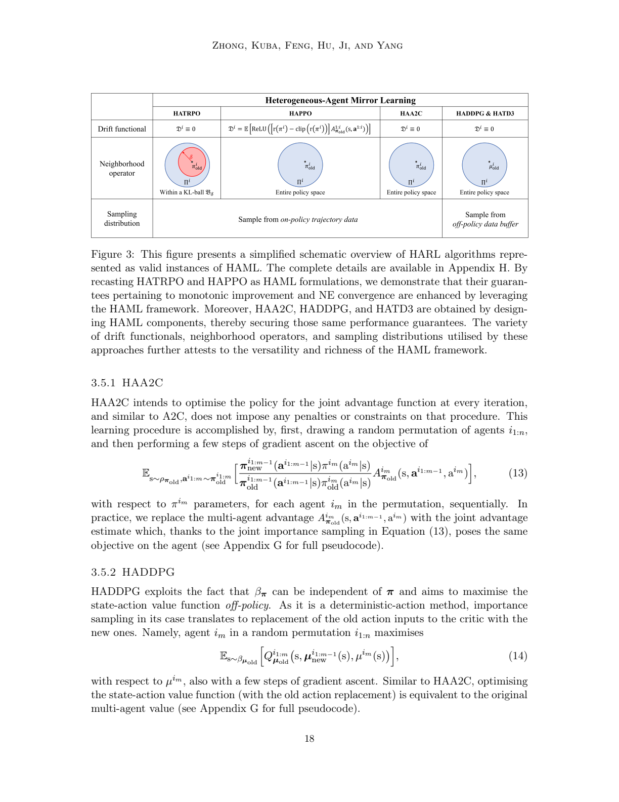

**精读:** Figure 3 是这篇长文最值得反复看的图。它把算法差异压缩为三个维度：drift functional、neighbourhood operator、sampling distribution。HATRPO 是 KL ball + on-policy；HAPPO 是 PPO clip 诱导的 drift + 全策略空间；HADDPG/HATD3 则是 off-policy buffer。

## 8. 实验：六类环境验证异质协同

**Source:** p.20 S0144

**Original:** We evaluate and analyse HARL algorithms on six cooperative multi-agent benchmarks: MPE, MAMuJoCo, SMAC, SMACv2, GRF, and Bi-DexterousHands, and compare their performance to existing SOTA methods.

**中文:** 作者在六类 cooperative multi-agent benchmark 上评估 HARL 算法：MPE、MAMuJoCo、SMAC、SMACv2、GRF 和 Bi-DexterousHands，并与现有 SOTA 方法比较。

**Source:** p.21 S0145

**Original:** The experimental results demonstrate that HAPPO, HADDPG, and HATD3 generally outperform their MA-counterparts on heterogeneous-agent cooperation tasks. Moreover, HARL algorithms culminate in HAPPO and HATD3, which exhibit superior effectiveness and stability for heterogeneous-agent cooperation tasks over existing strong baselines such as MAPPO, QMIX, MADDPG, and MATD3.

**中文:** 实验结果表明，在异质智能体协作任务中，HAPPO、HADDPG、HATD3 通常优于对应的 MA-counterparts。HARL 算法族中表现最突出的通常是 HAPPO 和 HATD3，它们相比 MAPPO、QMIX、MADDPG、MATD3 等强基线，在异质协作任务中表现出更好的有效性和稳定性。

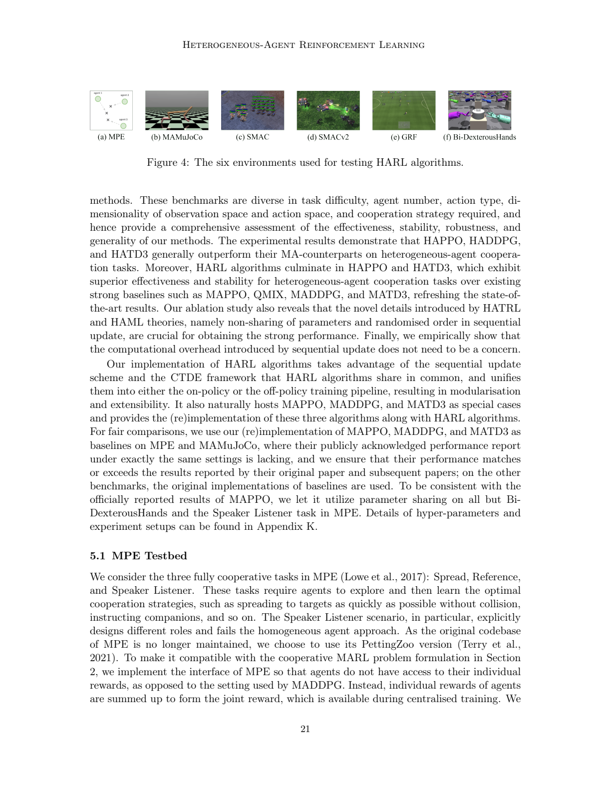

**精读:** 六类环境的意义是覆盖“简单粒子协作 - 机器人身体部件协作 - 即时战略 - 足球 - 灵巧手”不同异质性来源。这比上一篇论文的实验覆盖面更完整。

**Source:** p.22 S0173

**Original:** On MPE, HAPPO consistently solves all six combinations of tasks, with its performance comparable to or better than MAPPO. HATRPO also solves five combinations easily and achieves steady learning curves due to explicitly specified distance constraint and reward improvement between policy updates.

**中文:** 在 MPE 中，HAPPO 稳定解决六种任务组合，性能与 MAPPO 相当或更好。HATRPO 也能轻松解决五种组合，并由于显式设定策略更新间距离约束和回报改进而获得稳定学习曲线。

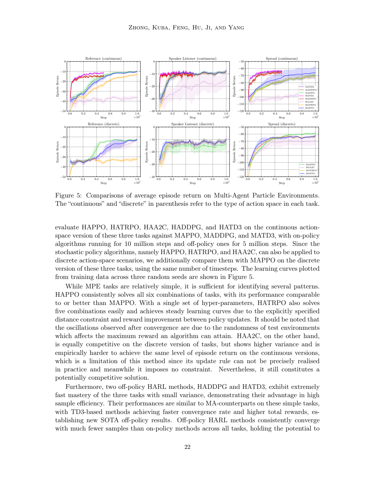

**Source:** p.23 S0191

**Original:** MAMuJoCo models each part of a robot as an independent agent and requires the agents to collectively perform efficient motion. With increasing variety of body parts, modeling heterogeneous policies becomes necessary.

**中文:** MAMuJoCo 将机器人的每个身体部件建模为独立 agent，并要求这些 agent 共同实现高效运动。随着身体部件差异增加，建模异质策略变得必要。

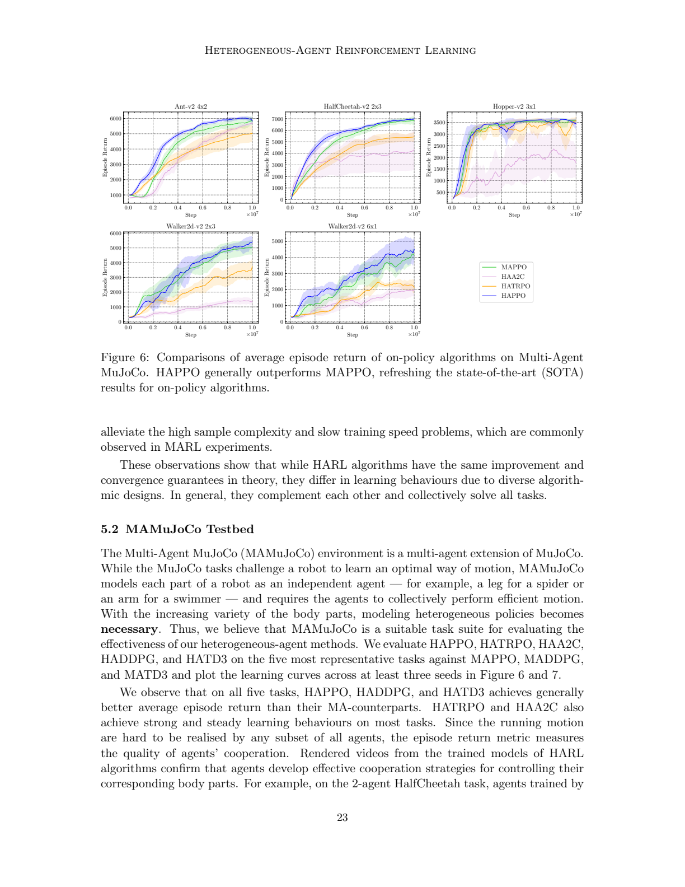

**精读:** MAMuJoCo 仍是与“异构防空资源协同”最相似的 benchmark：各部件单独动作没有意义，只有协同后才形成有效运动；防空中的探测、跟踪、干扰、拦截也是如此。

**Source:** p.24 S0207

**Original:** HADDPG and HATD3 generally outperform MADDPG and MATD3, while HATD3 achieves the highest average return across all tasks, thereby refreshing the SOTA results for off-policy algorithms.

**中文:** HADDPG 和 HATD3 通常优于 MADDPG 和 MATD3，其中 HATD3 在所有任务中达到最高平均回报，刷新 off-policy 算法的 SOTA 结果。

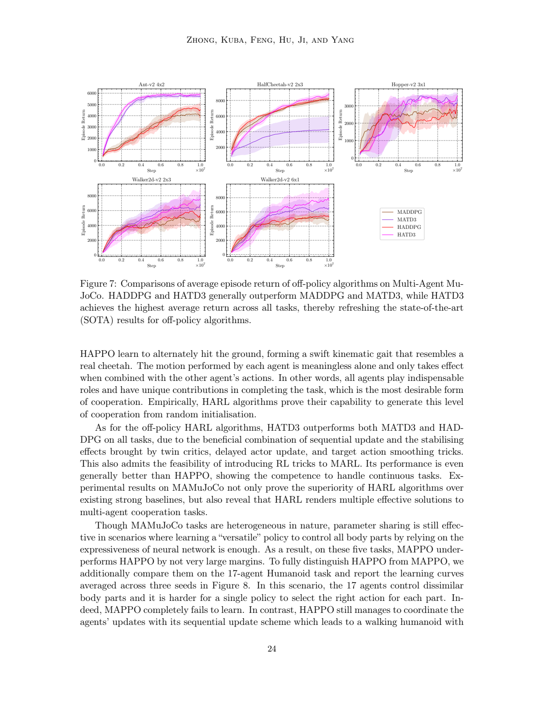

**Source:** p.25 S0214

**Original:** In the face of this many-heterogeneous-agent task, HAPPO and HATD3 achieve SOTA performance, while MAPPO fails completely. This highlights the superior effectiveness of HARL algorithms for promoting cooperation among heterogeneous agents.

**中文:** 面对 17-agent Humanoid 这一多异质智能体任务，HAPPO 和 HATD3 达到 SOTA 表现，而 MAPPO 完全失败。这突出了 HARL 在促进异质 agent 协作方面的优势。

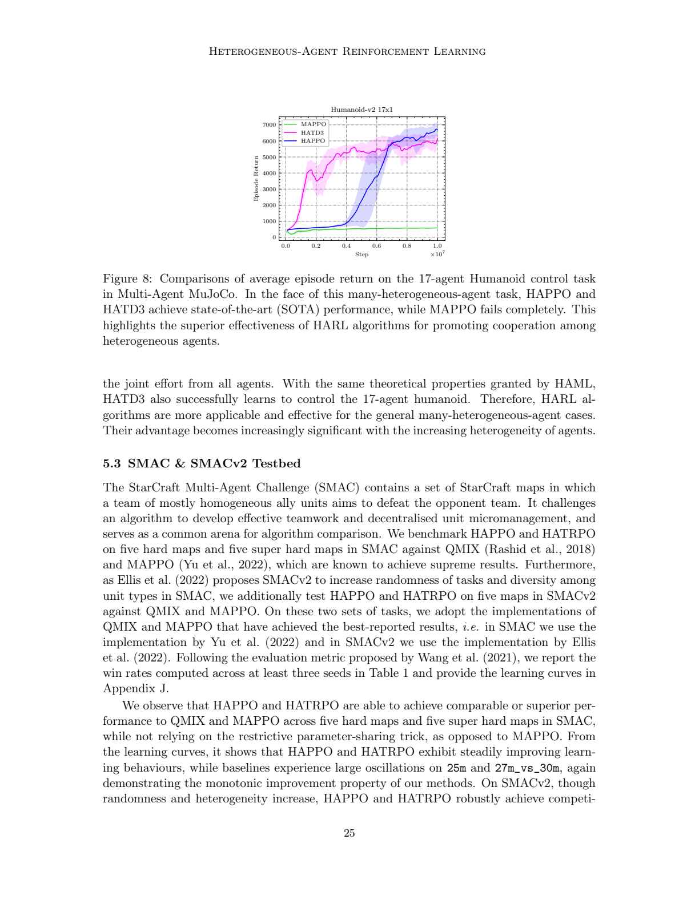

**Source:** p.25 S0218

**Original:** HAPPO and HATRPO achieve comparable or superior performance to QMIX and MAPPO on SMAC and SMACv2 while not relying on restrictive parameter sharing.

**中文:** HAPPO 和 HATRPO 在 SMAC 与 SMACv2 上达到与 QMIX/MAPPO 相当或更优的表现，同时不依赖限制性的参数共享技巧。

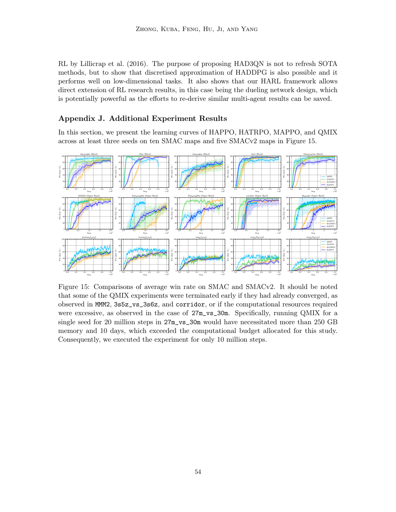

**图注说明:** p.54 Figure 15 给出 SMAC 与 SMACv2 的附录学习曲线，用于补充 Table 1 的胜率结果。它说明 HAPPO/HATRPO 在多张 hard/super-hard 地图上保持竞争性表现，但并不依赖 MAPPO 常用的参数共享设定。

**Source:** p.27 S0240

**Original:** On GRF, as the number of agents increases and the roles they play become more diverse, the performance gap between HAPPO and MAPPO becomes larger, again showing the effectiveness and advantage of HARL algorithms for many-heterogeneous-agent cases.

**中文:** 在 GRF 中，随着 agent 数量增加、角色更趋多样，HAPPO 与 MAPPO 的性能差距变大，再次显示 HARL 在多异质 agent 场景中的有效性和优势。

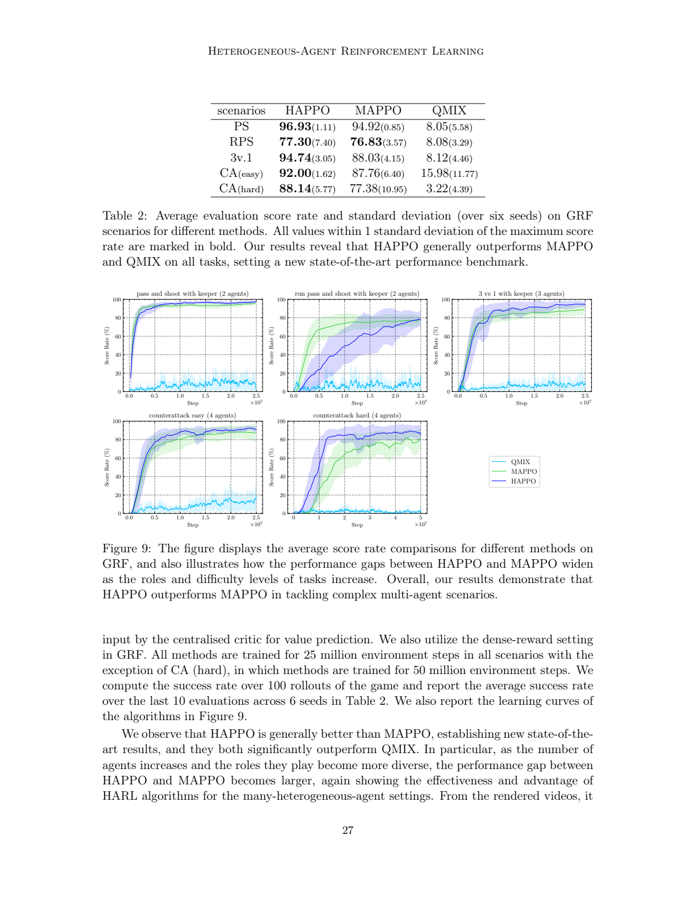

**Source:** p.28 S0253

**Original:** On Bi-DexterousHands, HAPPO consistently outperforms MAPPO and is at least comparable to or better than the single-agent baseline PPO, while also showing less variance. The comparison between HAPPO and MAPPO demonstrates the superior competence of the sequential update scheme adopted by HARL algorithms over simultaneous updates.

**中文:** 在 Bi-DexterousHands 中，HAPPO 持续优于 MAPPO，并且至少与单智能体 PPO 相当或更好，同时方差更小。HAPPO 与 MAPPO 的比较说明，HARL 采用的顺序更新机制相对于同时更新具有更强的异质协同能力。

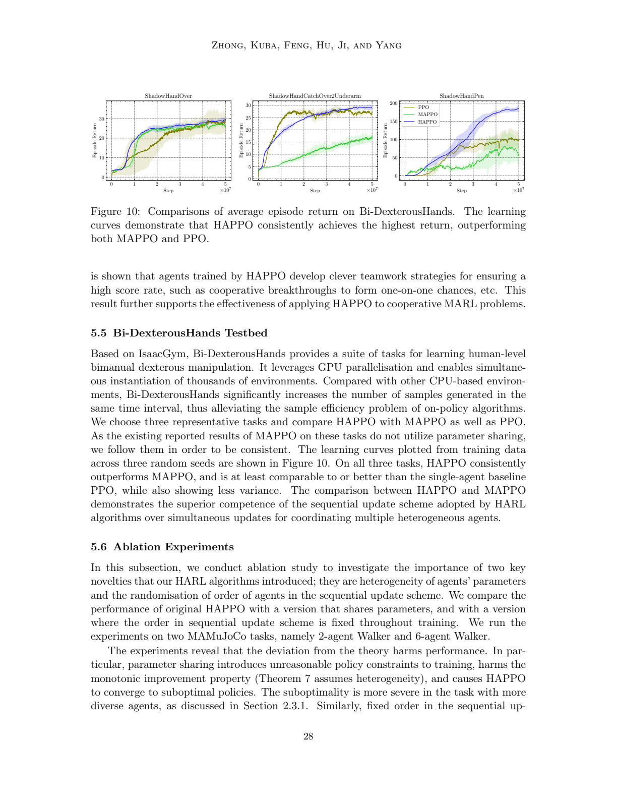

## 9. 消融与计算代价

**Source:** p.28 S0255

**Original:** The ablation study investigates two key novelties: heterogeneity of agents' parameters and randomisation of order of agents in the sequential update scheme. The experiments reveal that deviation from theory harms performance. Parameter sharing introduces unreasonable policy constraints, harms the monotonic improvement property, and causes HAPPO to converge to suboptimal policies.

**中文:** 消融研究考察两个关键新颖点：agent 参数异质性，以及顺序更新中 agent 顺序的随机化。实验表明，偏离理论会损害性能。参数共享会引入不合理的策略约束，损害单调改进性质，并使 HAPPO 收敛到次优策略。

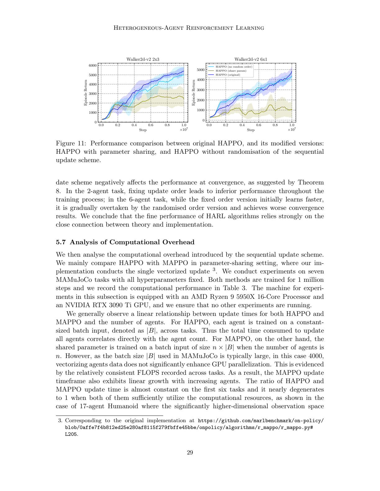

**Source:** p.30 S0269

**Original:** The figures suggest that the sequential update scheme does not introduce much computational burden compared to MAPPO. At the same time, HAPPO generally outperforms parameter-sharing MAPPO.

**中文:** 这些结果表明，与 MAPPO 相比，顺序更新机制并没有引入很大的计算负担。同时，HAPPO 通常优于参数共享 MAPPO。

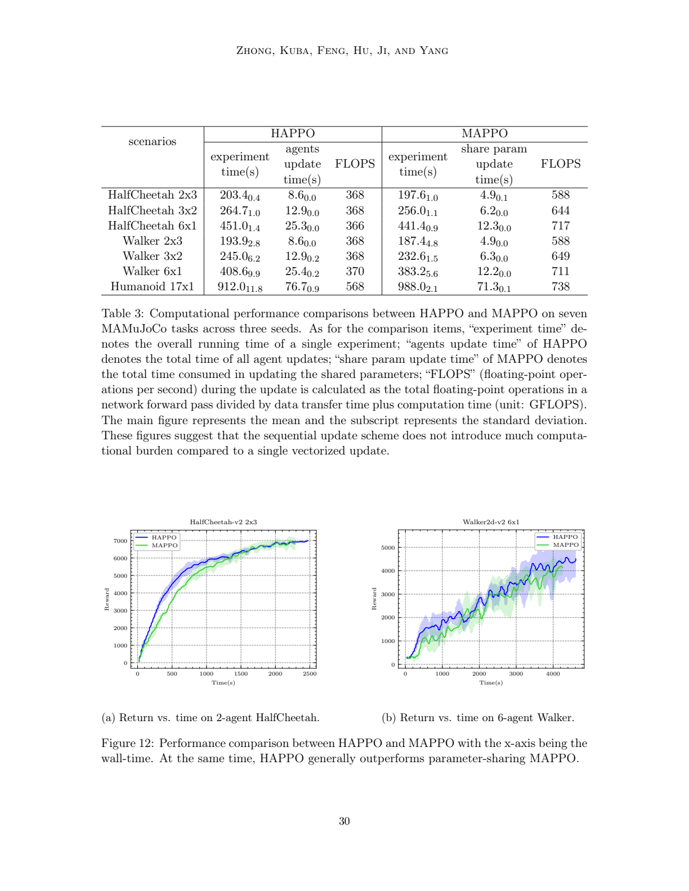

**精读:** 消融和计算代价是对工程落地最有用的部分。作者证明：非共享参数和随机顺序不是可有可无的技巧；同时，顺序更新的计算开销并没有大到不可接受。

## 10. 对防空编组的迁移启发

### 10.1 建模映射

| HARL 概念                | 防空编组解释                | 建模要点                                |
| ---------------------- | --------------------- | ----------------------------------- |
| agent                  | 雷达、拦截器、火控节点、干扰节点、指挥节点 | 可按资源类型或平台建模                         |
| heterogeneous policy   | 不同资源拥有不同动作空间和策略网络     | 不宜强行参数共享                            |
| joint reward           | 区域防空成功率、威胁降低、资源消耗惩罚   | 需转成团队共享目标                           |
| sequential update      | 按资源顺序或随机顺序逐类更新        | 防止局部策略同时更新破坏全局协同                    |
| HAML drift functional  | 不同资源的策略变化代价           | 导弹发射变化代价应高于雷达波束调整                   |
| neighbourhood operator | 硬约束集合                 | 发射窗口、弹药余量、通信约束、安全规则                 |
| sampling distribution  | 训练数据来源                | 可结合仿真 on-policy 与历史/规则数据 off-policy |

### 10.2 适合优先尝试的算法路线

1. 基线：MAPPO/IPPO，用于确认仿真环境和 reward 设计是否可学。
2. 主线：HAPPO，用异质 actor + 顺序更新验证资源协同收益。
3. 高样本效率路线：HATD3/HADDPG，用 off-policy buffer 提升仿真数据利用率。
4. 安全扩展：在 HAML 的 neighbourhood operator 中加入硬约束，例如弹药、空域、规则交战、误击风险。

### 10.3 关键实验问题

| 实验问题                   | 对应论文证据                | 防空场景检验方式               |
| ---------------------- | --------------------- | ---------------------- |
| 参数共享是否伤害异构资源？          | Figure 11 消融          | 共享/非共享雷达-火力-干扰策略对比     |
| 顺序随机化是否必要？             | Theorem 8 + Figure 11 | 固定资源顺序 vs 随机资源顺序       |
| 异质程度越高优势是否越明显？         | Humanoid、GRF 结果       | 增加资源类型和动作空间差异          |
| off-policy HARL 是否更高效？ | HATD3/HADDPG 结果       | 用历史仿真 buffer 提升训练效率    |
| 计算开销是否可接受？             | Table 3 + Figure 12   | 统计 wall-time、推理延迟、训练吞吐 |

## 11. 图表页资产索引

以下为本轮渲染的图表页资产，均可从 `assets/` 下查看：

- `assets/page_07.png`: Figure 1，同时更新失败反例
- `assets/page_10.png`: Figure 2，advantage decomposition 与 sequential update
- `assets/page_18.png`: Figure 3，HARL algorithms as HAML instances
- `assets/page_21.png`: Figure 4，六类 benchmark
- `assets/page_22.png`: Figure 5，MPE
- `assets/page_23.png`: Figure 6，MAMuJoCo on-policy
- `assets/page_24.png`: Figure 7，MAMuJoCo off-policy
- `assets/page_25.png`: Figure 8，17-agent Humanoid
- `assets/page_27.png`: Figure 9，GRF
- `assets/page_28.png`: Figure 10，Bi-DexterousHands
- `assets/page_29.png`: Figure 11，参数共享/固定顺序消融
- `assets/page_30.png`: Table 3 与 Figure 12，计算开销与 wall-time
- `assets/page_54.png`: Figure 15，SMAC/SMACv2 附录曲线

## 12. 精读检查问题

读完这篇后，你应该能回答：

1. HARL 与 HATRPO/HAPPO 的关系是什么？为什么说 HARL 是算法族？
2. HATRL 与 HAML 分别解决什么理论问题？
3. Lemma 4 为什么比 value decomposition 假设更一般？
4. Theorem 7 和 Theorem 8 分别保证什么？
5. HAML 中 HADF、neighbourhood operator、sampling distribution 三个组件分别对应什么算法设计自由度？
6. 为什么 HAPPO 可以被视为 HAML 实例？
7. HATD3/HADDPG 的 off-policy 设定对防空仿真训练有什么价值？
8. 为什么 17-agent Humanoid 和 GRF 更能体现异质协同优势？
9. 消融实验为什么说明“非参数共享”和“随机顺序”不是普通工程技巧？
10. 如果迁移到防空编组，哪些约束必须进入 neighbourhood operator 或 reward 设计？
