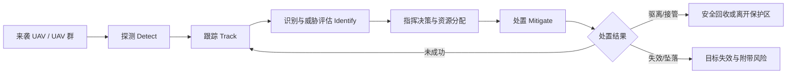
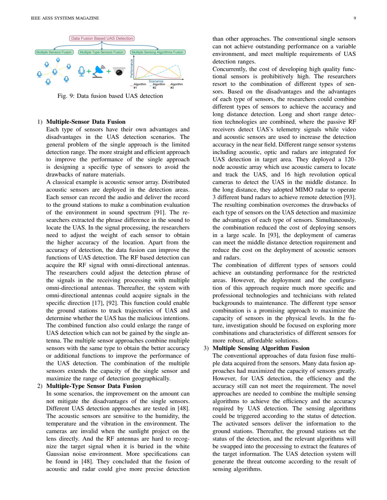
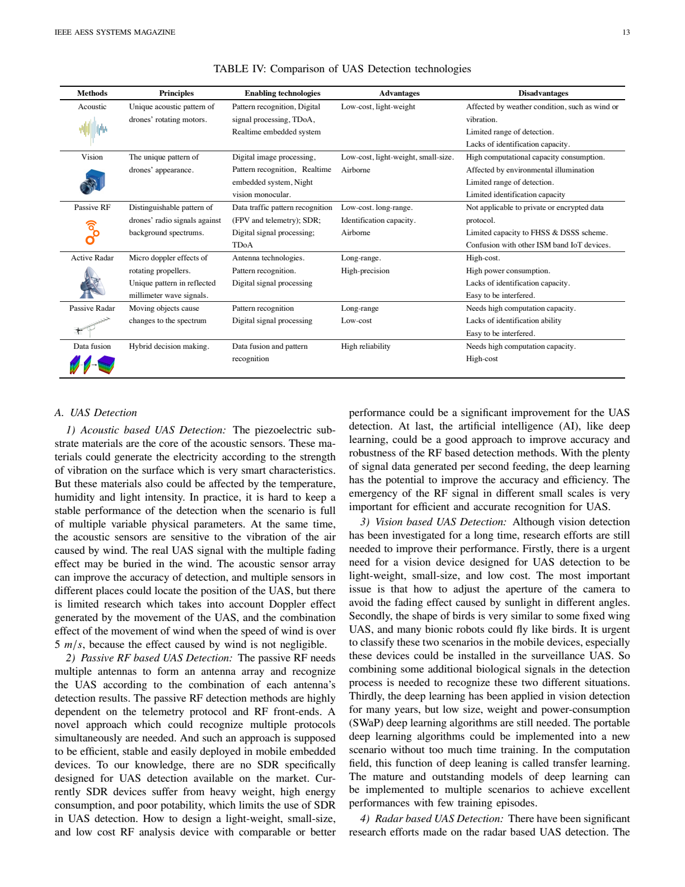
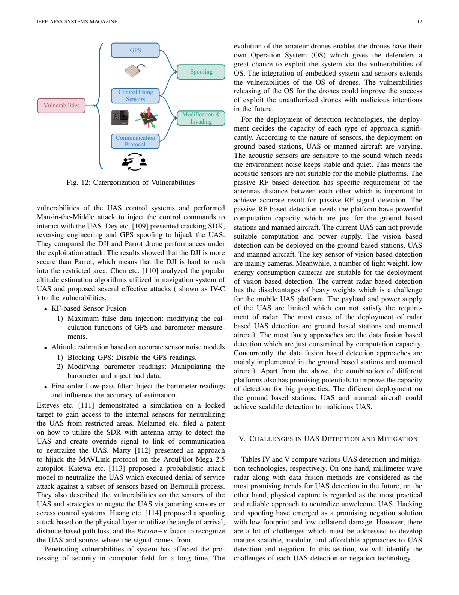
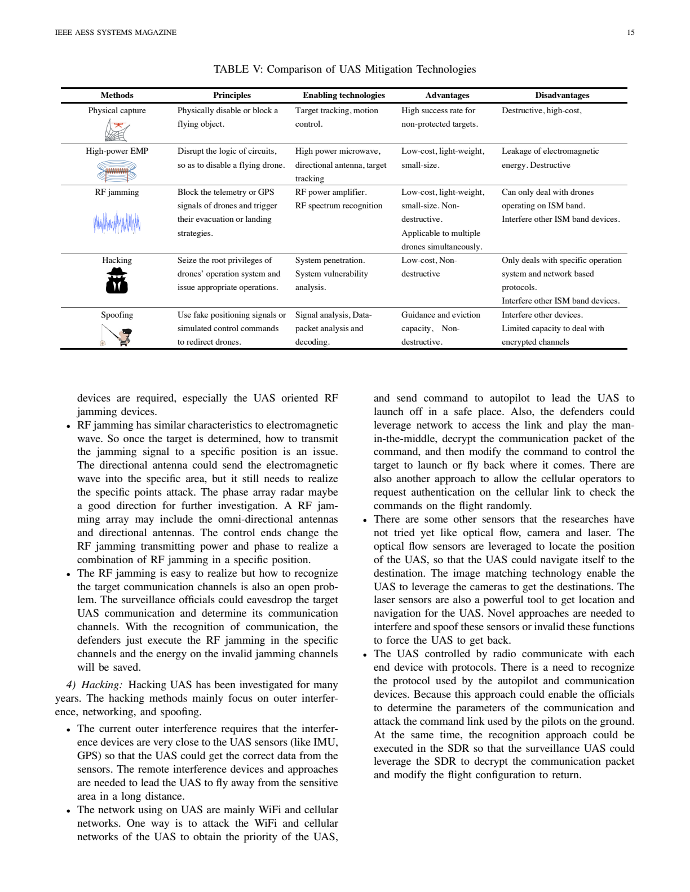
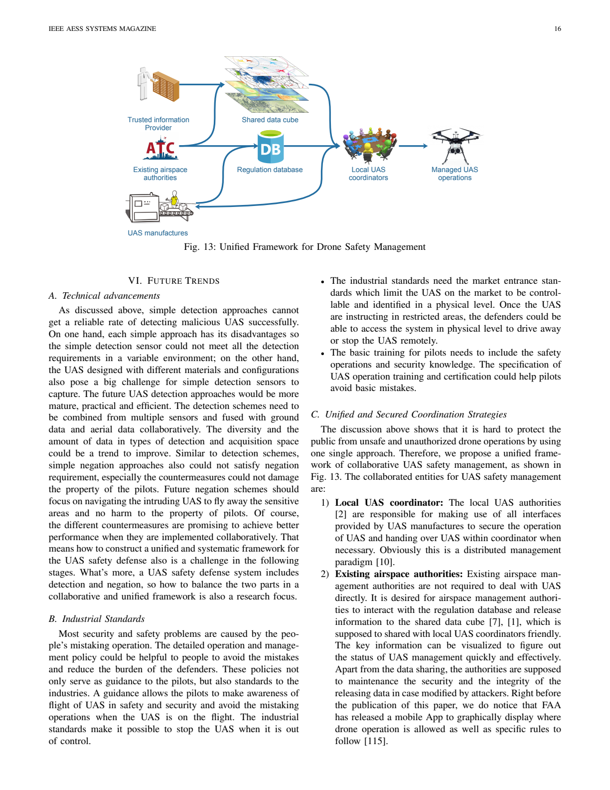
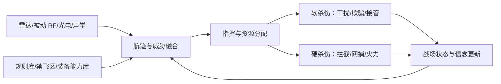

# Counter-UAS: State of the Art, Challenges and Future Trends 精读

Source PDF: `P05_2020_Counter_UAS_State_of_the_Art_Challenges_Future_Trends.pdf`  
Authors: Jian Wang, Yongxin Liu, Houbing Song  
Source version: arXiv:2008.12461v1, 2020；论文版式标注为 IEEE AESS Systems Magazine  
Reader status: 精读第一版。已提取全文 20 页文本，重点覆盖技术分类、系统链路、局限性，以及向反 UAV 防空编组强化学习环境的迁移。

## 一句话读懂

这篇论文不是强化学习论文，而是一篇 C-UAS 工程技术综述。它最重要的价值，是把反无人机系统整理为“探测、跟踪、识别、处置”闭环，并给出传感器与效应器的能力边界；这些能力边界正好可以转化为强化学习环境中的 agent 类型、观测变量、动作可行性、状态转移和安全约束。

## 阅读结论先行

对你的课题而言，最需要带走四个结论：

1. C-UAS 不是单纯的“火力分配”，而是感知与处置耦合的序贯决策问题。
2. 不同处置手段并非对所有 UAV 都有效，动作必须受目标通信链、导航方式、距离、识别置信度和附带损伤约束。
3. 真实目标状态不能默认对所有 agent 可见，应把问题建成带信念状态的 Dec-POMDP 或至少是部分可观测 Markov game。
4. 单传感器和单效应器都不可靠，真正有研究价值的是异构传感器、软杀伤、硬杀伤与指挥分配的联合编组。

## 论文结构

| 原文章节 | 页码 | 核心问题 | 对环境建模的作用 |
| --- | ---: | --- | --- |
| Introduction / Background | p.1-p.4 | 为什么需要 C-UAS、威胁有哪些 | 定义任务目标、保护对象和威胁类型 |
| State of the Art Detection | p.4-p.10 | 如何探测、定位、跟踪与识别 | 定义传感器 agent、观测和信息质量 |
| State of the Art Mitigation | p.10-p.12 | 如何捕获、干扰、欺骗或接管 UAV | 定义效应器 agent、动作和条件成功率 |
| Challenges | p.13-p.15 | 各技术的能力边界 | 定义动作掩码、成本、失效与约束 |
| Future Trends | p.16-p.17 | 多传感器、多手段和多主体协同 | 支撑异构 MARL 与分层决策架构 |

## 1. 论文研究问题与贡献边界

论文从三个现实动因出发：公共安全、国家安全和个人隐私。作者认为，理想 C-UAS 系统应具备两个子系统：

- 探测子系统：detect、track、identify，并尽量自动化、低占地、具备定位能力。
- 处置子系统：依法且安全地 disable、disrupt 或 seize control，同时降低附带损伤和单次处置成本。

论文的主要贡献是技术分类与定性比较，不是提出一个新的探测算法或处置算法。其证据主要来自已有工作汇总，因此它适合回答“环境里应该有什么”，不适合直接回答“RL 算法应该怎么训练”。

论文的总体逻辑可重构为：



精读判断：论文虽然把系统写成“探测 + 处置”两部分，但实际决策链至少有五段。对强化学习环境而言，`track`、`identify` 和 `resource allocation` 不能被悄悄折叠掉，否则 agent 会在拥有完美信息的假想世界里学习。

## 2. 威胁模型：防御目标到底在防什么

论文将威胁分为三类：

| 威胁类别 | 典型对象 | 威胁方式 | 可能后果 |
| --- | --- | --- | --- |
| Safety | 人员、设施、航空器、高价值目标 | 碰撞、操作失误、受控攻击 | 人员伤亡、财产损失、空域中断 |
| Security | 军事设施、关键基础设施、敏感区域 | 侦察、测绘、载荷投送、走私 | 信息泄露、设施受损、国家安全风险 |
| Privacy | 人员与私人空间 | 摄像、实时视频回传 | 隐私侵害 |

作者还列出三类国家安全任务：武器化或走私载荷、禁止性监视侦察、知识产权/敏感信息窃取。

### 对反 UAV 防空编组的迁移

你的环境中不能只用“敌机是否进入某个圆”定义威胁。更合理的目标状态至少包括：

- 运动学：位置、速度、航向、高度、加速度、预计到达时间。
- 任务属性：侦察、投送、撞击、诱饵、中继等任务假设及其概率。
- 载荷与毁伤：载荷类别、潜在毁伤、目标价值权重。
- 行为意图：是否朝保护对象逼近、是否盘旋侦察、是否协同分散或饱和突防。
- 信息状态：目标是否被发现、航迹质量、类别置信度、意图置信度。

这意味着威胁度不是一个固定标签，而应是随观测更新的量，例如：

```text
Threat_j = f(TTI_j, asset_value, payload_belief,
             intent_belief, track_quality, penetration_probability)
```

## 3. 探测技术：五类感知能力如何互补

论文将探测方法分为 acoustic、passive RF、vision、radar 和 data fusion。作者的核心判断是：单一传感器在多变环境下无法稳定完成探测与识别，数据融合是更有前景的方向。

### 3.1 声学探测

原理是利用旋翼、电机等声学特征，通过频谱、功率谱、MFCC、TDOA、波束形成或机器学习进行检测、定位与分类。

优势：成本低、重量小、阵列易部署。  
主要限制：探测距离有限，容易受风、振动、温湿度和背景噪声影响；阵列定位依赖校准，长期稳定性有限，目标识别能力较弱。

环境建模变量：

- 风速、背景噪声、传感器位置和校准误差。
- 声学检测概率、虚警概率、测向/定位误差。
- 目标距离、旋翼类型与目标声学特征强度。

精读判断：声学传感器更适合做近程预警或异源确认，不适合在第一版环境里充当唯一远程探测 agent。

### 3.2 被动 RF 探测

被动 RF 利用 UAV 与遥控端之间的遥测、控制或图传链路。论文归纳了频谱模式、数据流模式、运动-信号耦合特征和发射源定位等方法，常用 SDR 作为接收平台。

优势：低成本、较远距离、能够提供协议或型号识别信息，且具备机载部署潜力。  
主要限制：依赖目标发射 RF 信号；私有协议、加密链路、FHSS/DSSS 和自主飞行会削弱效果；还会与 ISM 频段其他设备混淆。

环境建模变量：

- `link_active`：目标是否正在通信。
- `protocol_known`、`encrypted`、`frequency_hopping`。
- 频段、带宽、信号强度、DoA、协议识别置信度。
- 目标是遥控、预编程航路、卫星导航还是视觉/惯导自主飞行。

精读判断：`link_active` 和 `navigation_mode` 是决定“被动 RF 能否探测”和“RF 干扰能否生效”的共同隐变量，应贯穿感知与处置两侧，而不能分别随机生成。

### 3.3 视觉与红外探测

视觉方法使用视频/图像分割、目标检测、CNN、红外热特征或动态视觉传感器识别 UAV。论文特别强调 UAV 与鸟类区分、光照变化、天气和嵌入式算力问题。

优势：低成本、小型化、可机载，能够提供丰富的外观类别信息。  
主要限制：视距和光照敏感，探测距离有限，计算负担高；小目标、复杂背景、鸟类和仿生目标容易造成误判。

环境建模变量：

- 光照、能见度、云雾、背景复杂度、遮挡和视场角。
- 像素尺度或角尺寸、目标是否在视场内。
- UAV/bird 分类置信度与误分类概率。
- 相机朝向、云台状态和处理时延。

### 3.4 雷达探测

论文将雷达分为主动雷达、被动雷达和后端信号处理三部分。主动雷达通过更高频段、FMCW、MIMO、噪声雷达等提升小目标分辨率；被动雷达利用 Wi-Fi、蜂窝或 DVB 等机会照射源；后端处理重点利用旋翼微多普勒、距离-速度图和学习式分类器。

优势：昼夜工作、相对不依赖天气、可同时测距测速、远距离和高精度。  
主要限制：小型低速 UAV 的 RCS 小，传统多普勒处理容易将其淹没在杂波中；主动雷达成本和能耗高，被动雷达计算负担高；型号识别仍然有限。

环境建模变量：

- RCS、目标径向速度、微多普勒可见度、材料与旋翼类型。
- 雷达量程、波束指向、更新率、杂波、SNR、干扰状态。
- 主动发射成本、被侦察风险和信号处理时延。

### 3.5 数据融合

作者将融合分成三个层次：

1. 同型多传感器融合：例如麦克风阵列或多天线，提高定位精度、覆盖和测向能力。
2. 异型传感器融合：例如远程雷达/被动 RF 预警，中近程视觉和声学确认。
3. 多算法融合与调度：根据当前检测状态，动态启用不同算法、调整精度和计算开销。



作者指出，融合的难点不仅是“把数据拼起来”，还包括结果一致性、不同传感器权重、异构采样精度、算法调度和计算开销。

### 探测技术综合比较



将论文 Table IV 转成建模语言：

| 传感器 | 主要能力 | 应建模的失效条件 | 适合承担的角色 |
| --- | --- | --- | --- |
| Acoustic | 近程发现、声源定位 | 大风、噪声、距离过远、校准漂移 | 廉价近程哨戒/确认 |
| Vision/IR | 分类、精细跟踪 | 光照、天气、遮挡、鸟类混淆 | 识别与末段跟踪 |
| Passive RF | 发现、协议识别、测向 | 静默、自主飞行、加密/跳频 | 远程被动预警与链路识别 |
| Active radar | 远程搜索、测距测速 | 低 RCS、低速杂波、干扰 | 主搜索与稳定航迹生成 |
| Passive radar | 隐蔽搜索 | 照射源几何、算力、杂波 | 补充覆盖与隐蔽探测 |
| Fusion node | 航迹融合、置信度更新 | 通信延迟、异步采样、错误关联 | 中央 critic/指挥决策输入 |

## 4. 处置技术：动作为什么必须带条件

论文把 UAS negation 分为三大类：物理捕获、干扰、漏洞利用。它还区分两种处置结局：

- capture and retrieve：驱离、接管或安全回收，尽量保全目标与周边财产。
- disable and drop：直接使目标失效并坠落，可能引入地面附带风险。

这个区分对奖励设计非常重要。处置成功不应只有一个二值奖励；“安全驱离”和“在保护对象上空坠落”不能同分。

### 4.1 物理捕获与定向 EMP

物理方法包括网捕、投射网、拦截 UAV 携网等，依赖稳定跟踪、运动控制和有效射程。优点是直接、对非防护目标成功率较高；缺点是可能损坏目标、成本高，并引入坠落风险。

论文把定向 EMP 放在该小节讨论：通过高功率微波/电磁脉冲扰乱机载电路。其有效性受作用距离、波束发散、频率、能量和非目标设备安全限制。

### 4.2 RF/GPS 干扰

论文讨论了三种通信干扰方式：

- Tone：对单一信道中心发送窄带干扰。
- Sweep：扫描整个频段。
- Protocol-aware：识别目标协议后生成针对性信号。

协议感知干扰通常比无差别 tone/sweep 更节能、更有效，但前提是先完成通信侦察与协议识别。论文还涉及 GPS 欺骗、雷达网络干扰、黑洞攻击和重放攻击。

优势：可非毁伤、成本和重量相对较低，某些方式可同时影响多架 UAV。  
主要限制：仅对存在可攻击链路/导航依赖的目标有效；方向性不足会干扰友方和民用设备；功率消耗、作用时延和频谱识别是关键问题。

### 4.3 漏洞利用、接管与欺骗

漏洞利用针对 GPS、通信协议和控制传感器，通过 spoofing、修改、注入或入侵获得控制权。它可能实现安全驱离或迫降，附带损伤较小，但高度依赖具体操作系统、协议、密钥状态和已知漏洞。



### 处置技术综合比较



| 处置手段 | 目标依赖条件 | 主要动作参数 | 关键副作用 |
| --- | --- | --- | --- |
| 网捕/硬拦截 | 距离、射界、跟踪质量、目标尺寸 | 目标、发射时机、拦截轨迹 | 弹药消耗、坠落和误伤 |
| 定向 EMP | 距离、波束、频率响应、功率 | 目标、功率、频率、照射时间 | 电磁泄漏、非目标设备损伤 |
| RF jamming | 链路活动、频段、协议、信干比 | 目标/区域、频段、功率、模式、持续时间 | 友方通信干扰、能耗 |
| GPS spoofing | 目标依赖 GNSS、可欺骗性 | 欺骗轨迹、功率、持续时间 | 影响周边导航设备 |
| Hacking/接管 | 已知协议/漏洞、链路可访问 | 攻击方式、注入命令、接管目标 | 失败时延、目标特异性 |

## 5. 作者认为最关键的挑战

论文 Table IV/V 和第 V 节给出一组跨技术共性问题：

- 可扩展性：面对大区域、多目标或 UAV 群，传感器覆盖和效应器容量不足。
- 模块化：传感器、算法、平台和处置设备难以快速组合。
- 成本与 SWaP：尺寸、重量、功耗、算力和维护成本制约部署。
- 环境适应性：天气、杂波、光照、噪声和电磁环境会改变探测性能。
- 识别可靠性：发现目标不等于识别其类别、协议和意图。
- 定向作用：干扰和 EMP 难以只作用于指定目标。
- 附带损伤：硬杀伤坠落、频谱污染和错误接管都可能造成二次风险。
- 协同一致性：多传感器结果可能冲突，感知和处置之间也存在资源竞争。

作者在 2020 年的趋势判断是：毫米波雷达与数据融合较有希望；物理捕获较实用可靠；hacking 和 spoofing 具有低占地、低附带损伤潜力。这里应理解为综述作者基于当时文献的定性判断，不是跨场景的定量结论。

## 6. 未来趋势：从单设备走向协同系统

作者提出三个方向：

1. 技术融合：地面和空中多传感器联合，多个处置手段协同。
2. 工业标准：通过可识别、可控接口和操作规范降低防御负担。
3. 统一协调：空域管理、制造商、可信信息提供方、地方协调者和 UAV 运行主体共享数据。



论文原图偏向民用空域治理。迁移到防空编组后，可改写成：



## 7. 向强化学习环境的完整映射

### 7.1 推荐的建模形式

建议把问题写成异构 Dec-POMDP：

```text
M = <I, S, {O_i}, {A_i}, P, R, gamma>
```

- `I`：异构防御资源集合。
- `S`：仿真器掌握的真实全局状态。
- `O_i`：每个 agent 可获得的局部观测。
- `A_i`：各类 agent 不同的动作空间。
- `P`：目标运动、传感器观测、航迹更新和处置效果的联合转移。
- `R`：防御效果、资源成本、时间和安全约束的综合回报。

最重要的边界是 `S != O_i`。仿真器可以知道目标真实位置和链路模式，但策略只能看到带误差、延迟和置信度的航迹。

### 7.2 全局状态空间

可将真实状态写成：

```text
s_t = {
  X_threat, X_asset, X_sensor, X_effector,
  X_track, X_network, X_environment, X_assignment
}
```

具体包括：

| 状态组 | 建议字段 |
| --- | --- |
| 威胁目标 | 位置、速度、航向、高度、类型、载荷、任务意图、RCS、声学特征、通信/导航模式、健康状态 |
| 保护对象 | 位置、价值、脆弱度、剩余承伤、禁射区/禁干扰区 |
| 传感器 | 位置、朝向、覆盖、模式、更新率、能耗、冷却、健康、测量误差 |
| 效应器 | 位置、射程、弹药/能量、频段、功率、冷却、占用状态、杀伤概率模型 |
| 航迹/信念 | 估计状态、协方差、类别概率、意图概率、AoI、数据来源、是否丢失 |
| 通信网络 | 邻接关系、带宽、时延、丢包、节点故障 |
| 环境 | 天气、风、光照、背景噪声、地物遮挡、电磁杂波 |
| 任务分配 | 当前资源-目标匹配、交战阶段、重复分配、切换次数 |

### 7.3 Agent 的具体指代

第一版环境建议采用“资源节点即 agent”，而不是把每个算法模块都做成 agent：

| Agent 类型 | 实体含义 | 典型局部观测 | 典型职责 |
| --- | --- | --- | --- |
| Sensor agent | 一部雷达、光电、被动 RF 或复合探测节点 | 自身状态、局部测量、邻近航迹、通信状态 | 搜索、跟踪、识别、移交 |
| Jammer agent | 一套固定/机动干扰设备 | 目标链路估计、频谱、距离、友方频谱占用 | 频段选择、功率控制、压制/欺骗 |
| Interceptor agent | 导弹、网捕 UAV、火力单元或拦截平台 | 航迹质量、射界、弹药、到达时间 | 目标选择、交战、重分配 |
| Command agent（可选） | 编组指挥/资源分配节点 | 融合航迹、全局资源摘要、规则约束 | 分配、优先级、授权与重规划 |

粒度选择原则：

- 如果研究重点是资源协同，使用资源节点 agent，符合 HAPPO/HARL 的异构设定。
- 如果研究重点只是全局任务分配，可只设一个 command agent，把其余装备作为环境资源。
- 不建议第一版同时学习底层飞行控制、传感器信号处理和高层资源分配，时间尺度差异会显著增加训练难度。

### 7.4 局部观测空间

Sensor agent 的观测可包含：

```text
o_sensor = [self_state, local_measurements, track_beliefs,
            weather/clutter, sensor_mode, neighbor_messages]
```

Jammer agent 的观测可包含：

```text
o_jammer = [self_state, candidate_tracks, link_beliefs,
            spectrum_occupancy, friendly_channels, assignment]
```

Interceptor agent 的观测可包含：

```text
o_interceptor = [self_state, candidate_tracks, TTI/TTA,
                 firing_solution, collateral_risk, assignment]
```

局部观测中应保留三种不确定性：位置协方差、类别/意图概率、信息年龄 AoI。只有目标估计坐标而没有置信度，会让策略无法区分“目标真的危险”和“航迹很不可靠”。

### 7.5 动作空间

建议按三个阶段逐步增加复杂度。

阶段 1，离散资源分配：

```text
Sensor:      no-op / search sector k / track target j
Jammer:      no-op / jam target j / hold current target
Interceptor: no-op / engage target j / abort
Command:     assign resource i to target j / keep / reassign
```

阶段 2，参数化离散动作：

- 传感器：目标或扇区 + 工作模式 + 更新率档位。
- 干扰器：目标 + tone/sweep/protocol-aware + 功率档位 + 持续时间。
- 拦截器：目标 + 弹种/拦截方式 + 发射窗口。

阶段 3，混合动作：

- 离散目标选择。
- 连续波束方向、飞行速度/航向、干扰功率、欺骗轨迹参数。

### 7.6 动作掩码与条件有效性

这篇综述对环境设计最大的直接贡献，是告诉我们哪些动作在物理上根本无效：

```text
mask(jam, target_j) = link_active_j
                      and band_known_j
                      and target_in_effective_range

mask(spoof_gps, target_j) = navigation_mode_j uses GNSS
                            and target_j is spoofable

mask(intercept, target_j) = track_quality_j >= threshold
                            and target_in_engagement_zone
                            and ammo_available
```

不满足条件的动作可直接屏蔽，也可允许执行但产生失败和成本。第一版推荐屏蔽物理不可能动作，对“情报不足导致的错误决策”保留失败概率。

### 7.7 状态转移

环境一步不能只更新目标位置，还要包含：

1. 目标机动与任务进展。
2. 各传感器按环境条件生成带噪测量和虚警。
3. 航迹关联、融合、置信度与 AoI 更新。
4. agent 执行动作，消耗弹药、能量、时间和频谱资源。
5. 根据目标属性与动作参数采样压制、驱离、接管、摧毁或失败结果。
6. 更新保护对象损伤、附带损伤和任务终止条件。

### 7.8 奖励函数

建议从团队共享回报起步：

```text
R_t = w1 * protected_asset_survival
    + w2 * safe_neutralization
    + w3 * threat_delay_or_eviction
    + w4 * track_quality_gain
    - w5 * asset_damage
    - w6 * collateral_damage
    - w7 * ammo_energy_spectrum_cost
    - w8 * duplicate_assignment
    - w9 * false_engagement
    - w10 * task_switching_and_latency
```

推荐奖励优先级：保护对象损伤 > 误击/附带损伤 > 威胁处置 > 资源消耗 > 过程塑形。否则策略可能为了获得更多“发现/跟踪奖励”拖延处置，或用高功率区域干扰换取表面上的高成功率。

### 7.9 约束与安全规则

部分约束不宜仅靠惩罚学习，应作为环境硬约束：

- 未达到识别/授权阈值不得硬杀伤。
- 禁射区、最小安全距离和射界约束。
- 友方通信频段与关键设备电磁兼容约束。
- 同一效应器的并发容量、冷却和弹药约束。
- 每个目标的最小/最大资源分配数量。
- 失联、丢失航迹或过期信息下的交战规则。

## 8. 可直接形成的实验问题

这篇论文可以支撑以下环境实验：

1. 单一雷达 vs 雷达 + 被动 RF + 光电融合，对防御成功率和虚警的影响。
2. 只使用硬杀伤 vs 软硬杀伤联合，比较弹药消耗和附带风险。
3. 全局真状态 vs 带噪局部观测，检验算法对部分可观测性的敏感度。
4. 静态分配 vs 动态重编组，检验新目标到达和资源故障下的恢复能力。
5. 不使用动作掩码 vs 使用能力约束动作掩码，检验样本效率和违规率。
6. 同质 MAPPO vs 异质 HAPPO/HARL，检验不同 agent 能力与动作空间下的协同效果。

建议评价指标：

- 保护对象存活率与累计损伤。
- 威胁漏防率、处置率和平均处置时间。
- 航迹连续率、定位误差、分类准确率和虚警率。
- 弹药、能量、频谱和计算资源消耗。
- 误击、附带损伤和规则违反次数。
- 通信量、重分配次数和算法推理时延。
- 对 UAV 数量、传感器故障和通信延迟的扩展性。

## 9. 论文局限性

1. 论文发表于 2020 年，技术图景对后来的自主蜂群、视觉导航、端侧大模型和现代反蜂群系统覆盖有限。
2. 主要场景是民用低空安全和小型商用 UAV，不能直接代表高强度军事防空。
3. 比较多为定性总结，不同研究的距离、目标类型、天气和评价指标并不统一。
4. 没有提出统一的概率探测、杀伤或成本模型，不能原样变成仿真参数。
5. 对多目标饱和攻击、诱饵、对抗性机动和攻防博弈讨论不足。
6. 对“探测—识别—授权—处置”的指挥时间链建模不够细。
7. 分类边界略有混杂，例如定向 EMP 被放入 physical capture 小节，但其机理更接近定向能/电子毁伤。
8. 文中的法规、产业标准和部分技术成熟度判断具有时间与地区依赖性。

因此，正确用法是：用它确定实体、能力、失效条件和约束；再用后续论文或实测数据标定概率、射程、时延和成本。

## 10. 与 HAPPO/HARL 研究线的衔接

这篇综述负责回答“环境里有哪些异构资源和物理约束”，HAPPO/HARL 负责回答“这些异构 agent 如何协调学习”。两者可这样拼接：

| C-UAS 工程问题 | MARL 抽象 | 推荐算法关注点 |
| --- | --- | --- |
| 雷达、光电、RF、干扰和拦截能力不同 | 异构 observation/action space | HAPPO/HARL 非参数共享策略 |
| 感知与处置动作相互影响 | 联合策略与共享回报 | CTDE、集中 critic |
| 各资源同时改变策略可能破坏协同 | 多 agent 非平稳更新 | HARL 顺序更新 |
| 航迹不完整且信息有延迟 | Dec-POMDP | RNN/attention、AoI 状态 |
| 资源—目标关系随时间变化 | 动态二部图 | GNN 编码 + MARL |
| 动作有装备与规则约束 | action mask / constrained policy | 安全约束与可行动作集合 |

## 最终评价

这篇文章的创新性不在算法，而在于提供了一张较完整的 C-UAS 技术地图。它最适合被用作环境需求分析和建模依据：从传感器能力边界推出局部观测，从处置适用条件推出动作掩码，从附带损伤推出安全约束，从多传感器/多手段融合推出异构 MARL 架构。

对你的下一步工作，最稳妥的第一版环境是：多来袭 UAV + 雷达/被动 RF/光电融合航迹 + 干扰器 + 拦截器 + 保护对象；高层每个决策步只做搜索/跟踪、目标分配、干扰或拦截，底层物理控制由规则模型执行。这样既保留论文揭示的关键异构性，又不会在一开始把问题扩展成难以训练的全栈仿真。
